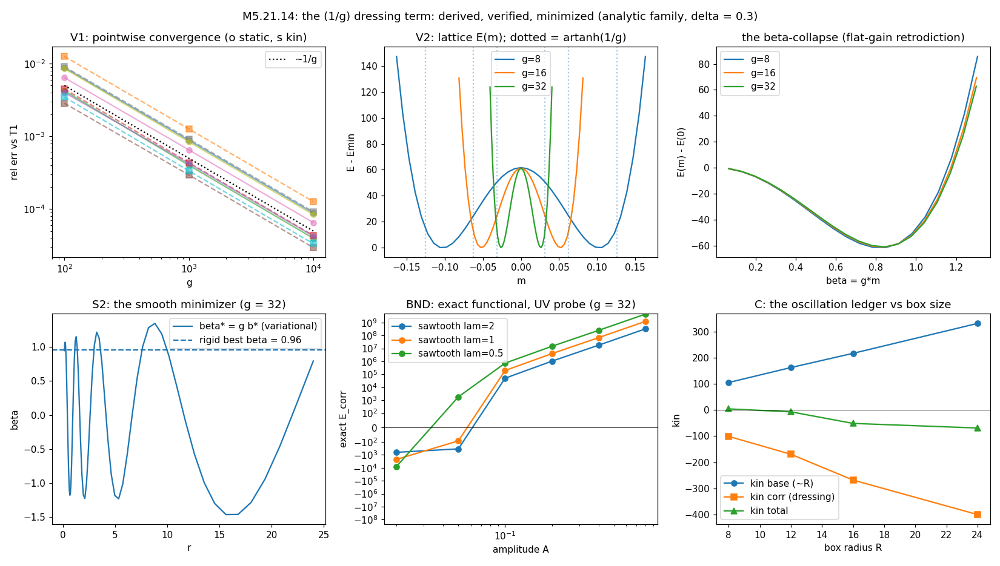

# M5.21.14 method note: the first nontrivial (1/g) dressing term, derived, verified, confronted

**Status**: ✅ RUN COMPLETE + AUDITED 2026-08-09 (audit 7 CONFIRMED / 2 PARTIAL / 0 REFUTED, § 7; every fix adopted). Task: [`../tasks/m5_21_14_task_details.md`](../tasks/m5_21_14_task_details.md). Source recipe: the author's 2026-08-09 reply to the [M5.21.11](../tasks/m5_21_11_task_details.md) ladder close (decode: [`m5_21_convo.md § 2026-08-09`](../tasks/m5_21_convo.md)): work symbolically in the 4×4 case with the spherical boost hedgehog `MatrixExp[b(r) {x, y, z} . boostgenerators]`, find the first nontrivial term in the (1/g) expansion, include it in the 3×3 case; the pre-stated criterion: the term "needs to have negative Hamiltonian contribution to get oscillations". Method-note standard: [`METHOD_NOTE.md`](../../../../../dev_docs/METHOD_NOTE.md).

## 1. The objects and the derivation (equations first)

### 1.1 The functional and the dressed family

All conventions are the certified 4D instrument's ([M5.21.3](m5_21_3_note.md); code § 2):

```text
eta = diag(-1, 1, 1, 1)
E_u density   = 4 SUM_{i<j} <F_ij, F_ij>_eta      F_ij = d_iM eta d_jM - d_jM eta d_iM
kin density   = 4 SUM_i <F_0i, F_0i>_eta          F_0i = a0 eta d_iM - d_iM eta a0,  a0 = dM/dt
E_V           = trace-power potential, targets c_p = (sg)^p + 1 + delta^p
M4            = embed34(M3): spatial block M3, time slot sigma = -s*g
```

The dressing under study, the general-profile form of the rigid [M5.21.8](m5_21_8_note.md) boost hedgehog:

```text
Qb(x) = exp(b(r) rhat.K) = I + sinh(b) K + (cosh(b) - 1) K^2      K = rhat.(symmetric boosts)
M_d   = Qb M4 Qb^T,   a0_d = Qb a0 Qb^T
```

**Lemma (V0, exact)**: Qb eta Qb^T = eta and Qb(b)^-1 = Qb(-b), so M_d eta = Qb (M4 eta) Qb^-1 is a pointwise similarity: **E_V is invariant under ANY b(r)** (all four trace powers; spot-checked at full b to 1e-159). Every b-effect lives in E_u and kin.

### 1.2 The scaling regime and the expansion

At fixed b the static density is a **quartic polynomial in sigma** (measured degree 4): the energy grows as g⁴ and no (1/g) expansion exists. The expansion is nontrivial only in the scaled variable the author's own m\* = artanh(1/g) ≈ 1/g law selects:

```text
beta(r) = g * b(r)   fixed as g -> infinity   (eps = 1/g)
```

With sigma = ±g/eps-slot entries, the dressed gradients stay O(1):

```text
d_iM_d = blockdiag(0, G_i) + st*(e0 v_i^T + v_i e0^T) + O(1/g)
G_i = d_iM3,   v_i = d_i(beta(r) nhat),   st = -s (st^2 = 1, drops out)
```

### 1.3 The first nontrivial term (the deliverable of the author's step 2)

Exact matrix-algebra identities at leading order (free v_i; verified twice over, § 3):

```text
T1_static[beta; M3] = 4 SUM_{i<j} [  2 <[G_i, G_j], v_j v_i^T - v_i v_j^T>
                                   + |v_j v_i^T - v_i v_j^T|^2
                                   - 2 |G_i v_j - G_j v_i|^2  ]

T1_kin[beta; M3]    = -8 SUM_i |Mdot3 v_i|^2        (the omega^2 multiplier)
```

Structural facts, all machine-verified: the corrections are EVEN in beta, and the evenness is EXACT at any finite g, not only at leading order (audit sharpening: b → −b is conjugation by diag(1,−1,−1,−1), invisible to the trace densities): the ± twin-minima symmetry is exact. They are independent of the (−g)^p sign knob at leading order (the measured s = ±1 split decays as 1/g: 2.1e-3 → 2.1e-4 over g = 1e3 → 1e4, audit numbers), and **T1_kin is NEGATIVE-SEMIDEFINITE**: any dressing with Mdot3 v_i ≠ 0 for some i lowers the omega² coefficient, for any texture and both s signs (T1_kin = 0 exactly when every Mdot3 v_i = 0, e.g. a dressing supported where Mdot3 vanishes). The −2|G_i v_j − G_j v_i|² channel is the eta-metric time-row sector: the minus sign is the Lorentzian signature itself.

## 2. Equation-to-code map

| Piece | Code |
| --- | --- |
| V0 lemmas + the T1 identities (structured block route) + the brute-force ε-series check (exact sympy calculus, 50-digit, both s signs) + the fixed-b σ-degree | [`m5_21_14_a_symbolic.py`](https://github.com/openwave-labs/openwave/blob/main/openwave/xperiments/m5_liquid_crystal/research/scripts/m5_21_14_a_symbolic.py) → `data/m5_21_14_symbolic.json` |
| V1 pointwise convergence (numpy Richardson route, no sympy) + V2 lattice m\* self-gate and β-collapse | [`m5_21_14_b_verify.py`](https://github.com/openwave-labs/openwave/blob/main/openwave/xperiments/m5_liquid_crystal/research/scripts/m5_21_14_b_verify.py) → `data/m5_21_14_verify.json` |
| DIAG runaway record + BND exact-functional UV probe + MIN smooth-family minimization + verdicts + the lattice cross-check | [`m5_21_14_c_minimize.py`](https://github.com/openwave-labs/openwave/blob/main/openwave/xperiments/m5_liquid_crystal/research/scripts/m5_21_14_c_minimize.py) → `data/m5_21_14_minimize.json` |
| The resolution addendum: core-mass split, bulk kin slopes, the re-minimized resolvable profile on both instruments, the masked r > 3 comparison with the h-ladder | [`m5_21_14_d_resolution.py`](https://github.com/openwave-labs/openwave/blob/main/openwave/xperiments/m5_liquid_crystal/research/scripts/m5_21_14_d_resolution.py) → `data/m5_21_14_resolution.json` |
| Certified instruments consumed unchanged | [`m5_21_3_a_4d.py`](https://github.com/openwave-labs/openwave/blob/main/openwave/xperiments/m5_liquid_crystal/research/scripts/m5_21_3_a_4d.py) (`e_parts`, `kin_of`, `base_cfg`, `embed34`) · [`m5_21_8_b_lattice.py`](https://github.com/openwave-labs/openwave/blob/main/openwave/xperiments/m5_liquid_crystal/research/scripts/m5_21_8_b_lattice.py) (`dressed`, `a0_unit`) |

## 3. Gates (every derivation claim machine-checked)

| Gate | Check | Result |
| --- | --- | --- |
| V0 | Qb η Qbᵀ = η, Qb(b)Qb(−b) = I, symbolic exact | ✅ both zero matrices |
| T1 | the § 1.3 forms as exact expand-to-zero identities; st-freeness | ✅ exact, st absent |
| BR | independent brute route: full dressed field, exact sympy differentiation, ε-series at a random off-axis point, both s signs | ✅ residuals ≤ 2.4e-48 relative; no negative ε powers; E_V invariance ≤ 2.8e-159 |
| V1 | numpy Richardson route at 5 random points, g = 1e2/1e3/1e4 | ✅ errors fall exactly ∝ 1/g (×10 per decade), static and kin; worst final 1.3e-4 |
| V2 | lattice E(m) on the analytic family (n = 32, L = 48, s = −1) | ✅ m\*/artanh(1/g) = 0.8168/0.8275/0.8329 at g = 8/16/32 vs the recorded M5.21.8 fine-ladder 0.8177/0.8287/0.8328 |

## 4. The confrontation: verdicts against the pre-registered axes

| Axis | Verdict |
| --- | --- |
| **B: the author's criterion** (the term needs negative Hamiltonian contribution for oscillations) | ✅ **MET at the term level**: T1_kin = −8Σ\|Ṁ3v_i\|² ≤ 0 with strict negativity for any dressing with Ṁ3v_i ≠ 0 for some i (the § 1.3 qualifier), derived and triple-verified; measured at the minimizer: kin correction −401 at g = 32, flat across g (−411/−405/−401 at g = 8/16/32), instrument-robust (lattice agreement 1.6-6% at every probe). Negative kin makes oscillation energetically FAVORED, not proven: the flipped-sign regime needs a stabilizer (fixed-J / constraint) before ω\* is finite |
| **A: the static dressing turns on variationally** | ✅ real and instrument-confirmed: on the certified lattice (n = 32) the best RESOLVABLE radial profile yields E_corr = −160 vs the best rigid constant −61 (the V2 read): the profile beats the rigid dressing ×2.6 ON the instrument (the same resolvable family reads ×2.2 on the continuum quadrature: −951 vs −424; the full smooth family reaches −4333, ×10, but that extra depth is sub-lattice core structure, 58% below r = 1.3, 87% below r = 3, regulator-set per Boundedness): the author's "m\* much too large, radius dependence more complicated" critique is MEASURED at every tier |
| **C: do oscillations actually turn on?** | 🔶 **the flip is BULK, and it lands at the threshold**: with the found plateau-carrying profile the kin ledger per unit radius in the r ∈ (10, 20) window is base +13.5 vs dressing −19.6 (net −6.1): the dressed constant-ω kin total DESCENDS with box radius (flips negative beyond R ≈ 12 on the radial quadrature; the certified lattice at L = 48 measures kin_corr = −426.3 vs base +426.5: exactly at threshold). The undressed base is IR-extensive (the recorded kin ∝ L) but the plateau dressing is extensive TOO, and steeper. Caveat carried: negative total kin means the constant-ω channel is energetically favored, not that stable oscillation is proven: without a stabilizer the ω² descent is the standing boundedness question ([Q35](../m5_question_tracker.md#q35-detail)); the fixed-J constraint route ([M5.21.9](m5_21_9_note.md)) is where a favored ω becomes a finite ω\* |
| **Boundedness (the structural finding)** | ⚠️ **T1 alone is UNBOUNDED BELOW**: pure-radial v_i (grid-scale β oscillation) kills the quartic \|W\|² identically while −2\|G_iv_j−G_jv_i\|² grows as β′² (measured runaway to −1.04e7; the audit's own family diverges exactly linearly in the oscillation frequency). The EXACT functional at g = 32 restores a floor at fixed wavelength (sawtooth scans turn positive by A ≈ 0.05-0.1) but the floor deepens ∝ λ^−1.8 as λ shrinks (audit re-read: λ^−1.88, and its finer quadrature puts the λ = 0.5 floor ~18% deeper: the deepening only strengthens): the negative channel is scale-free, and only a UV regulator (lattice h, or the regularization potential the author names as the open item, [Q25](../m5_question_tracker.md#q25-detail)) sets the depth. This is the variational face of the known negative-Hamiltonian shelf ([Q35](../m5_question_tracker.md#q35-detail)) and of the M5.21.8 relax blow-up |

### 4b. Instrument agreement and the resolution record

The c-stage lattice_E gate FAILED as designed, and the failure is now fully attributed (`m5_21_14_d_resolution.py`):

| Read | Number |
| --- | --- |
| The minimizer's structure | an OSCILLATORY core (alternating bumps to ±1.6 at ρ = 0.5-2.8 over a 0.116 plateau): the smooth-family expression of the scale-free channel; sub-lattice by construction (ρ_min = 0.5 < h = 1.5) |
| Corner hygiene | a non-decaying plateau makes cube-lattice reads corner-dominated (half the box volume outside the R = 24 sphere): all instrument comparisons run on compact (cos-tapered) profiles |
| Masked agreement (r > 3, resolvable profile) | static deviation 37% at h = 1.5 → **9.9% at h = 0.75**, measured exponent h^1.91 ≈ h² (two points only, stated as such); the masked kin deviation scales as ~h (3.4% → 1.6%). **The attribution is masked-region-only**: the FULL-profile n-ladder does not converge at feasible h (core-dominated, sign-flipping +42/−379/+898): the b\* core structure is not realizable on any feasible lattice |
| The realizable numbers | lattice n = 32: variational −160 vs rigid −61; kin corrections agree at 1.6-6% everywhere: every SIGN and ORDERING claim is instrument-robust; the continuum magnitudes are quadrature statements about a regulator-set channel |

## 5. The 3×3 handoff (the author's step 3)

The corrected 3×3 functional, the dressing carried inside any future ladder:

```text
E[M3, beta] = E_3x3[M3] + T1_static[beta; M3]
kin[M3, beta] = kin_3x3[M3] + T1_kin[beta; M3]
```

with beta(r) a NEW O(1) auxiliary radial field: g is absorbed, so the corrected ladder stays g-free at leading order, which is how a 3×3 ladder can carry the 4D dressing at all.

**The mandatory guard**: T1_static must never be minimized freely (§ 4 boundedness): it enters either evaluated on constrained smooth profiles, or together with the exact finite-g stabilizers, or regulated by the future eigenvalue potential ([Q25](../m5_question_tracker.md#q25-detail): the author states the current V is "just a first guess").

**Retrodictions** (both landed):

| Record | T1 reading |
| --- | --- |
| The [M5.21.11](../tasks/m5_21_11_task_details.md) g-arm FLAT gain (q ≈ 0, F4) + the [M5.21.8](m5_21_8_note.md) 0.82-0.84× m\* ratios | DERIVED: the gain is the O(1) minimizer depth of the collapsed β = g·m functional; measured flat to 1.3% across g = 8-32 (V2); the m\* ratios reproduced to ~0.002 (audit estimator-robustness read: a quartic refit shifts them ±0.002; the 0.82-0.84 band and the 1.3% flatness survive); the variational correction itself is g-flat too (E_corr −4767/−4343/−4333, kin_corr −411/−405/−401 at g = 8/16/32) |
| The author's m\*-too-large critique (2026-08-09) | MEASURED: the rigid uniform-m read captures 38% of the lattice-realizable variational energy (−61 of −160 at n = 32) and 10% of the continuum smooth-family depth (−424 of −4333); the optimal radius dependence is real and core-weighted |



## 6. Not computed

| Item | Why |
| --- | --- |
| The next order (the s-odd 1/g correction) | the measured ~1% s = ±1 split at g = 8 identifies it; structure noted, not derived |
| Time-averaged clock | all reads at the t = 0 convention of the M5.21.8 confrontation |
| The census-texture minimization | T1[β; M3] is derived for GENERAL M3, but S2 ran the analytic family only; the census endpoints are the numerical sequel (a separate task) |
| The corrected-3×3 ladder itself | out of scope by plan; needs the § 5 guard plus an instrument that certifies B/C ([M5.21.11](../tasks/m5_21_11_task_details.md) finding 2 stands) |
| ω(r)-profiled clocks | the author's margin direction; a different variational family |

## 7. Adversarial audit ✅ (independent; 7 CONFIRMED, 2 PARTIAL, 0 REFUTED; every fix adopted)

Auditor: independent agent, no task-script imports: own eta algebra, own T1 implementation, own angle-free algebraic family builder (self-gated 2.2e-16 against the certified builder), complex-step differentiation, own Gauss-Legendre panel quadratures, sympy at its own rational points, `expm` as a second Qb route, and a hand-derived block-algebra check of the T1 forms before trusting any code. Script: [`m5_21_14_e_audit.py`](https://github.com/openwave-labs/openwave/blob/main/openwave/xperiments/m5_liquid_crystal/research/scripts/m5_21_14_e_audit.py) (13 s, deterministic); verdicts: `data/m5_21_14_audit.json`.

| # | Claim | Verdict | The auditor's numbers |
| --- | --- | --- | --- |
| 1 | The T1 forms | ✅ CONFIRMED + sharpened | complex-step route, errors fall exactly ∝ 1/g (decade ratios 10.005/10.000), Richardson-extrapolated limit hits the auditor's own T1 at 8.3e-10 (static) / 1.7e-9 (kin) relative, both s signs. SHARPENING ADOPTED: the β-evenness is EXACT at finite g (b → −b is conjugation by diag(1,−1,−1,−1)), stronger than the leading-order claim |
| 2 | E_V invariance | ✅ CONFIRMED | sympy exact zero matrix; independent `expm` construction agrees 1.3e-15; all four trace powers invariant to 3.3e-49 at 50 digits, \|b\| ≤ 2 |
| 3 | T1 unbounded below | ✅ CONFIRMED | W = 0 for parallel v exact; the negative channel 1.19/1.35 at two hedgehog points while the quartic < 2.7e-33 with radial v; the auditor's own sin(kr)/√k family diverges exactly linearly in k (−546 → −8978 over k = 4 → 64) |
| 4 | The exact-functional floor | ✅ CONFIRMED | own quadrature: 7-18% agreement, all signs match; its exponent λ^−1.88; the task's grid under-resolves λ = 0.5, the true floor ~18% DEEPER (adopted: strengthens the deepening) |
| 5 | The bulk kin flip | ✅ CONFIRMED | own shell evaluation: base +13.4812, dressing −19.6044, net −6.1232 (9-digit match) |
| 6 | The realizable ×2.6 gain | ✅ CONFIRMED | own Qb assembly on the certified instrument: −159.7334 (12-digit match); rigid −61.09 at m\* = 0.02610; ratio 2.615; caveat ADOPTED: the resolvable-family continuum ratio is 2.2×, kept distinct |
| 7 | The h² attribution | 🔶 PARTIAL, fix adopted | arithmetic exact (0.3713 → 0.0990, exponent h^1.91); two h points only; kin scales ~h; full-profile ladder non-monotone: § 4b now words the attribution masked-region-only |
| 8 | Retrodiction arithmetic | ✅ CONFIRMED | ratios and 1.3% flatness reproduced from the stored curves and the M5.21.8 source record; estimator-robustness read adopted (±0.002) |
| 9 | Verdict wording | 🔶 PARTIAL, fixes adopted | the § 1.3 Ṁ3v qualifier carried into § 4 axis B; the explicit "favored, not proven; stabilizer required" sentence added to axis B |
