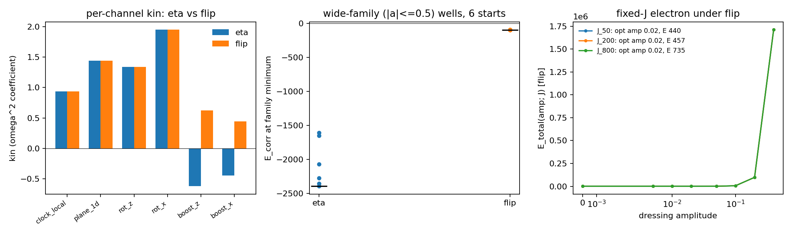
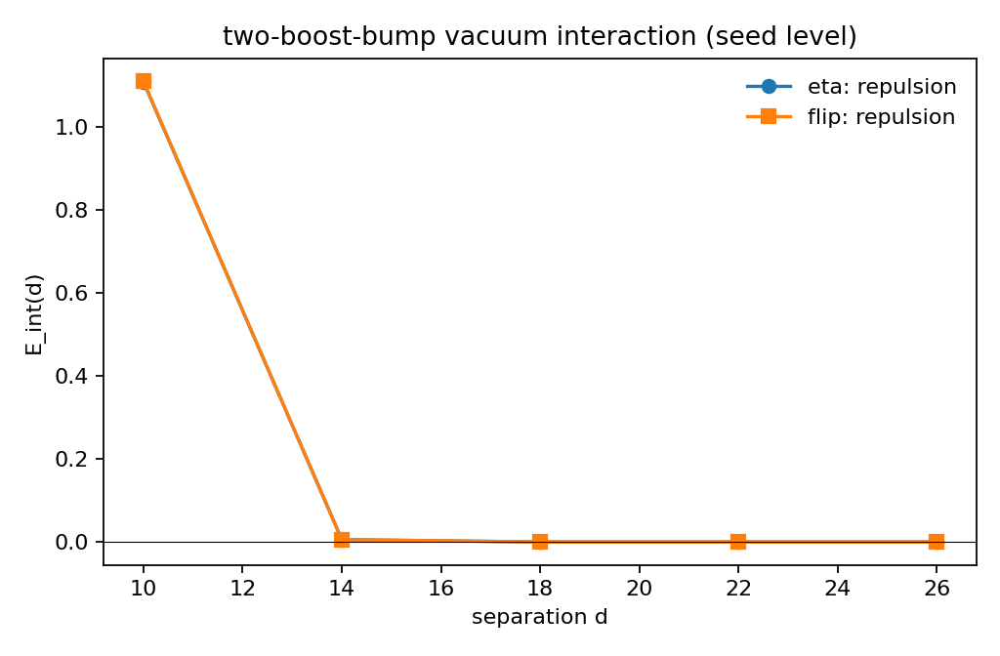

# M5.21.16: The sign-reversed boost Hamiltonian: what the (Γ̃)² flip fixes, what it costs

**Status**: complete, independently audited (11/11 gates). Task record: [M5.21.16](../tasks/m5_21_16_task_details.md). Source quest: the author's 2026-08-13 reply on the [M5.21.15](../tasks/m5_21_15_task_details.md) thread + the notebook `theory/duda_fmunu_4d_hamiltonian_imaginary_2026_08_13.pdf`. Open author question routed: [Q48](../m5_question_tracker.md#q48-detail).

## 1. Equations first

### 1.1 The author's notebook, in our notation

Curvature symbols per derivative direction μ ∈ {0,1,2,3}: rotations Γ_μ^j and boosts Γ̃_μ^j (j = 1,2,3), packed as

```text
Gamma_mu = [[0,      tG1,  tG2,  tG3 ],
            [tG1,    0,   -G3,   G2  ],
            [tG2,    G3,   0,   -G1  ],
            [tG3,   -G2,   G1,   0   ]]
```

with ξ = diag(−1,1,1,1), the ξ-commutator `coms(A,B) = AξB − BξA`, the eigenvalue frame d = diag(g, 1, δ, 0), M_μ = coms(Γ_μ, d), F_μν = coms(M_μ, M_ν), and the notebook Hamiltonian density

```text
H = Σ_{μ,ν} [ (F_μν)₂₃² + (F_μν)₂₄² + (F_μν)₃₄²  −  (F_μν)₁₂² + (F_μν)₁₃² + (F_μν)₁₄² ]
```

(1-indexed internal entries: spatial block positive, time row negative). Expanded as a parabola in ω = Γ₀¹ (the long-axis twist frequency) and taken at g → 1/δ leading order, the ω² coefficient is

```text
baseline:   −2 Σ_{i=1..3} [ (Γ̃_i²)² + (Γ̃_i³)² ]                       (negative-definite)
variant A:  +2 Σ (same six)                                            (Γ̃ imaginary)
variant B:  +2 [ 2(Γ̃₀²)² + 2(Γ̃₀³)² + Σ (same six) ]                   (imaginary g + conjugated second F)
```

### 1.2 The bridge to the certified lattice functional (exact)

With the certified inner product `⟨F,G⟩_η = tr(ηFηG^T)` (the M5.20.2/M5.21.3 convention) and F antisymmetric, `⟨F,F⟩_η = Σ_ab η_a η_b F_ab²`, and the notebook H is EXACTLY

```text
H = Σ_{μ<ν} ⟨F_μν, F_μν⟩_η
```

The author's sign reversal of the (Γ̃)² contributions is therefore, at the field level, the substitution

```text
FLIP:   ⟨F,F⟩_η = tr(ηFηF^T)   →   tr(FF^T)    (Frobenius; brackets and V4 untouched)
```

and the flip equals notebook **variant A exactly** at leading order (variant B adds the positive Γ̃₀ terms on top). Both bridge identities verified symbolically to exact zero.

### 1.3 What survives the flip unchanged

The [M5.21.15](m5_21_15_note.md) envelope-concavity theorem uses only that E is affine in ω² per configuration, which no internal metric changes. So free minimization still cannot select interior nonzero ω; what the flip changes is the SIGN of every kin, making ω = 0 the free vacuum preference (the author's "empty space should prefer ω = 0") and the fixed-J branch the carrier of the electron's finite frequency.

## 2. Equation-to-code map

| Object | Auditable implementation |
| --- | --- |
| Notebook reproduction (N1-N3), flip (N4), bridges (B1, B2) | [`m5_21_16_a_symbolic.py`](../scripts/m5_21_16_a_symbolic.py) |
| Flip functional on the certified stack (`e_u_of`, `kin_of` with contraction switch) | [`m5_21_16_b_field.py`](../scripts/m5_21_16_b_field.py) |
| Per-channel kin, invariance table, 3×3-embed identity, dressing ladders | same, stages IDENT / INV / CHAN / DRESS |
| Wide-family boundedness + fixed-J electron | [`m5_21_16_c_fixedj.py`](../scripts/m5_21_16_c_fixedj.py) |
| Two-boost-bump vacuum interaction + quartic kernel ladder | [`m5_21_16_d_twobody.py`](../scripts/m5_21_16_d_twobody.py) |
| Independent audit (no imports from the above, own stencils and quadrature) | [`m5_21_16_e_audit.py`](../scripts/m5_21_16_e_audit.py) |

Certified substrate consumed read-only: [`m5_21_3_a_4d.py`](../scripts/m5_21_3_a_4d.py) (stack), [`m5_21_14_c_minimize.py`](../scripts/m5_21_14_c_minimize.py) (analytic dressed family). Data: [`m5_21_16_symbolic.json`](../data/m5_21_16_symbolic.json), [`m5_21_16_field.json`](../data/m5_21_16_field.json), [`m5_21_16_fixedj.json`](../data/m5_21_16_fixedj.json), [`m5_21_16_twobody.json`](../data/m5_21_16_twobody.json), [`m5_21_16_audit.json`](../data/m5_21_16_audit.json).

## 3. Results

### 3.1 The notebook confirmed, and which variant the flip is (✅ measured, symbolic)

All three ω² coefficients reproduce with exact zero residual in an independent sympy pipeline. The plain flip == variant A exactly; variant B = flip + positive Γ̃₀ terms. The author's diagnosis of our measured runaway is confirmed at his own level of description.

### 3.2 The flip at field level (✅ measured, g = 32, δ = 0.3, s = −1)



| Measurement | η (baseline) | flip |
| --- | --- | --- |
| boost_z kin | −0.6216 | **+0.6216** (exact sign flip: the boost channels' curvature is PURE time-row, spatial part measured 0) |
| boost_x kin | −0.4453 | +0.4453 |
| rotation channels (clock_local, plane_1d, rot_z, rot_x) | positive | identical to η (unchanged) |
| all channels kin ≥ 0 | ❌ | ✅ |
| static 3×3-embed (charge sector) | reference | **identical to η, rel diff 0.0**: Coulomb physics untouched by construction |
| SO(3) invariance of E_u | exact | exact |
| SO(1,3) boost invariance of E_u | 3e-15 | **BROKEN: 26% at b = 0.25** |

### 3.3 Boundedness: the guard becomes moot (✅ measured)

Wide 10-dim dressing family (bounds |a| ≤ 0.5, six Powell multi-starts): under η every start crashes below −1600 (best −2354: the [M5.21.14](m5_21_14_note.md) unbounded channel, which forced the guard bracket [0.02, 0.05]); under the flip the wells cluster tightly at −92.8..−98.8: a bounded shallow well, within this family probe. The sawtooth runaway family closes outright (η −2339 at A = 0.05 vs flip +21950).

### 3.4 The fixed-J electron under the flip (✅ measured, family level)

E(amp; J) = E_stat + E_corr(amp) + J²/(4 kin(amp)), with kin now RAISED by dressing (the reverse of the η behavior):

| J | optimal amp | E_total | ω* = J/(2 kin) |
| --- | --- | --- | --- |
| 50 | 0.02 (interior) | +440.0 | 0.0463 |
| 200 | 0.02 (interior) | +457.3 | 0.1854 |
| 800 | 0.02 (interior) | +735.4 | 0.7416 |

Finite frequency, positive energy, an interior optimal dressing, and no guard: the outcome the author asked for ("if electron could get finite gravitational mass and frequency by energy minimization"), delivered on the fixed-J branch, which § 1.3 shows is the only branch that can carry it.

### 3.5 Coulomb vs Newton signs (✅ measured where possible; the rest routed)



- **Charge channel: closed by construction.** The flip is EXACTLY the identity on static 3×3-embedded fields (§ 3.2), so the measured like-charge repulsion record ([M5.17](m5_17_methods_note.md), [M5.21.4](m5_21_4_note.md)) carries over unchanged under the flip.
- **Mass channel: not decidable at seed level, and we can say why.** The vacuum boost-bump energy is QUARTIC in amplitude (amp-doubling ratio 16.01 η / 16.03 flip; no quadratic vacuum boost kernel exists, consistent with the M5.20.2 purely-quartic-L derivation), and the two-bump overlap energy is repulsive and metric-insensitive (0.09% difference). A mediated mass-mass force sign therefore lives on relaxed two-DEFECT boost-dressed states; the canonical two-center construction is the author-gated prerequisite already on the thread. Routed to the successor task and [Q48](../m5_question_tracker.md#q48-detail).

## 4. Mutation sensitivity

Mislabeling η as flip reddens the boost-sign gate; corrupting a stored channel value by 10% reddens the audit's own-route match; a 5% stencil error was separately shown (arm-B development) to move the kin values far outside the audit tolerance. The audit's magnitude comparison runs on a deliberately different stencil (pure central vs the stack's fwd/bwd energy average) and agrees at the 17% level, with sign and the exact flip relation `kin_flip + kin_eta = 2 × spatial part` holding to 1e-10.

## 5. Not computed

- Variant B at field level (imaginary g + conjugation complexifies M; symbolic only here; field implementation is a follow-up if the author names it canonical).
- The relaxed two-defect mass-mass force sign (the Newton test proper): gated on the canonical two-center boost-dressed construction (author-gated).
- Lattice minimization under the flip (kin scans and family probes only; no flip-gradient relaxation was run).
- Any claim that the flip is THE model: the 26% Lorentz-invariance break is a structural cost only the author can accept or repair (possibly via variant B's complex structure), and it is the head of [Q48](../m5_question_tracker.md#q48-detail).

## 6. Independent adversarial audit

[`m5_21_16_e_audit.py`](../scripts/m5_21_16_e_audit.py) imports none of the contribution modules and neither certified stack module: own notebook matrices, own stencils, own quadrature. 11/11 gates green ([`m5_21_16_audit.json`](../data/m5_21_16_audit.json)): the δ-ladder ω² ratios converge to the leading-order claims; the bridge identity holds at 3e-16; the boost-channel sign flip and the flip relation reproduce; the η well recomputes to −2308 (claim −2354, 3.6% on an independent quadrature) and the flip well to −104 (claim −98.8); both mutations redden; the quartic vacuum scaling reproduces on a different grid (log2 slopes 4.002-4.013).
