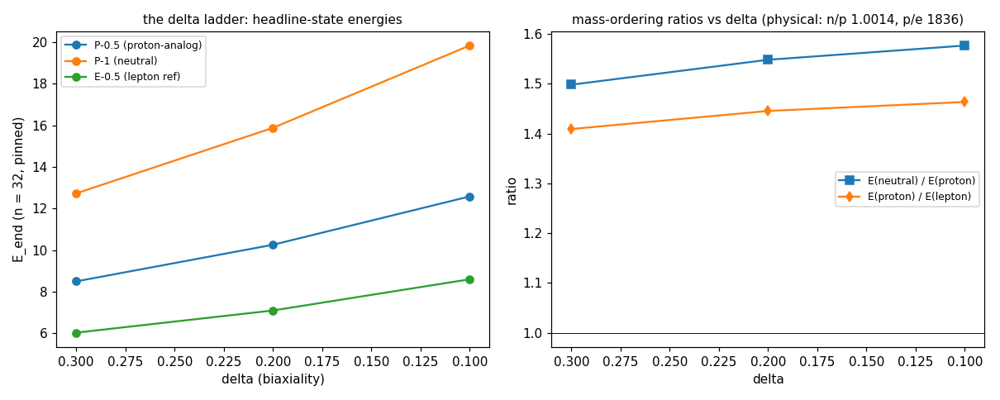
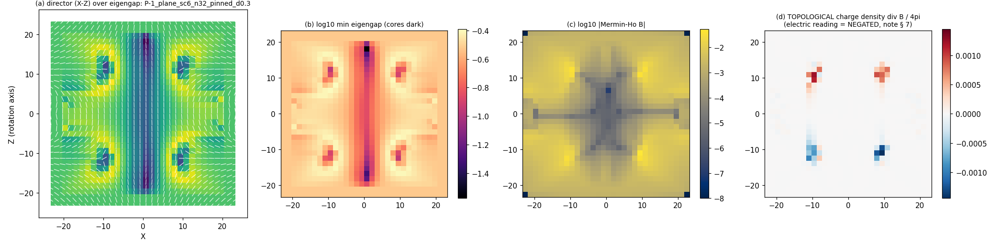
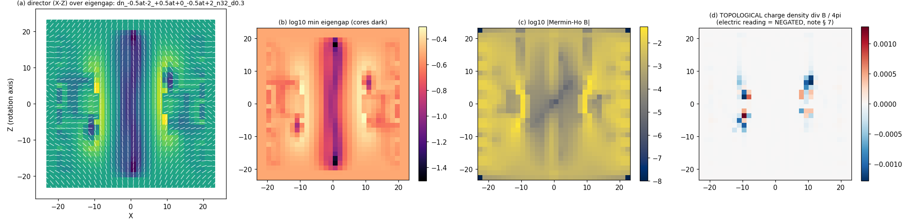
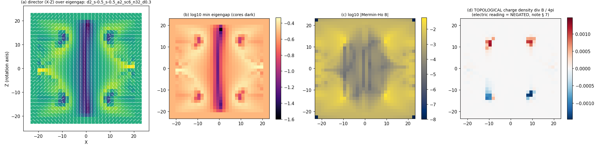
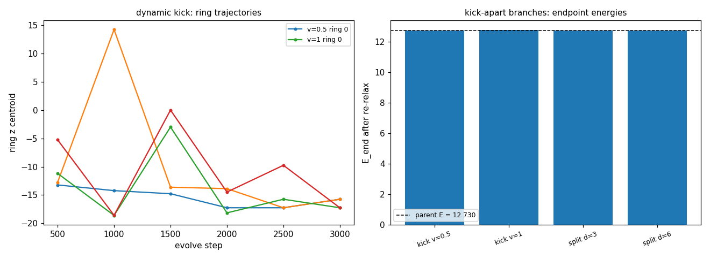

# M5.22.1: the deuteron rung (opening probes + two-knot construction)

**Task**: [M5.22.1](../tasks/m5_22_1_task_details.md) · run 2026-08-01 (go 10:00 EDT). Rung 3 of the author ladder, staged by the 2026-07-30 census-checkpoint reply ([`m5_22_convo.md § 2026-07-30`](../tasks/m5_22_convo.md)): the δ = 0.1 energy ladder, the kick-apart identity probe on the two-ring neutral state (the author's dineutron test), ring count read as candidate baryon number, and the two-knot deuteron construction forks. Claim language: QUALITATIVE at toy parameters (δ ∈ [0.1, 0.3]; the realistic-parameter bridge is [Q33](../m5_question_tracker.md#q33-detail)).

Scripts of record: [`m5_22_1_a_kick.py`](../scripts/m5_22_1_a_kick.py) (separation probes + ring ledger + slab charges) · [`m5_22_1_b_deuteron.py`](../scripts/m5_22_1_b_deuteron.py) (two-knot constructions + charge-density moments) · [`m5_22_1_c_panels.py`](../scripts/m5_22_1_c_panels.py) (figures). Instrument stack consumed by import, unchanged from the census: [`m5_22_b_census.py`](../scripts/m5_22_b_census.py) → [`m5_21_2b_a_instrument.py`](../scripts/m5_21_2b_a_instrument.py) (certified T2/sym/ε = 0, w2 = 0.002758100, box L = 48, FIRE, pinned shell) + [`m5_21_4_a_pair.py`](../scripts/m5_21_4_a_pair.py) (oriented Mermin-Ho charge). Dynamics: the [M5.21.6](m5_21_6_note.md) damped leapfrog (GL-gated dt = 0.025).

**The sign convention (standing, census note [§ 7](m5_22_note.md))**: every signed charge quantity in this note is the MATHEMATICAL topological charge; the ELECTRIC reading NEGATES it (the author's 2026-07-30 hedgehog-electron convention). \|Q\| statements are convention-free.

## 1. The equations (what the new code computes)

The energy functional, FIRE relaxer, and Mermin-Ho instruments are the census's, unchanged ([m5_22_note.md § 1](m5_22_note.md)). New instruments of this task:

```text
Slab charge (fragment read):
  Q_slab(z0, z1) = (1/4pi) SUM_faces B . dS  over the box
  |x|,|y| <= half_lat, z0 <= z <= z1;  half_lat = L/2 - 4h (encloses
  a ring at rho ~ 10, which a small centered cube cannot)

Charge-density moments (rho = div B / 4pi, interior only):
  p_z = INT rho z d3x          (dipole)
  Q2_zz = INT rho (3 z^2 - r^2) d3x,  Q2_xx analog  (quadrupole)

Static separation map (split branch):
  M'(x, y, z) = M(x, y, z - d tanh(z / w0)),  w0 >= 1.5 d (monotone),
  pin shell re-imposed exactly, then FIRE

Separation velocity kick (dynamic branch):
  V0 = -v tanh(z / w0) dzM     (rigid +z translation of the upper
  half, -z of the lower), damped leapfrog (dt = 0.025, absorbing
  sponge pushed to r0 = 0.8 L/2 so the rings at r ~ 16 evolve
  undamped), then FIRE from the evolved state

Ring ledger: connected components of the low-eigengap set
  (thr ladder {0.06, 0.09, 0.15}, 3^3 = 26-connectivity, components
  >= 2 voxels, column/ring split at rho_mean = 3); ring count = the
  candidate baryon-number instrument (the author's 2026-07-30
  interpretation, under test). CONVENTION CAVEAT (audit): the raw
  count at n = 32 depends on thr + connectivity + merging (a physical
  ring can read as several adjacent components); every count quoted
  here states its thr, and "2 rings" means the merged physical read

Two-center composite seed (seed2 fork):
  ang(x, y) = ang_P(x - x1, y; s1) + ang_P(x - x2, y; s2)
  (the author's P-family cross-sections, angles ADDED, per-term ring
  cores blended), census 3D lift unchanged

Endpoint graft (graft fork):
  M0 = (1 - w(z)) M_p(shifted -zoff) + w(z) M_n(shifted +zoff),
  w = (1 + tanh(z / w0)) / 2, then FIRE
```

Equation-to-code map (blob/main, frozen task files):

| Term | Function | Where |
| --- | --- | --- |
| Q_slab | `slab_flux` | [`m5_22_1_a_kick.py`](https://github.com/openwave-labs/openwave/blob/main/openwave/xperiments/m5_liquid_crystal/research/scripts/m5_22_1_a_kick.py) |
| separation map | `separate` | same |
| velocity kick + leapfrog | `kick`, `leap_step` | same |
| ring ledger | `ring_read` | same |
| moments p_z, Q2 | `moments` | [`m5_22_1_b_deuteron.py`](https://github.com/openwave-labs/openwave/blob/main/openwave/xperiments/m5_liquid_crystal/research/scripts/m5_22_1_b_deuteron.py) |
| composite seed | `seed2_field` | same |
| graft | `graft` | same |

## 2. The δ = 0.1 ladder (✅ measured; the author's direct ask)

Fresh seeds relaxed at each δ (n = 32, pinned, maxit 12000; ALL f_tol, all inside the citation gate, worst xr = 1.45; audit caveat: that worst margin is stencil-convention-dependent, the auditor's alternative edge conventions read 1.483 for the same state, both under the 1.5 bar). Data: `m5_22_row_*_d0.1.json` etc. in [`../data/`](../data/); census collection refreshed ([`m5_22_census.json`](../data/m5_22_census.json), 40 rows).

| State | δ = 0.3 | δ = 0.2 | δ = 0.1 |
| --- | --- | --- | --- |
| P−0.5 (proton-analog), \|Q\| = 1 | 8.496 | 10.257 | 12.582 |
| P−1 (neutral), Q = 0 | 12.730 | 15.882 | 19.840 |
| E−0.5 (lepton reference), \|Q\| = 1 | 6.029 | 7.096 | 8.596 |
| **neutral / proton** (physical n/p = 1.0014) | 1.498 | 1.548 | 1.577 |
| **proton / lepton** (physical p/e = 1836) | 1.409 | 1.446 | 1.464 |



The honest read: **walking δ toward physical does NOT tighten the energy ladder by itself.** The neutral/proton rung drifts AWAY from the physical 1.0014 (1.50 → 1.58); proton/lepton inches in the physical direction (1.41 → 1.46 of a needed 1836). All three states persist as protected f_tol minima at every δ probed, so the EXISTENCE claims are δ-robust; the RATIOS are not converging in this corner of parameter space. This is an in-model data point FOR the author's own caveat: the quantitative ladder waits on the full realistic-parameter bridge ([Q33](../m5_question_tracker.md#q33-detail): δ ~ 1e-10 WITH the g-rescaling), not on small-δ steps alone.

## 3. The two-ring neutral state: internal charge structure (✅ measured)

Before any kick, the new slab instrument resolves what the census's centered-cube profile could not: **the two rings carry OPPOSITE UNIT topological charges.** The audit sharpened every number: the exact van Oosterom-Strackee degree per enclosing surface reads **+1.0000 (upper) / −1.0000 (lower) / 0.0000 (far)**, robust to the surface choice, with the central column contributing exactly 0 (no monopole charge on the column); the slab FD values ±1.04 are the finite-difference read of those exact integers, not structure.

| Read | Value |
| --- | --- |
| Exact degree, upper ring (audit) | **+1.0000** (slab FD read: +1.04) |
| Exact degree, lower ring (audit) | **−1.0000** (slab FD read: −1.04) |
| Q_far (total) | 0 exactly (audit); FD −0.003 |
| dipole p_z | **+24.0** by the audit's exact surface ladder; the div-based volume read (+21.3) underreads ~11% (core smearing + pin-shell exclusion) |
| quadrupole Q2_zz | +1.0 (small; the proton's own Q2_zz = +63 for scale) |



Panel (d) shows it directly: the upper ring is a positive topological charge-density lobe, the lower ring negative. The neutral state is a **bound ring-antiring pair (a charge dipole), not two zero-charge rings**. Under the electric convention the signs negate; the \|1\|-per-ring magnitude and the dipole structure are convention-free.

## 4. The kick-apart identity probe (✅ measured: 4/4 branches return to the sector, no split)

The author's dineutron test ("try to decay this two vortex rings configuration by kicking them apart", expected "probably decay into 2 baryons"), run as four machine-checkable branches on the n = 32 endpoint (parent E = 12.7296):

| Branch | What it did | Endpoint |
| --- | --- | --- |
| split d = 3 | rings statically displaced ~±2.7, FIRE | E = 12.7308, rings re-healed at ±12, exact degrees ±1/0 unchanged |
| split d = 6 | rings displaced ~±5.5 (most of the way to the shell), FIRE | E = 12.7308 (coincides with d = 3 to 0.4% in field distance) |
| kick v = 0.5 | velocity kick, 3000 damped steps: rings drifted to ±14.2 with KE 6.6 still live, then FIRE | E = 12.7385, rings at ±12 |
| kick v = 1 | violent: E transiently ≈ 50, a 27-fragment churn at step 1000, reorganized through 3 equator cores | E = 12.7746 (f_tol), two-ring geometry and exact degrees restored |

**Precision of the "return" (audit-qualified wording).** All four endpoints return to the SAME TOPOLOGICAL SECTOR and ring geometry: exact degrees +1 (upper) / −1 (lower) / 0 (far) on every endpoint. They are NOT numerically the parent minimum: field distances from the parent run 4.6% (both splits) to 12.7% (v = 1) of the relaxation scale, and the v = 1 endpoint is a genuinely distinct stationary state +0.35% above the parent (the audit's own descent probe: parent dE 2e-12, v1 endpoint dE < 1e-7 over 400 steps). So the sector has a small family of nearby two-ring minima; nothing probed leaves it. A v = 1 strength caveat: of the KE ≈ 177 injected, ~124 was sponge-absorbed by step 1000, so the effective probe is weaker than the injected number suggests.

**The identity verdict at this rung: the author's expected split into two baryons does NOT happen at toy parameters in the pinned arena.** The two-ring neutral state behaves as ONE deeply bound object whose internal structure is the ring-antiring dipole of § 3, not as two loosely bound neutrons. (For calibration: the physical dineutron is UNBOUND by ~70 keV; this object's binding against every probed separation is qualitatively unlike that.) Honest caveats: (i) the pinned far field is load-bearing (the census showed neutral states dissolve under free BC, so pinned is the only arena where the question is posable), (ii) the kick family probed is translation-separation only, (iii) n = 32 resolution, toy δ = 0.3.

Consequence for the pairing: with no single-ring neutral fragment produced, **the deuteron construction pairs the proton-analog with the two-ring neutral state as-is**, and [M5.22.2](../tasks/m5_22_2_task_details.md)'s decay target remains the census neutron-analog unchanged.

## 5. The two-knot construction forks (✅ measured, six forks, n = 32)

All self-run per the series exhaustion rule (the author's announced analytic deuteron seed had not arrived at run time and folds in at the next checkpoint). Binding bars from the constituents (n = 32, δ = 0.3): E_p + E_neutral = 8.496 + 12.730 = 21.226; 2 E_p = 16.992.

| Fork | E_end | stop | Q_far (topo) | Ring read | Verdict |
| --- | --- | --- | --- | --- | --- |
| seed2 p+n, a = 2 | 21.312 | max_iter | −0.75 | 12-component tangle | ❌ unconverged, charge-ambiguous |
| seed2 p+n, a = 3 | 22.288 | f_tol | −0.68 | 3 rings | ❌ stationary but charge-ambiguous; ABOVE the constituent sum |
| seed2 pp control | 15.047 | f_tol | +0.001 | 2 rings ±13.5, slabs ±1.07 | 🔶 ESCAPED to a SECOND ring-antiring neutral basin (P−1's cousin, +2.32 above it): ring count ADDS (1+1 → 2), charge CANCELS (total 2D winding +2, the census escape law) |
| graft zoff = 6 | 10.870 | f_tol | −0.88 (FD smear) | equator cluster + shell-adjacent parts | ❌ winding expelled to a pin-boundary seam |
| graft zoff = 9 | 10.666 | f_tol | −0.85 (FD smear) | same | ❌ same |
| **seedn 3-center** (−½, +½, −½) | **15.245** | **f_tol** | **exactly \|1\| (audit); FD −1.007** | **2 rings at z = ±6.2; internal charge stack +1 / −1 / +1 (below)** | 🔶 **THE CANDIDATE** (below) |

**The two measured obstructions** that killed the first five forks, and the fix: (i) seed-level charge additivity dies by the 3D escape law (the pp control's windings +1 +1 composed into exactly the even class the census proved escapes: the state came out NEUTRAL; audit-exact far degree 0.0000, ring charges exactly ±1); (ii) the graft far field is LAYERED, not one fractional sector (the audit's sharpening): the interior reads exactly Q = 0 with a clean lift out to half-width ~16, and the missing unit winding sits as a FRUSTRATED NON-ORIENTABLE SEAM against the pinned shell (72-164 broken lift edges at half-widths 17-20); the rows' q_far ≈ −0.85/−0.88 are the FD flux smearing that seam, not a radius-stable fractional charge. Either way the construction verdict stands: a blended pinned far field does not define a usable topological sector. The three-center seedn fork was added mid-run as the fix implied by both measurements: ONE consistent far field of total 2D winding +1 (odd, no escape) with the extra structure carried as an interior winding-cancelling ± ring pair.

### 5b. The deuteron candidate (🔶 stationary, resolution-gated)

The three-center composite relaxes to a NEW protected state with the deuteron's quantum numbers under the author's ring-count-as-baryon-number reading:

| Read | Value | Comment |
| --- | --- | --- |
| E_end | 15.245 (f_tol; audit-reproduced 15.2446) | **5.98 BELOW the p + neutral constituent sum (21.226)**: the bound direction |
| Q_far (topological) | exactly \|1\| (audit exact degree; the row's −1.007 is FD error) | ELECTRIC = **+1** in the same gauge convention that makes the proton-analog +1: the deuteron's charge |
| Ring count | 2 (z = ±6.2, thr 0.15 merged read) | A = 2 under ring-count-as-baryon-number ([Q40](../m5_question_tracker.md#q40-detail) caveat applies) |
| Internal charge structure | an exact **+1 / −1 / +1 stack** at z = −6 / 0 / +6 (the audit's z-cut degree ladder; the row's fractional slab numbers are cap-through-core artifacts, not quoted) | the seed's ± pair did NOT annihilate: the interior antiring persists between two like-sign charges, net \|1\| |
| Quadrupole Q2_zz | +21.8 topological → **electric −21.8** | ⚠️ SIGN TENSION: the physical deuteron's electric quadrupole is POSITIVE (prolate). Claimed as a sign only at toy parameters, and only if the state survives confirmation |
| Cross-stencil ratio | **1.70 > 1.5** | ❌ FAILS the census citation gate at n = 32: stationary and integer-charged but under-resolved. NOT citable as a headline state; the n = 48 confirmation run (~1 h) decides |







The honest headline for the checkpoint: **a stationary \|Q\| = 1 two-ring state with the deuteron's charge and ring count exists at n = 32, bound relative to its constituents by 28%, but it fails the pre-registered resolution bar (xr 1.70), and its electric quadrupole sign currently DISAGREES with the physical deuteron.** Confirmation is a resolution question (n = 48), not a construction question. The binding-sign claim (m_d < m_p + m_n direction) is conditional on that confirmation; the quadrupole sign is the first quantitative anchor either way (a confirmed disagreement is article-grade content per the pre-registration).

### 5c. The n = 48 confirmation run: INCONCLUSIVE at 12000 iterations

The first n = 48 pass (fresh three-center seed, maxit 12000) did not settle the candidate either way:

| Read | n = 32 (f_tol) | n = 48 (max_iter, still descending) |
| --- | --- | --- |
| E_end | 15.245 | 14.192 (lower, unconverged) |
| Q_far (FD) | −1.007 (exact \|1\| by audit) | −0.966 (near-unit; exact-degree read pending convergence) |
| Ring geometry (thr 0.15 merged) | 2 rings at z = ±6.2 | an equator-clustered complex (components at z ≈ −1.5 / −0.3; 9 components at thr 0.09): the ±6.2 arrangement NOT reproduced at this depth |
| Q2_zz topological → electric | +21.8 → **−21.8** | +85.9 → **−85.9**: the electric-quadrupole sign is NEGATIVE at BOTH resolutions (the one read this run strengthens) |

The state persists as a low-energy near-unit-charge complex at n = 48, but neither stationarity nor the two-ring geometry is confirmed at this depth; a 12000-iteration extension from the endpoint was launched at close (`dn_..._n48_d0.3_ext`).

**The extension verdict (24000 total iterations)**: the descent nearly flattens (E 14.1924 → 14.1484, the last 2000 iterations moving ~5e-5) with the residual force hovering at 1e-5 to 8e-5, short of strict f_tol; the charge class holds (q_far −0.957 FD); the geometry remains a multi-component complex spread over z ∈ [−6, +10] (13 components at thr 0.15), NOT the crisp n = 32 two-ring arrangement; and the electric quadrupole reads −61.5, making the NEGATIVE sign consistent across all three reads (n32: −21.8; n48 at 12k: −85.9; n48 at 24k: −61.5). Standing verdict of this run: **the deuteron candidate rests on n = 32 evidence only; at n = 48 it is a slowly annealing near-unit-charge complex whose convergence and internal geometry stay open**; the electric-quadrupole sign tension vs the physical deuteron is the run's most resolution-robust quantitative read. No MODELS.md cell moves on this evidence.

## 6. Not computed

| Item | Why / where it lives |
| --- | --- |
| Absolute masses, moments in fm units | No lattice → physical anchor at toy parameters ([Q33](../m5_question_tracker.md#q33-detail)) |
| Free-BC kick-apart | A Q = 0 state has no far-field protection under free BC (census F3); the probe would measure dissolution, not identity |
| Twist / non-translational kick channels | Only separation kicks probed; other decay channels stay open |
| The n = 48 convergence of the deuteron candidate | First pass RUN and inconclusive (§ 5c: max_iter, geometry unsettled); the 12000-iteration extension decides citability + the two-ring geometry |
| Beta decay of the neutron-analog | [M5.22.2](../tasks/m5_22_2_task_details.md) |

## 7. Adversarial audit (✅ 4 CONFIRMED, 2 QUALIFIED, 0 refuted; every catch adopted above)

Independent second agent, own script ([`m5_22_1_e_audit.py`](../scripts/m5_22_1_e_audit.py): self-contained numpy/scipy, zero imports from the analysis scripts; own pad0 energy + own analytic gradient (FD-gated 1e-9) + own BFS director lift + exact van Oosterom-Strackee solid-angle degrees + a z-cut charge ladder + per-term-unwrap 2D winding + descent probes; controls read +1.000000 / +2.000000 exactly). Verdicts: [`m5_22_1_audit.json`](../data/m5_22_1_audit.json).

| Claim | Verdict | The audit's numbers |
| --- | --- | --- |
| C1 ladder energies + ratios | ✅ CONFIRMED | all 9 energies to rel < 8e-9; ratios exact; charge classes 1/0/1 at every δ |
| C2 ring-antiring | ✅ CONFIRMED (sharpened) | exact degrees +1.0000 / −1.0000 / 0.0000, surface-robust; the column carries 0; p_z = +24.000 by surface ladder (the div read underreads ~11%) |
| C3 the 4/4 return | 🔶 QUALIFIED | same topological sector + geometry confirmed on all four; endpoints are DISTINCT nearby stationary states (field distance 4.6-12.7%, v1 dE < 1e-7 under its own descent): wording adopted in § 4 |
| C4 the pp escape | ✅ CONFIRMED | far degree exactly 0 at 3 radii; own 2D winding +1.99982 (even, escapes); ring charges exactly ±1 |
| C5 graft frustration | 🔶 QUALIFIED (sharpened) | LAYERED far field: interior exactly Q = 0, unit winding expelled to a frustrated non-orientable pin-boundary seam; the fractional q_far values are FD smears of the seam: picture adopted in § 5 |
| C6 the deuteron candidate | ✅ CONFIRMED (instrument catch) | E = 15.2446; \|q_far\| exactly 1.000; internal structure = the +1/−1/+1 z-stack; the row's fractional fragment reads are cap-through-core artifacts: adopted in § 5b |

Audit caveats adopted into this note: slab charges captioned as FD reads of exact integers (§ 3, § 5); the § 4 return wording qualified with the distance ladder + the v1 sponge-absorption caveat (KE 177 injected, ~124 absorbed by step 1000); the ring-ledger convention stated in § 1; the xr margin's stencil-convention dependence stated in § 2; the E_pp = 15.047 vs 2 E_p = 16.992 comparison is NOT a binding statement (the pp composite escaped to the neutral sector). Methodological record: a naive incremental-unwrap winding integral silently loses the π carried by each atan2 branch jump at half-integer s; the per-term continuity of the census instrument is part of the definition. Volume-lift degree reads are corrupted by lift-frustration walls at defect cores; per-surface gauge-aligned lifts are the trustworthy configuration.
