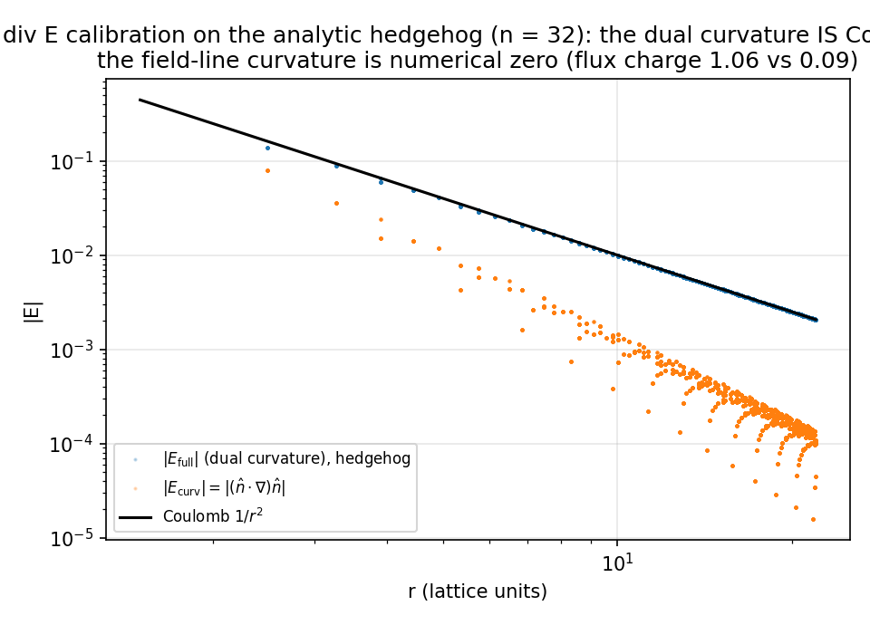
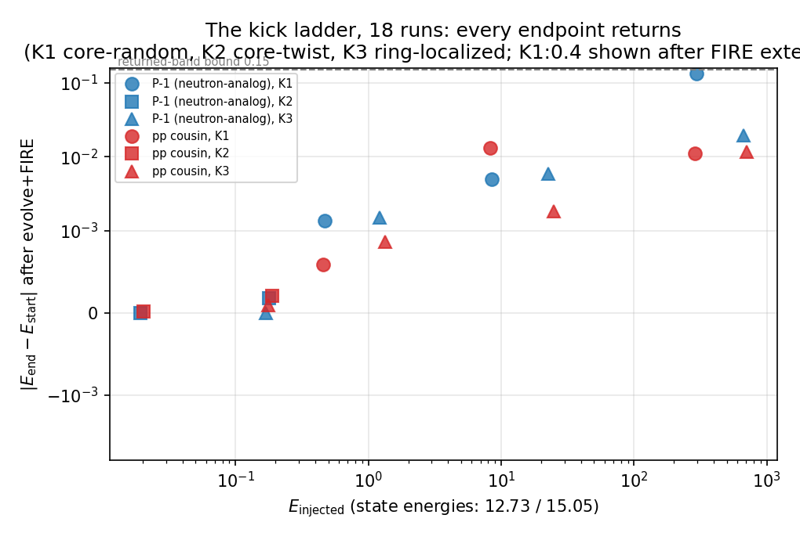
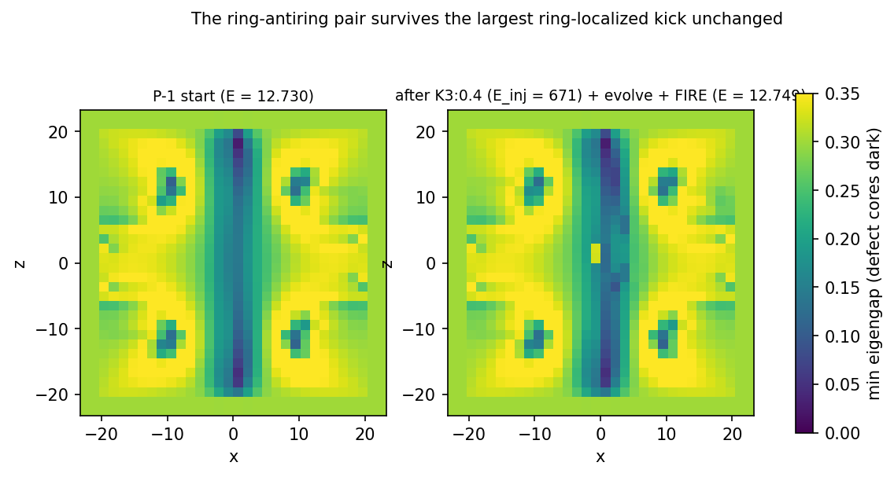

# M5.22.2: the div E electric instrument + the beta-decay probe on the neutral states

**Run record, 2026-08-05.** Rung 4 of the author ladder ([M5.22.2 task doc](../tasks/m5_22_2_task_details.md)); consumes the M5.22 census endpoints and the M5.22.1 objects. Everything below is at toy parameters (δ = 0.3, n = 32 pinned box L = 48, the certified T2 stack) unless stated. Convention: signed values are MATHEMATICAL topological orientation; the electric reading NEGATES them (the author's 2026-07-30 hedgehog convention, [census note § 7](m5_22_note.md)).

## 1. The equations (what the new code computes)

The 2026-08-02 correction ([convo](../tasks/m5_22_convo.md)): the M5.22.1 charge density (div B) "seems magnetic charge"; the electric charge needs div E, "for E being e.g. curvature of long axis here, or full as in arXiv 2108.07896". Both named variants were built:

**E_curv (the literal reading)**: the field-line curvature of the long axis n̂ (leading eigenvector of M),

```text
E_curv,i = (n̂ · ∇) n̂_i          rho = div E_curv / 4π
```

Lift-invariant (n̂ → −n̂ leaves it unchanged), so it needs no orientation fix-up.

**E_full (the paper form)**: arXiv 2108.07896 eq (3)-(4) build the connection and curvature from the unit field, Γ_μ = n̂ × ∂_μ n̂, R_μν = Γ_μ × Γ_ν = [n̂·(∂_μ n̂ × ∂_ν n̂)] n̂, and the DUAL tensor F* maps the space-space curvature to the ELECTRIC sector. The dual vector of the spatial curvature is

```text
E_full,k = (1/2) ε_kij  n̂ · (∂_i n̂ × ∂_j n̂)      rho = div E_full / 4π
```

which is numerically the SAME array the M5.22.1 moments called "B" (the oriented Mermin-Ho vector of the long axis). The continuum identity for the ideal hedgehog n̂ = r̂ gives E_full = r̂/r² exactly (Coulomb), which § 2 verifies on the lattice.

Charges are read three ways per variant: q_vol = Σ rho h³ over the interior (pin shell excluded), q_flux = the surface flux through centered cubes (the div read underreads ~11% at ring cores, [M5.22.1 note § 5b](m5_22_1_note.md)), and the moments p_z, Q2_zz, Q2_xx of rho.

Equation-to-code map (blob/main, frozen task files):

| Equation | Function | File |
| --- | --- | --- |
| E_curv | `e_curv` | [`m5_22_2_a_dive.py`](https://github.com/openwave-labs/openwave/blob/main/openwave/xperiments/m5_liquid_crystal/research/scripts/m5_22_2_a_dive.py) |
| E_full | `e_full` (= `mermin_B` of [`m5_21_4_a_pair.py`](https://github.com/openwave-labs/openwave/blob/main/openwave/xperiments/m5_liquid_crystal/research/scripts/m5_21_4_a_pair.py)) | same |
| q_vol, q_flux, moments | `variant_reads` | same |
| the frame-axis fork | `orient_axis`, `axes_mode` | same |
| K3 ring-localized kick | `kick_ring` | [`m5_22_2_b_decay.py`](https://github.com/openwave-labs/openwave/blob/main/openwave/xperiments/m5_liquid_crystal/research/scripts/m5_22_2_b_decay.py) |
| kick → damped evolve → FIRE | `decay_run` (leapfrog + sponge from [`m5_22_1_a_kick.py`](https://github.com/openwave-labs/openwave/blob/main/openwave/xperiments/m5_liquid_crystal/research/scripts/m5_22_1_a_kick.py), K1/K2 from [`m5_21_6_a_decay.py`](https://github.com/openwave-labs/openwave/blob/main/openwave/xperiments/m5_liquid_crystal/research/scripts/m5_21_6_a_decay.py)) | same |
| panels | `m5_22_2_c_panels.py` | [`m5_22_2_c_panels.py`](https://github.com/openwave-labs/openwave/blob/main/openwave/xperiments/m5_liquid_crystal/research/scripts/m5_22_2_c_panels.py) |

## 2. The instrument calibration (✅ measured; the discriminator between the two variants)

Controls with known electric content: the analytic hedgehog n̂ = r̂ (unit topological charge) and the relaxed census proton-analog P-0.5 and lepton E+0.5 endpoints (audit-exact |degree| = 1, topological −1 = electric +1).

| Control | E_full | E_curv |
| --- | --- | --- |
| Analytic hedgehog | ✅ Coulomb r̂/r² pointwise: median rel. err 0.7%, p90 2.0% (4 < r < 16); cube-flux charge +1.06 | charge 0.09 ≈ 0 (field lines are straight rays) |
| Proton-analog (topological −1) | ✅ q_vol −0.977, flux −1.05: quantized | ❌ q_vol +7.05, flux ladder 2.2 → 11.9: NOT quantized |
| Lepton ref (topological −1) | ✅ q_vol −0.974, flux −1.01: quantized | ❌ q_vol −4.43, flux ladder sign-inconsistent |



**The frame-axis fork** (which eigenframe axis carries the Gauss charge; the arXiv 2108.07896 eq (16) biaxial-sector question made machine-checkable): on the charged states only the LONG axis quantizes (half18 flux −1.02 / −1.01 / −1.01); the middle axis carries ≤ 0.34 and the short axis ≤ 0.01 (half18); on the neutral P-1 all three are ~0. The audit reproduced the split through a structurally different orientation path (rank-1 projectors), magnitudes matching; the global lift SIGN is unanchored between constructions, so magnitudes are the physics. Data: [`m5_22_2_dive_axes.json`](../data/m5_22_2_dive_axes.json).

**The verdict this rung can state**: of the two named variants, only E_full (the paper's dual curvature of the long axis) passes the Gauss-law calibration; the literal field-line curvature does not quantize on any control. Since E_full is numerically the array the M5.22.1 instrument already computed, the correction lands as a REREAD, not a recompute: under the paper's dual mapping (space-space curvature = electric sector) the M5.22.1 moment VALUES are electric-sector reads as they stand. 🔶 The dual mapping itself (space-space ↔ electric, not magnetic, for these static states) is the author's to confirm at the checkpoint; the calibration evidence (hedgehog E_full = Coulomb with the elementary charge as its Gauss integral, the physics the author's own Gauss-law panel states) is what we can measure.

**RESOLVED 2026-08-06** ([convo § 2026-08-06](../tasks/m5_22_convo.md)): the author confirms the electric read as the spatial F-tensor components, E = (F_23, F_31, F_12), with the longest-axis curvature as the basic form ("corresponding to Faber's n field"). The dual mapping stands; the residue is now instrumental only: the literal full-F object also carries contributions from the other eigenvalues and eigenvectors, staged as the [M5.22.4](../tasks/m5_22_4_task_details.md) opening add-on (expected near-identity for these states: the § 2 axis fork measured middle/short flux ≤ 0.34/0.01, an expectation to verify by diff, not assume).

## 3. The moment recompute (✅ measured)

Both variants on the pre-registered target set ([`m5_22_2_dive_all.json`](../data/m5_22_2_dive_all.json)); electric values = negated topological:

| State | E_full q (vol) | electric Q2_zz | E_curv q (vol, ❌ non-quantized) |
| --- | --- | --- | --- |
| Proton-analog n32 / n48 | −0.977 / −0.969 | −63.2 / −93.0 | +7.0 / +5.9 |
| Neutron-analog P-1 n32 / n48 | 0.000 / 0.000 (1e-12: exactly neutral) | −1.0 / −0.8 (≈ 0) | +28.1 / +29.7 |
| pp cousin | 0.000 | −0.37 (≈ 0) | +29.6 |
| Deuteron candidate n32 / n48 | −0.877 / −0.893 (div underread of −1) | **−21.8 / −61.5** | +3.2 / −0.7 |

**The § 8 question of the M5.22.1 note is answered**: the deuteron candidate's electric quadrupole sign stays NEGATIVE under the calibrated electric instrument at both resolutions. The tension vs the physical deuteron (+0.286 e·fm², positive) is real under this instrument and convention, not a magnetic-sector artifact; the dual mapping was author-confirmed 2026-08-06 (§ 2; [convo](../tasks/m5_22_convo.md)); what remains non-citable is the |Q2| magnitude (resolution-drifting 21.8 → 61.5).

## 4. The beta-decay probe (✅ measured: NO decay in 20 runs; the honest negative)

The protocol: endpoint → kick (masked to the free interior, shell exact; GK gates re-verified here: symmetry deviation and shell leak both 0.0e+00) → damped leapfrog evolve (3000 steps, dt = 0.025 GL1-verified, absorbing sponge at r > 0.8·half so the rings at r ≈ 16 sit undamped) → FIRE to the product basin. Targets: the census neutron-analog P-1 (the ring-antiring pair, the author's bineutron candidate) and the pp-control cousin (the second ring-antiring basin, E = 15.047). Expected channels (the author, 2026-08-02): n → p + e + ν; bineutron → p + n + e, or 2n.

| Kick | E_inj (P-1 / cousin) | Endpoint |
| --- | --- | --- |
| K1 core-random 0.05 / 0.15 / 0.4 | 0.47 / 8.5 / 295 | returned (the 0.4 blasts converge back under FIRE extension: E 12.86 vs 12.73, structure + charges intact; the P-1 endpoint keeps a 3-voxel residual blob at z ≈ +2.2, so "2 rings" there needs the ≥ 4-voxel component filter the audit flagged) |
| K2 core-twist 30° / 90° | 0.02 / 0.18 | returned (the twist kick injects ~nothing: the state is near-axisymmetric about z, itself a measured fact) |
| K3 ring-localized 0.02 / 0.05 / 0.15 / 0.4 | 0.17 → 671 | returned, every rung: the kicked ring re-forms at the same (ρ ≈ 10, z ≈ ±12) with slab charges ±1.04 unchanged; K3:0.4 shed 344 into the sponge line-integral and still landed at E_start + 0.019. ⚠️ "absorbed" is an instrument READING, not a closed ledger: the implicit damping divisor and the FIRE stage remove energy untracked (audit: 327 of the 671 injected is outside the ledger), so it bounds the emitted pulse from below only |





The K3 family exists because stage 1 measured a protocol gap: the K1 envelope exp(−(r/8)²) is origin-centered, so the rings at r ≈ 15.7 received weight ~0.02 while the column took the blast. K3 centers the envelope on one ring torus (the convert-one-neutron probe). Even so: no conversion.

**The verdict**: neither neutral state realizes any of the named channels under any probed kick; both are DEEP, robust minima (up to 53× the state energy injected, all shed and reabsorbed into the same basin). Per the author's own caveat this is a reportable outcome, not a failure: the missing 3×3 angular momenta "could qualitatively change behavior", and the dynamical rung [M5.22.4](../tasks/m5_22_4_task_details.md) (the ω-twist probe) is now the prime suspect for what a beta channel needs. The Sulich composite question (does the neutron-analog decompose as proton + electron under the kick) reads NO at this rung.

## 5. Not computed

| Item | Why |
| --- | --- |
| The β-spectrum SHAPE anchor | Gated on a decaying channel; none was found, so there is no product-energy ensemble to histogram |
| The full biaxial-frame F_μν (eq 16 sectors beyond the axis fork) | The per-axis flux fork covers the sector question this rung needed; the full 4×4 frame curvature belongs with [M5.22.4](../tasks/m5_22_4_task_details.md) |
| Kick families beyond K1/K2/K3 (e.g. paired-ring squeeze, column-targeted asymmetric) | Bounded by the rung budget; the three families + the widened amplitude ladders (20 runs) exhaust the pre-registered set + the measured-gap follow-up |
| n = 48 kick runs | The n = 32 verdict is uniform across 20 runs; resolution escalation deferred to any future decaying-channel candidate |
| \|Q2\| magnitudes as citable numbers | Resolution-drifting (21.8 → 61.5 for the candidate); signs only are cited |

## 6. Adversarial audit (✅ 7 PASS, 1 PARTIAL, 0 refuted; every catch adopted above)

Independent auditor, own implementations throughout (own analytic hedgehog + derivative-exact identity, own Levi-Civita dual vector, own slicing-based central differences, own divergence, own cube/slab fluxes, own eigengap ledger, own rank-1-projector axis orientation, own kick replication). Script: [`m5_22_2_e_audit.py`](https://github.com/openwave-labs/openwave/blob/main/openwave/xperiments/m5_liquid_crystal/research/scripts/m5_22_2_e_audit.py); verdicts: [`m5_22_2_audit.json`](../data/m5_22_2_audit.json).

| Claim | Verdict | Auditor's numbers |
| --- | --- | --- |
| Hedgehog calibration | ✅ PASS | analytic identity EXACT (max rel dev 3.5e-16: E_full = r̂/r² is a theorem, not a fit); FD median rel err 0.00700, p90 0.0201; own q_vol 0.999; the +6% flux excess is genuine face-sampling discretization |
| Instrument identity (E_full = the M5.22.1 "B") | ✅ PASS | max abs diff 0.0, both against the source delegation and an independent Levi-Civita contraction |
| Quantization split (full quantizes, curv does not) | ✅ PASS | full −0.977/−0.974; curv +7.05 with flux ladder 4.1 → 11.7, > 2 from any integer |
| Frame-axis fork | ✅ PASS | own construction: long \|1.02\|, middle 0.098, short 0.022 (half18); lift sign unanchored between constructions (magnitudes are the physics) |
| Deuteron quadrupole | ✅ PASS | own field + own div: +21.765 / +61.543, matching the M5.22.1 rows to 1e-6; the electric negation is convention |
| Returned verdicts (6 rows re-derived) | ⚠️ PARTIAL | all \|E_end − E_start\| ≤ 0.132, charges ±1.03-1.08, ring positions match; the literal "2 rings" fails on 1/6 rows (the P-1 K1:0.4 ext 3-voxel blob) without a ≥ 4-voxel filter: adopted in § 4 |
| K1-envelope gap | ✅ PASS | w_K1 = 0.022 at the ring center (0.036 ring-mean); w_K3 = 1.0 / 0.85 |
| Energy bookkeeping | ✅ PASS with caveat | E_injected replicated to 1e-5 (671.4243); "absorbed" is not a closed ledger (adopted in § 4) |

Audit defects adopted: the § 2 axis-fork values labeled half18 explicitly; the § 4 ring-count filter rule stated; the § 4 absorbed-energy caveat added.

## 7. Data and reproduction

| Artifact | Path / regen |
| --- | --- |
| Instrument + calibration | `python3 m5_22_2_a_dive.py calib` then `all` then `axes` (seconds each; [`../data/m5_22_2_dive_calib.json`](../data/m5_22_2_dive_calib.json), [`_all.json`](../data/m5_22_2_dive_all.json), [`_axes.json`](../data/m5_22_2_dive_axes.json)) |
| Kick runs | `python3 m5_22_2_b_decay.py stage1` (~10 runs × 11-20 min) + `stage2` (2 extends + 8 K3 runs, ~2.5 h); per-run rows `../data/m5_22_2_row_*.json` (tracked), endpoint arrays `m5_22_2_end_*.npz` (local-only, gitignored, kept) |
| Panels | `python3 m5_22_2_c_panels.py` (seconds) |
