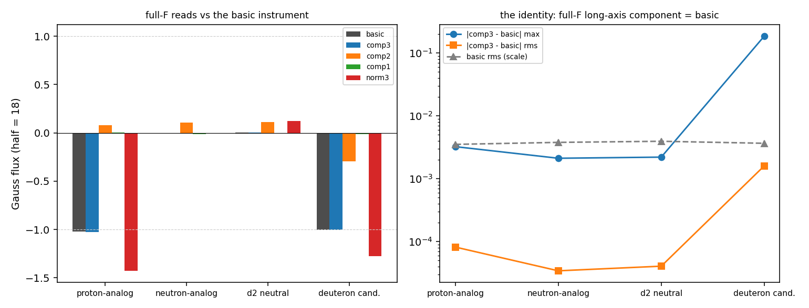
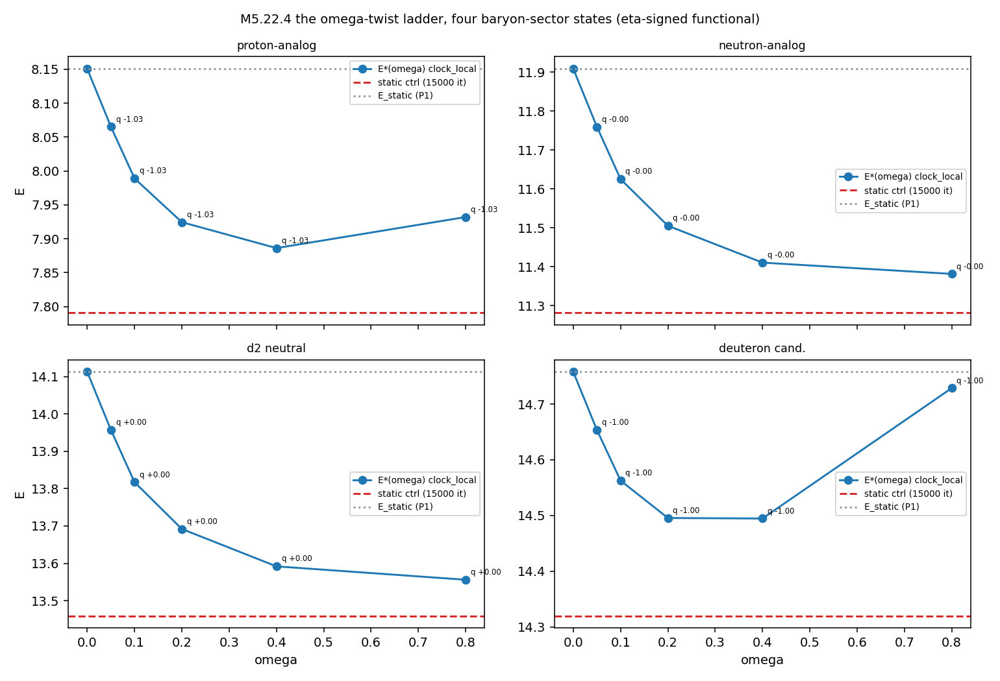

# M5.22.4 findings: the full-F electric instrument + the omega-twist ladder on the baryon states

Task record: [`tasks/m5_22_4_task_details.md`](../tasks/m5_22_4_task_details.md). The author inputs: the 2026-08-02 dynamical-minima directive and the 2026-08-06 full-F definition ([`m5_22_convo.md`](../tasks/m5_22_convo.md)). Scripts: [`m5_22_4_a_fullf.py`](../scripts/m5_22_4_a_fullf.py) (add-on), [`m5_22_4_b_omega.py`](../scripts/m5_22_4_b_omega.py) (ladder), [`m5_22_4_c_panels.py`](../scripts/m5_22_4_c_panels.py).

## 1. The full-F electric instrument (the opening add-on): built, and it CONTAINS the basic read exactly

The author's 2026-08-06 definition: the full electric field is the spatial coordinates of the arXiv 2108.07896 F tensor, E = (F_23, F_31, F_12), "containing contributions from other eigenvalues, eigenvectors"; the basic instrument (the [M5.22.2](../findings/m5_22_2_note.md) calibrated dual-curvature read) is the longest-axis curvature only.

The literal build (paper eq 5-8, static case): the oriented full eigenframe O = (e₁ short, e₂ middle, e₃ long; right-handed, the audited orientation machinery for e₃ and e₁, e₂ = e₃ × e₁), the connection Γ_i = O^T ∂_i O, the rotation vector Γ⃗_i = ((Γ_i)_32, (Γ_i)_13, (Γ_i)_21) (eq 7), the curvature R⃗_ij = Γ⃗_i × Γ⃗_j (eq 3/8), and E assembled from the space-space pairs mirroring `mermin_B` stacking.

**The derived identity (verified numerically, not assumed)**: expanding (Γ⃗_i × Γ⃗_j)₃ with (Γ)_32 = e₃·∂e₂ = −e₂·∂e₃ gives exactly e₃·(∂ᵢe₃ × ∂ⱼe₃), the basic instrument; the internal short/middle components are, by the same algebra, the Mermin-Ho densities of e₁/e₂, i.e. the objects whose flux the M5.22.2 axis fork already measured. **The full F therefore contains the basic read as its long-axis internal component, identically.** The residual difference is pure discretization (the frame build differentiates all three axes, the basic build only e₃).

| State | basic (half 18) | comp3 = full-F long | comp2 (middle) | comp1 (short) | norm read | identity diff (rms / max) |
| --- | --- | --- | --- | --- | --- | --- |
| analytic hedgehog (calib) | +1.043 | +1.040 | 3e-18 | −0.003 | +1.574 (≈ π/2, NOT quantized) | 4.4e-4 / 0.020 |
| proton-analog | −1.024 | −1.024 | +0.077 | +0.005 | −1.427 | 8e-5 / 0.003 |
| neutron-analog | −0.003 | −0.003 | +0.106 | −0.010 | −0.003 | 4e-5 / 0.002 |
| d2 neutral basin | +0.001 | +0.001 | +0.112 | −0.005 | +0.124 | 4e-5 / 0.002 |
| deuteron candidate | −1.007 | −1.006 | −0.295 | −0.014 | −1.274 | 1.6e-3 / 0.185 |

Reads: the long-axis component is the ONLY quantized one (calib states −1.05/−1.02 topological, hedgehog +1); the middle/short contributions stay non-quantized and small (≤ 0.30/0.014, matching the M5.22.2 axis-fork expectation ≤ 0.34/0.01); the signed-norm "all contributions" read is NOT charge-quantized anywhere (hedgehog ≈ π/2: geometric, not topological). The deuteron's larger max-pointwise diff (0.185) is core-localized; its flux agrees with basic to ~1e-3 (audit catch adopted: the tighter 6e-4 figure is specific to the `cube_flux` box convention, which snaps the center to index 16 giving an asymmetric half-18 cube; a symmetric one-voxel-narrower box moves the deuteron gap to 1.07e-3 and the fluxes by ~0.007, the quantized reads plateau-stable either way). **The M5.22.2 near-identity expectation is now a measured statement**: adopting the author's full form changes no charge read on any target state. The author's independent 2026-08-06 15:45 assessment, arriving after this measurement ran ([convo](../tasks/m5_22_convo.md)): the basic read "should be sufficient for most applications", the full form adding "QM fast twists (rather negligible)"; this section is the quantitative backing for that statement.

Data: `m5_22_4_fullf_calib.json`, `m5_22_4_fullf_all.json` (regen: `python3 m5_22_4_a_fullf.py calib|all`, ~1 min each).

## 2. The static 4D lift (P1): the states SURVIVE the lift, structure and charge intact

Each 3D endpoint (census T2 term) embedded block-diagonally into the 4×4 field (time row at vacuum −sg) and relaxed statically under the audited M5.21.3 stack (trace-target V4, sym stencil, FIRE 6000 it). The potential swap (T2 → trace-target) was the flagged risk; the reads say it deforms energies, not structure:

| Run | E seed → end | q_far seed → end | Ring cores (ledger th 0.1) | Stop |
| --- | --- | --- | --- | --- |
| proton-analog (s = +1) | 11.45 → 8.15 | −1.029 → −1.029 | central column (44 vox, z ±6.75) + axis singularities preserved | max_iter (contained) |
| neutron-analog (s = +1) | 17.57 → 11.91 | −0.0022 → −0.0022 | both rings preserved at ρ ≈ 10.3, z ≈ ±11-13, cores DEEPENED (2 → 6 vox each) | max_iter |
| d2 neutral basin (s = +1) | 19.92 → 14.11 | +0.0024 → +0.0024 | both rings preserved at ρ ≈ 10.1-10.2, z ≈ ±13-14, cores deepened (2 → 17 vox) | max_iter |
| deuteron candidate (s = +1) | 18.79 → 14.76 | −1.0023 → −1.0022 | column + both rings preserved at ρ ≈ 11.4, z ≈ ±5-7 | max_iter |
| neutron-analog (s = −1 spot-check) | 17.57 → 13.00 | −0.0022 → −0.0022 | same ring pattern as s = +1 | max_iter |

Block-diagonality exact in every run (max off-block element 0.0: static relaxation never leaves the spatial block, the M5.21.3 behavior reproduced). Endpoints are contained-not-converged (the known trace-target grind); ladder verdicts are read against the matched-depth static control (§ 4), never against the raw P1 energy. Mass ordering at the 4D static level: proton-analog 8.15 < neutron-analog 11.91 < d2 14.11 < deuteron 14.76 (same ordering as the census within the s = +1 branch).

## 3. The generator catalog (P2): the electron's kin sign table REPRODUCES on the baryons

kin(M; a0) per named generator at each P1 endpoint (η-metric, sign-indefinite by construction; a positive kin means the twist costs energy at rate ω²·kin, a negative kin is the signature channel):

| Run | clock_local (the directive twist) | plane_1d | rot_z | rot_x | boost_z | boost_x | twist linear term b |
| --- | --- | --- | --- | --- | --- | --- | --- |
| proton-analog | +0.231 | +0.291 | +0.200 | +0.265 | −0.086 | −0.074 | 0 (≤ 1e-13) |
| neutron-analog | +0.160 | +0.215 | +0.173 | +0.174 | −0.052 | −0.056 | 0 |
| d2 neutral basin | +0.154 | +0.187 | +0.160 | +0.153 | −0.044 | −0.051 | 0 |
| deuteron candidate | +0.639 | +0.688 | +0.239 | +0.773 | −0.331 | −0.150 | 0 (≤ 5e-11) |
| neutron-analog s = −1 | +0.161 | +0.217 | +0.175 | +0.175 | −0.054 | −0.054 | 0 |

(The "0" twist cells mean numerically zero: |b| ≤ 5e-11 across all runs with the induced |dE(k\*)| ≤ 1e-21; audit catch adopted: the tightest 1e-13 figure is proton-only, the deuteron's plane_1d b = 4.5e-11 is the loosest and still twelve orders below the kin scale.)

Reads: (1) **every rotation generator, including the author's named long-axis twist (`clock_local`), has kin > 0 on every baryon state, both branches**: the [M5.21.3](../tasks/m5_21_3_task_details.md) electron sign table transplants unchanged to the structured ring states; the negative channel stays the BOOST sector. (2) The axial-twist channel's linear coefficient is numerical zero on all five runs: **no spontaneous twist selection** on any baryon state (the electron's finding-7 null generalizes). (3) The deuteron carries the stiffest twist inertia (0.639) and the strongest negative boost channel (−0.331).

## 4. The omega-ladder (P3): NO minimum at omega > 0 on any baryon state, the decoupling exact

E\*(ω) = min_M [E_static(M) + ω²·kin(M; clock_local)] per state, warm-started rungs ω = 0.05 → 0.8 (3000 it each), read against the matched-depth static control (ω = 0, 15000 it), the [M5.21.3](../tasks/m5_21_3_task_details.md) methodology verbatim:

| State | E_static (P1) | ctrl (15000 it) | E\*(0.05) − ctrl | E\*(0.1) − ctrl | E\*(0.2) − ctrl | E\*(0.4) − ctrl | E\*(0.8) − ctrl | ω²·kin at 0.8 | static parts at 0.8 vs ctrl |
| --- | --- | --- | --- | --- | --- | --- | --- | --- | --- |
| proton-analog | 8.151 | 7.791 | +0.275 | +0.198 | +0.134 | +0.095 | +0.141 | 0.143 | 7.790 vs 7.791 |
| neutron-analog | 11.908 | 11.281 | +0.478 | +0.344 | +0.224 | +0.129 | +0.100 | 0.101 | 11.281 vs 11.281 |
| d2 neutral basin | 14.112 | 13.459 | +0.498 | +0.358 | +0.233 | +0.133 | +0.097 | 0.097 | 13.459 vs 13.459 |
| deuteron candidate | 14.758 | 14.320 | +0.334 | +0.243 | +0.176 | +0.175 | +0.409 | 0.408 | 14.320 vs 14.320 |

**The verdict, per state: the minimum sits at ω = 0.** Every rung on every state lies ABOVE the matched-depth static control; the raw E(ω) decline along the ladder is pure relaxation grind (the control descends further at the same cumulative depth). The M5.21.3 electron decoupling reproduces EXACTLY on the structured states: at the final rung the re-relaxed static parts equal the control to 3-4 decimals on all four states (audit catch adopted: the proton is the boundary case at 1.3e-3, the other three sit at 4-6e-4), and the whole ladder offset is +ω²·kin with kin positive and nearly ω-independent (proton 0.223-0.231; neutron 0.157-0.160; d2 0.152-0.154; deuteron 0.638-0.646). The twist neither finds a new basin nor deforms the profile: it is a rigid quadratic cost on top of whatever the statics do. Charges are preserved along every rung (proton −1.029, neutron −0.002, d2 +0.003, deuteron −1.002, unchanged to 3 decimals).

**What this says against the directive**: at the toy 3×3-lifted-to-4D stack, constant-frequency twists of the long axis do NOT convert any baryon-sector state into a dynamical minimum, exactly as they did not for the electron; the boost sector remains the only negative-kin channel (§ 3), and it was already characterized in M5.21.3 as a stationary-point-free slope. If the author's dynamical baryons exist in this framework, they need either the full 4×4 dynamics beyond the constant-ω ansatz, or the "more physical parameters" the author's 2026-08-06 reply names alongside the dynamics, or both. The honest negative is the deliverable: the constant-ω approximation of the directive is now measured on all four states.

## 5. Adversarial audit: 5 PASS, 0 refuted; all catches adopted

Independent auditor (own script [`m5_22_4_e_audit.py`](../scripts/m5_22_4_e_audit.py), own finite differences / curvature / flux integrator / kin / static functional; only the audited `orient_v1` borrowed for orientation; results [`m5_22_4_audit.json`](../data/m5_22_4_audit.json), reruns end-to-end in ~1 s):

| Claim | Verdict | Key evidence |
| --- | --- | --- |
| C1 the frame identity, all three components | ✅ PASS | 3 random smooth Rodrigues frames: worst relative error 8.7e-3 at the fine grid, shrinking 3.6-3.9× on h-halving = clean O(h²) convergence to zero, for ALL THREE internal components |
| C2 the full-F flux table | ✅ PASS | Own frame build + flux: all four comp3/basic values reproduced; the identity diffs reproduced; the box-placement catch adopted in § 1 |
| C3 the kin sign table | ✅ PASS | Own a0 + own kin: prot clock +0.2314 / boost_z −0.0862, deut clock +0.6387 / boost_z −0.3309, matching to full precision |
| C4 the ladder verdict | ✅ PASS | All 20 rungs above their control (margins +0.095 to +0.498); E = E_u + E_v + ω²·kin to < 1e-9 per rung; own static functional on the ω = 0.8 proton endpoint agrees to 1.6e-5 (float32 round-trip); the proton boundary-case catch adopted in § 4 |
| C5 charge preservation | ✅ PASS | Own flux on the ω = 0.8 endpoints: proton \|Δq\| = 1.3e-5, deuteron 1.2e-4 |

Auditor's scope note (recorded as stated): the exact-zero C2/C3 agreements mean the implementations follow the stated definitions bit-identically; the genuinely independent evidence is C1 (synthetic frames, convergence order), the alternative box placement, and the C4 functional recompute.
