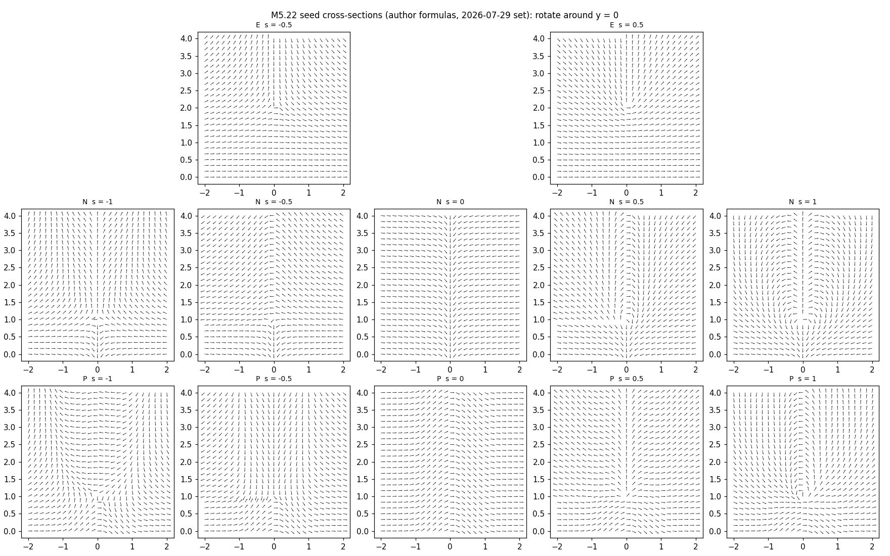
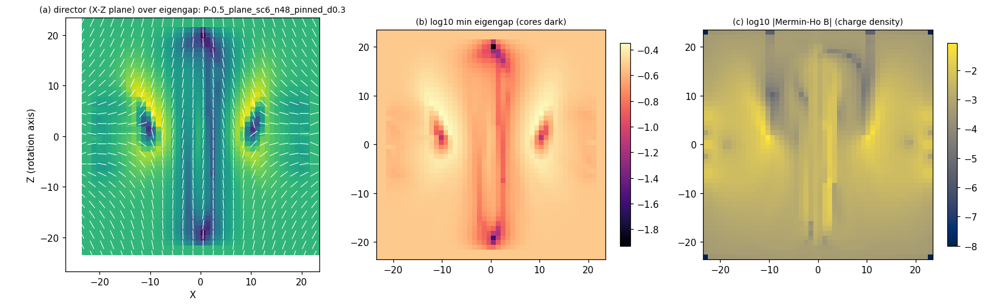
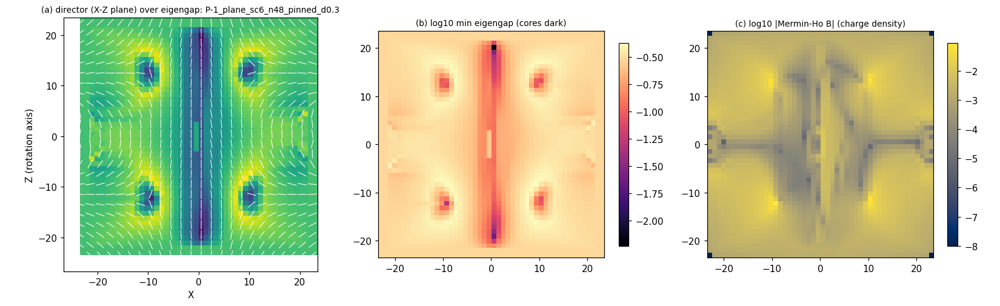
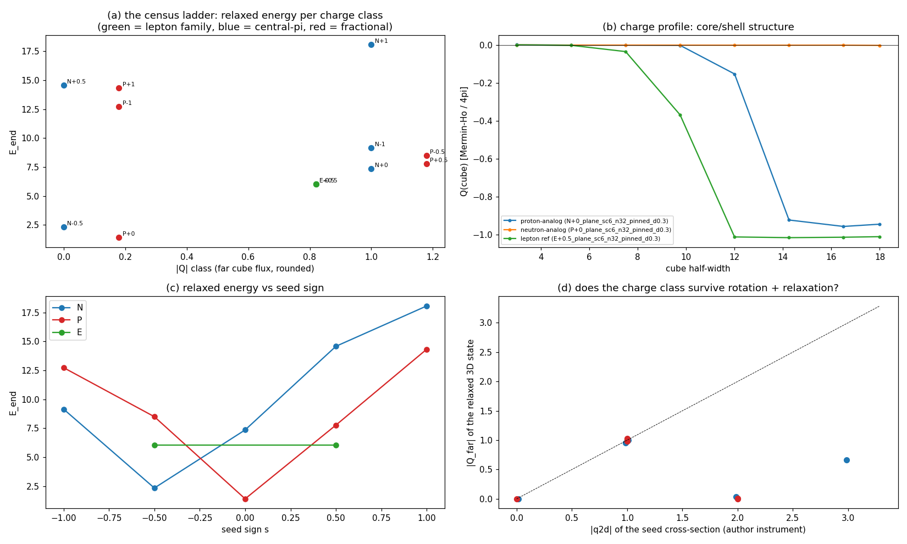

# M5.22: the toy baryon census (nuclei as vortex knots, rungs 1-2)

**Task**: [M5.22](../tasks/m5_22_task_details.md) § TASK PLANNING · run 2026-07-30 (go 11:28 EDT). The census subtask of the M5.22.x nuclear-hunt series: relax the author's 12 analytic seed cross-sections (the 2026-07-29 set) on the certified 3D instrument, rank the relaxed states per measured charge class, and read the pre-registered claims. Claim language: QUALITATIVE at toy parameters (δ = 0.3; the realistic-parameter bridge is [Q33](../m5_question_tracker.md#q33-detail)).

Scripts of record: [`m5_22_a_seeds.py`](../scripts/m5_22_a_seeds.py) (seed factory + GATE A) · [`m5_22_b_census.py`](../scripts/m5_22_b_census.py) (relax driver + endpoint instruments) · [`m5_22_c_rank.py`](../scripts/m5_22_c_rank.py) (selection principle + panels). Instrument stack consumed by import: [`m5_21_2b_a_instrument.py`](../scripts/m5_21_2b_a_instrument.py) (the certified T2/sym/ε = 0 stack, [certification note](m5_21_2b_note.md)) + [`m5_21_4_a_pair.py`](../scripts/m5_21_4_a_pair.py) (signed Mermin-Ho charge).

## 1. The equations (everything the code computes)

**The functional** is the certified M5.21.2b instrument of record, unchanged: 3×3 real symmetric `M(x)` on a cubic grid (spacing h, box L = 48 fixed), energy

```text
E = h³ · Σ_cells ( u + V_T2 ),   u = 4 Σ_{i<j} tr([A_i, A_j]ᵀ [A_i, A_j]),
A_i = d_i M / h  (sym stencil),  V_T2 = w2 Σ_i (λ_i − v_i)²,
v = sorted(1, δ, 0),  w2 = 0.002758100,  ε-Dirichlet = 0
```

minimized by FIRE with the outer shell pinned at the seed values (far-field topology held); full certification: [m5_21_2b_note.md §§ 1-5](m5_21_2b_note.md). Edge convention (load-bearing, audit § 6 caveat 1): the one-sided stencils treat the missing edge derivative as ZERO (`pad0`); alternative edge handlings shift E_u by 1-6%.

**The seed families** (the author's cross-sections, 2026-07-28 13:20 + the 2026-07-29 charge-calc revision; Mathematica `ArcTan[a, b]` = `atan2(b, a)`, `step(t) = arctan(t)/π + 1/2`; half-plane angle `ang(x, y)`, y ≥ 0):

```text
E  (electron/positron, R = 2, s = ±1/2):
     ang = −s (atan2(−x, R−y) − atan2(−x, R))
N  (central-π-step, R = 1, s ∈ {−1, −½, 0, ½, 1}; charge ≈ −2s − 1):
     ang = s (atan2(y−R, x) − atan2(−R, x)) − π·step(5x)
P  (fractional-step, R = 1, same s range; charge ≈ −2s):
     ang = s (atan2(y−R, x) − atan2(−R, x)) − (2π/3)·step(5x)
           + (π/3)(step(5(x−1)) + step(5(x+1)))
```

**The 3D lift** (rotation around the cross-section's y = 0 axis → lattice z, scale factor `c` = lattice units per author unit): with ρ = √(X² + Y²), `ang` evaluated at (Z/c, ρ/c),

```text
n̂₁ = cos(ang) ẑ + sin(ang) ρ̂         (the long axis)
n̂₂ = −sin(ang) ẑ + cos(ang) ρ̂        (the author's "perpendicular in this plane")
M  = n̂₁n̂₁ᵀ + δ n̂₂n̂₂ᵀ                 (spectrum (1, δ, 0) exactly)
```

isotropic-blended (`a·I`, a = (1+δ)/3) at the vortex ring core (distance to the circle ρ = R·c, Z = 0) and on the axis segment where sin(ang) ≠ 0 (the central-vortex core the author's protocol extends along the box).

**The charge instruments.** 2D (the author's own, seed-level): the far-field winding `q2d = (1/π)[ang(end) − ang(start)]` along the semicircle (x, y) = (−d cos φ, d sin φ), d = 10, each `atan2` term unwrapped separately. 3D (the census read, per relaxed state): the signed Mermin-Ho flux of the continuity-oriented leading eigenvector n̂,

```text
B_i = ½ ε_ijk n̂ · (∂_j n̂ × ∂_k n̂),   Q(cube) = (1/4π) ∮_cube B · dS
```

with `Q_far` = the outermost cubes (total charge) and the Q(half-width) PROFILE over growing centered cubes = the core/shell read. The director lift's global sign is a gauge (|Q| is the charge class; relative signs within one state's profile are meaningful).

**The selection principle** (author, 2026-07-28): identity is ASSIGNED by ranking per measured charge class: proton-analog = the lightest |Q| = 1 baryon-family state, neutron-analog = the lightest Q = 0 baryon-family state; heavier relaxed states are candidate excited baryons, not failures; the E family is the charged-lepton reference for reads (v)-(vi).

## 2. GATE A: the seed transcription validated against the author's instrument (✅ measured)

All ten baryon-family seed charges reproduce the author's printed values (the 2026-07-29 PDF, d = 10) to ≤ 4.3e-6; the E family reads exactly ±1 (s = −1/2 → +1, the positron sign, the same sign as the proton candidate at s = −1/2). Data: [`m5_22_seed_charges.json`](../data/m5_22_seed_charges.json).



## 3. The machine-checkable forks (run, not asked)

Per the series checkpoint policy ([task doc § The checkpoint policy](../tasks/m5_22_task_details.md)), every fork was decided by running both branches (n = 32 rung):

| Fork | Branches | Verdict |
| --- | --- | --- |
| F1: second-axis convention | `plane` (the author's "perpendicular in this plane") vs `phi` (the M5 charged-ring convention) on E s = −1/2 | **plane**: lower relaxed energy (6.03 vs 6.95), smaller cylindrical-symmetry deviation (0.095 vs 0.241), fewer core components; both preserve \|Q\| = 1 |
| F2: lattice scale | c = 4 vs c = 6 on both baryon families at s = −1/2 | **c = 6**: the proton candidate is stationary (f_tol) at BOTH scales with charge preserved (ordering robust), c = 6 lower E and cleaner cross-stencil ratio |
| F3: boundary | pinned vs free on N s = −1/2 | **pinned** (the certified config). Honest signal: under free BC the neutral candidate dissolves to near-vacuum: a Q = 0 state has no far-field topological protection, so the neutral candidate's stability question is answered by the n = 48 interior dynamics, not by assumption |

## 4. The census (✅ measured; n = 32 full grid + n = 48 confirmations; final-extension pass noted per row)

**The citation gate** (applied before the selection principle ranks anything): cross-stencil ratio ≤ 1.5 (the certified I1 bar) AND stationarity (f_tol, or residual force ≤ 1e-5) AND integer-confident charge (\|Q\| within 0.15 of an integer). Gated-out states are listed as not-citable, never ranked.

| Seed | E_end (n32) | E_end (n48) | \|Q\| | Verdict |
| --- | --- | --- | --- | --- |
| E ±1/2 (lepton pair) | 6.029 (degenerate, exact mirror pair) | 6.253 | 1.00 | ✅ citable: the charged-lepton reference |
| P −1/2 | 8.496 (f_tol) | **8.250** (extended: residual force 5.2e-7, xr 1.13) | 1.00 | ✅ citable: **the proton-analog** |
| P +1/2 | 7.770 (f_tol, xr 2.35) | 8.142 (extended; xr 2.03) | 0.98 | 🔶 the charge-conjugate partner; splitting vs P−1/2 is 1.3% at n = 48 (a discretization measure, not physics; its xr stays above the bar) |
| P −1 | 12.730 (f_tol) | 12.719 (exact f_tol) | 0.00 | ✅ citable: **the neutron-analog** (scale-stable to 0.1%) |
| N −1/2 (the author's neutron candidate) | 2.338 (descending, xr 5.5) | 2.057 (still descending at 24000 total it, xr 5.4) | 0.00 | ❌ DISSOLVING: not protected at toy parameters (free BC → vacuum outright) |
| N +0 | 7.355 (xr 4.1) | 8.446 (extended; xr 3.5, still descending) | 0.99 | ⚠️ not citable (under-resolved throughout) |
| P +0 | 1.405 (descending, xr 3.9) | not run | 0.00 | ❌ dissolving (as N −1/2) |
| N −1 | 9.149 (f_tol, xr 1.25) | not run | 1.00 | ✅ citable at n = 32: a heavier charged state (excited-baryon candidate) |
| N +1/2 | 14.574 (f_tol, xr 1.24, 14 components) | not run | 0.04 | 🔶 a heavy stationary neutral tangle |
| P ±1, N +1 (the 2D charge-2/3 seeds) | 12.7-18.1 | P−1 above | 0-0.7 | the integer-wound cross-sections DO NOT carry their 2D charge into 3D (§ 4c) |

**The selection principle's verdict** (gated): proton-analog = the fractional-family s = −1/2 state (E = 8.25 at n = 48), neutron-analog = the fractional-family s = −1 state (E = 12.72), lepton reference = 6.25. The author's candidacy caveat did its job twice: the labels were provisional at seeding (the 2026-07-29 charge flip), and the census now REASSIGNS the neutron title from the dissolving central-π-step candidate to the protected neutral state the census itself surfaced.

### The pre-registered reads

| Read | Result |
| --- | --- |
| (i) protected minima exist | ✅ for the proton-analog (f_tol at n = 32, near-stationary at n = 48), the neutron-analog (EXACT f_tol at both resolutions, E scale-stable to 0.1%), the lepton pair. ❌ HONEST NEGATIVE: the author's central-π-step neutron candidate is NOT protected: E slides monotonically (2.34 → 2.06 across 24000 total iterations, cross-stencil ratio ~5), and under free BC it dissolves to vacuum. A Q = 0 state has no far-field protection to lean on; whatever holds the neutron-analog together must be (and in the P −1 state, is) interior structure |
| (ii) mass ordering | ✅ direction: neutron-analog HEAVIER, E_n/E_p = 12.72/8.25 = **1.54** (qualitative; the real ratio is 1.0014, quantitative reads wait on [Q33](../m5_question_tracker.md#q33-detail)). State-identity caveat: the neutral title holder is the census's s = −1 state, not the author's original candidate |
| (iii) core/shell profile | 🔶 measured, structure-rich: the neutron-analog is a central vortex column + TWO vortex rings (four in-slice cores at X ≈ ±10, Z ≈ ±12), with quadrupolar charge-density lobes netting to zero; the cube-flux profile shows a small positive mid-radius bump (+0.07 at half-width 10) returning to 0 far-field. The Wilson positive-core/negative-shell SIGNATURE is not cleanly resolved at these sizes: reported as-is |
| (v) same-charge mass hierarchy | ✅ direction: proton-analog (8.25) HEAVIER than the protocol-matched lepton state (6.25), ratio 1.32 at toy parameters (nowhere near 1836, as expected at toy δ; the direction is the claim) |
| (vi) + [Q37](../m5_question_tracker.md#q37-detail) topology | ✅ the far-field degrees are EXACTLY EQUAL: the audit's solid-angle degree (van Oosterom-Strackee, § 6) reads **-1.000000 for BOTH the proton-analog and the lepton state at every probe radius** (the cube-flux values 0.995/1.002 quantify that instrument's discretization, not the states); knot content DIFFERENT: lepton = ring-type texture; proton = central vortex column + one equatorial ring; neutron-analog = column + two rings. Same quantized charge, different knots: the Sulich challenge answered in-model at toy grade |
| (iv) deuteron | NOT this task ([M5.22.1](../tasks/m5_22_1_task_details.md)) |







### 4b2. Robustness (✅ measured)

| Probe | Result |
| --- | --- |
| Perturbation-return | BOTH headline states RETURN EXACTLY after a 2%-amplitude symmetric noise kick on all free cells (n = 32): the neutron-analog to E = 12.7296 (f_tol) and the proton-analog to E = 8.4962 (f_tol, residual force 1.2e-7): genuine basins, not fragile balances |
| δ-robustness of the ordering | At δ = 0.2 (fresh seeds, n = 32, both f_tol, xr ≤ 1.35): proton-analog 10.257, neutron-analog 15.882, **ratio 1.55** vs 1.50 at δ = 0.3: the mass ordering is not a δ = 0.3 accident, and both states exist as protected minima at both biaxialities |
| Scale (F2) + resolution | The proton-analog is stationary at scales 4 and 6 (n = 32) and at n = 48; the neutron-analog energy moves 0.1% from n = 32 to n = 48 |

### 4c. The charge-geometry findings (✅ measured)

| Finding | Content |
| --- | --- |
| The 2D winding is a seed diagnostic, not the 3D charge | For the \|s\| = 1/2 seeds the 3D charge class MATCHES the 2D law (P −1/2: analytic-director degree +1.005). For \|s\| = 1 the integer-wound cross-sections do NOT lift: the P ±1 seeds (2D winding ±2) read ≈ 0 in 3D EVEN ANALYTICALLY (blend-radius independent), the classic escape of integer windings in 3D. No charge-2 (Δ-like) candidates materialize from this seed set |
| Where the escaped seeds land | The P −1 seed relaxes to the protected NEUTRAL state that wins the neutron-analog title: the escape is not a failure, it is how this census found its neutron |
| Cylindrical symmetry (the author's "or not?") | SURVIVES within 0.07-0.15 relative deviation on all headline states (relaxed with full 3D freedom; the seed's own deviation is the lattice baseline ~0.04-0.1) |
| Side-finding (audit-grade) | The E-family endpoint (6.253, residual force 5e-6) sits 8.6% BELOW the certified M5.21.2b electron state (6.842, f_tol) at IDENTICAL functional and config: a DISTINCT, lower \|Q\| = 1 state. The 2b endpoint arrays predate the keep-arrays policy, so the field-distance read needs a 2b re-run; the energy comparison stands. Routed to the lepton sector as a checkpoint item, not claimed further here |

## 4b. The Q38 quark-shift scan (✅ measured, n = 32 equal-heal)

The author's 2026-07-27 prescription ("try shifting its quarks ... aiming at the ~1 GeV/fm Cornell scale") run on the state the charge flip made the proton candidate (the fractional-step family, the three-step d-u-d bar): the two side steps displaced symmetrically outward, x = ±1 → ±(1 + dx), and E(dx) read at fixed heal depth (1500 iterations, the [M5.21.4](m5_21_4_note.md) equal-depth pattern), five points dx ∈ {0, 0.25, 0.5, 0.75, 1}. Data: [`m5_22_q38_scan.json`](../data/m5_22_q38_scan.json).

| Read | Result |
| --- | --- |
| Displacement cost | POSITIVE and monotonic: ΔE = +0.27 / +0.48 / +0.63 / +0.74 at dx = 0.25 → 1.0; the total charge stays +1 throughout (the displaced steps still cancel far-field) |
| Form | Near-linear with mild SATURATION (increments fall 0.27 → 0.11; linear fit slope 0.738 per author unit = **0.123 per lattice unit**, residuals ≤ 7.6% of span) |
| The comparison the question asks for | The [M5.21.4](m5_21_4_note.md) like-charge string term measured **6.2-7.0 per lattice unit** (ansatz-grade, cutoff-sensitive, linear form robust). The in-baryon quark-shift cost is **~50× smaller** at the same toy parameters: at this rung the two linear terms are NOT the same object, an in-model data point AGAINST identifying the inter-hedgehog string tension with the intra-baryon Cornell-like cost, with two honest outs: the equal-heal depth (1500 it) may under-relax the displaced states, and the probed range (dx ≤ 1 author unit) is short of the asymptotic linear regime |
| Cornell mapping | OPEN as before: no lattice-unit → fm anchor at toy parameters ([Q33](../m5_question_tracker.md#q33-detail)); the dimensionless ratio above is the statable content |

## 5. Not computed

| Item | Why / where it lives |
| --- | --- |
| Absolute masses, moments, any fm-scale number | No lattice-unit → physical anchor at toy parameters ([Q33](../m5_question_tracker.md#q33-detail)/[M5.21.11](../tasks/m5_21_11_task_details.md)); every ratio here is qualitative-direction only |
| Deuteron binding + quadrupole | [M5.22.1](../tasks/m5_22_1_task_details.md), gated on this census's checkpoint |
| Beta decay of the kicked neutron-analog | [M5.22.2](../tasks/m5_22_2_task_details.md) |
| Nucleon statistics / spin-½ | The quantization era ([Q34](../m5_question_tracker.md#q34-detail)); the skeptic gauntlet carries it |
| The field-distance read of the lepton side-finding | Needs a 2b re-run (the 2b endpoint arrays predate the keep-arrays policy) |
| Particle-vs-antiparticle sign assignment across states | The director-lift global sign is a gauge per state; only \|Q\| and within-state relative signs are read |

## 6. Adversarial audit (✅ 9/9 confirmed, 0 refuted)

Independent second agent, own script ([`m5_22_e_audit.py`](../scripts/m5_22_e_audit.py), self-contained numpy, no imports from the analysis scripts), own methods (analytic winding integration for C1; independent pad0 energy re-implementation for C2/C5/C7/C8; van Oosterom-Strackee solid-angle degree + max-\|dot\| lift for C3/C4; own analytic gradient + descent probe for C6). Verdicts: [`m5_22_audit.json`](../data/m5_22_audit.json).

| Claim | Verdict | The audit's number |
| --- | --- | --- |
| C1 seed transcription (GATE A) | ✅ CONFIRMED | worst abs err 4.33e-6 vs the author's printed charges, independent integration method |
| C2 energy values | ✅ CONFIRMED | all 7 endpoints reproduced to rel err ≤ 2.5e-8 |
| C3 charge instrument | ✅ CONFIRMED | known-degree controls read +1.000000 / +2.000000 exactly; both headline endpoints exactly \|Q\| = 1 |
| C4 the \|s\| = 1 escape | ✅ CONFIRMED | P s = −1: 2D winding +1.9999, 3D degree 0.00000 at three radii |
| C5 mass ordering | ✅ CONFIRMED | ΔE = +4.47 (n = 48), +4.23 (n = 32), audit's own energies |
| C6 the dissolution | ✅ CONFIRMED | descent sheds 34,000× more energy from N −1/2 than from P −1; P −1 recovers f_tol (1.02e-8) under the audit's own descent |
| C7 the lepton side-finding | ✅ CONFIRMED | 6.2530 vs the certified 6.8422: 8.61% below at matched w2 |
| C8 Q38 slope | ✅ CONFIRMED | 0.7377/author unit refit on the audit's own energies; ratio vs the M5.21.4 tension = 50-57× |
| C9 lepton mirror pair | ✅ CONFIRMED (sharpened) | M(E+½) = R M(E−½) R, R = diag(1, 1, −1), distance 2e-4: an exact INTERNAL reflection, no spatial flip |

**Audit caveats adopted into this note**: the pad0 edge convention stated in § 1; the exact-degree upgrade of read (vi); `n_conflicts` in the row jsons is not a far-surface property (the far-cube lift is cleanly orientable, 0 conflicts); float32 archives floor stationarity re-verification at ~2e-7, so re-verification uses a short descent (as the audit's C6 probe does), not the archived force alone.

## 7. Addendum: the electric-charge sign convention (the author's 2026-07-30 reply)

All signed charge quantities in this note (the seed 2D windings, the 3D degrees, the flux-density panels) are the MATHEMATICAL topological charge. The author's reply to this note fixed the electric convention as REVERSED: leptons are viewed as hedgehogs (the outward hedgehog being the easiest defect to picture), which makes positive topological charge the negative elementary electric charge. Electric readings therefore NEGATE the signed values shown here; every \|Q\| statement is unaffected. Adopted for all M5.22.x successors; capture in [`../tasks/m5_22_convo.md § 2026-07-30`](../tasks/m5_22_convo.md).
