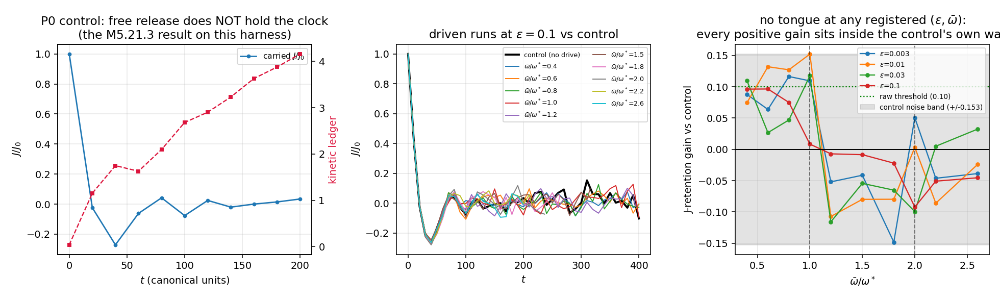
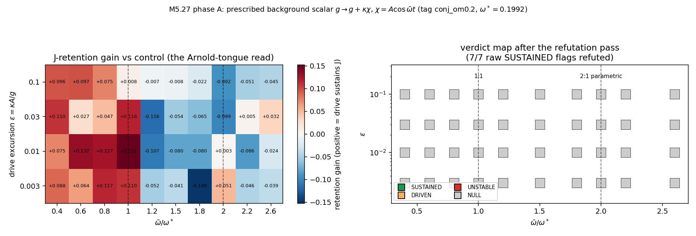
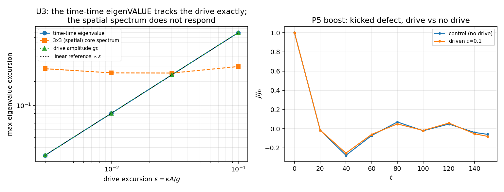

# M5.27 phase A: the background-scalar time sector (entrainment pilot), method note

**Result in one line**: a prescribed uniform background scalar coupled to the spectrum as `g → g + κχ` does NOT entrain the clock, at any registered `(κ, ω̄)`, and the reason is structural rather than a parameter miss: on the block-diagonal states the staged 4×4 runs, the drive force commutes with `M`, so it moves eigenVALUES with coefficient 1.000 and exerts exactly zero torque on the eigenFRAME that carries the clock.

Task record: [`../tasks/m5_27_task_details.md`](../tasks/m5_27_task_details.md) · roadmap: [`../m5_roadmap.md`](../m5_roadmap.md) · run date 2026-07-24 · arch Metal (Apple M4), taichi 1.7.4, f32.

## 1. Equations first

The verified-L spectral potential, unchanged from the frozen Lagrangian:

```text
V4(M) = w  Sum_{p=1..4} ( t_p - C_p )^2 ,      t_p = tr( (M eta)^p )
C_p   = sg^p + 1 + delta^p ,                   eta = diag(-1, 1, 1, 1)
vacuum: M_vac = diag(-sg, 1, delta, 0)         (V4 = 0 exactly)
w = 7.24023879e-4 (locked WSCALE),  g = 8.0,  delta = 0.5
```

The pilot's ONLY modification is that the background scalar enters through `sg`:

```text
chi(t) = A cos(om_bar t) ,   A = 1
sg(t)  = g + kappa chi(t) = g ( 1 + eps cos(om_bar t) ) ,   eps = kappa A / g
```

Only the product `kappa A` enters the equations of motion, so the phase-A knob
space is `(eps, om_bar)`, two knobs and not three. The equation of motion is the
certified canonical one with `sg` sampled per step at the leapfrog midpoint:

```text
d^2M/dt^2 = c^2 Sum_alpha d_alpha G_alpha  -  dV4/dM (M; sg(t))
```

The two derivatives the run needs, both exact:

```text
dV4/dM   = Sum_p 2 w (t_p - C_p) p sym[ (eta (M eta)^(p-1))^T ]
dV4/dsg  = -2 w Sum_p p sg^(p-1) (t_p - C_p)          (t_p carries no sg)
```

`dV4/dsg` is the drive-power ledger line: the work the prescribed background
does on the field is `P(t) = (dV4/dsg) (dsg/dt)`, summed over cells.

## 2. Equation-to-code map

| Equation | Function | File:line |
| --- | --- | --- |
| `V4` (production) | `v4_of` | [`engine2_pde.py:985`](https://github.com/openwave-labs/openwave/blob/main/openwave/xperiments/m5_liquid_crystal/engine2_pde.py#L985) |
| `dV4/dM` (production) | `dv4_of` | [`engine2_pde.py:1008`](https://github.com/openwave-labs/openwave/blob/main/openwave/xperiments/m5_liquid_crystal/engine2_pde.py#L1008) |
| the leapfrog step that RECEIVES `sg` | `evolve_M_eta_finish` | [`engine2_pde.py:1118`](https://github.com/openwave-labs/openwave/blob/main/openwave/xperiments/m5_liquid_crystal/engine2_pde.py#L1118) |
| `sg(t)` (the whole drive) | `sg_of` | [`../scripts/m5_27_a_harness.py`](../scripts/m5_27_a_harness.py) |
| `dV4/dsg` ledger | `dv4_dsg_sum_k` | [`../scripts/m5_27_a_harness.py`](../scripts/m5_27_a_harness.py) |
| clock phase (apolar, unwrapped) | `PhaseTracker` | [`../scripts/m5_27_a_harness.py`](../scripts/m5_27_a_harness.py) |
| carried isorotation charge `J` | `read_carried_j` | [`engine2_pde.py:1593`](https://github.com/openwave-labs/openwave/blob/main/openwave/xperiments/m5_liquid_crystal/engine2_pde.py#L1593) |
| gates | - | [`../scripts/m5_27_b_gates.py`](../scripts/m5_27_b_gates.py) |
| lock scan P0-P3 | - | [`../scripts/m5_27_c_lockscan.py`](../scripts/m5_27_c_lockscan.py) |
| adversarial audit | - | [`../scripts/m5_27_d_audit.py`](../scripts/m5_27_d_audit.py) |
| refutation pass | - | [`../scripts/m5_27_h_refute.py`](../scripts/m5_27_h_refute.py) |

**No engine file was modified.** The drive is entirely host-side: `sg` is already
a per-call kernel argument, and all of its influence sits in `C_p`.

## 3. Gates (all green before any scan point was read)

| Gate | Result |
| --- | --- |
| G-box | stiff M00 mode `omega_M00 = 78.28`; box modes `n pi/L` = 0.070, 0.140, 0.209, ... (spacing 0.070, so they are DENSE across the scan window and one sits within 5% of `omega* = 0.1992`: marked, and the box-size discriminator is the tool, not avoidance) |
| G-vac | driven defect-free box tracks the analytic adiabatic vacuum to 1.6e-4 relative, zero spurious interior gradient; BOUNDARY DECISION = `track` |
| G-power | taichi ledger vs independent f64 numpy: `dV4/dsg` rel 8.2e-5, `V4` rel 7.9e-6 (f32 grid-sum level); numpy FD truncation falls 4.00x on halving h, confirming the analytic form exact |
| G-phase | unwrapped apolar phase gives rate -0.0136 vs the predicted visible rate 0.01603 (ratio 0.85) |
| G-reg | fixed-J live hold reproduces the delivered M5.23.2 anchor: J 0.19923 → 0.19872 over 100 steps (anchor -0.29%) |
| G-static | core spatial spectrum survives the drive at eps = 0.03 (max shift 0.33, no topology loss) |
| G-dt | Kapitza window `om_bar = 10` resolvable at the certified dt (126 steps/cycle), stable |

## 4. The control, which reframed the whole pilot

Free release of the fixed-J endpoint does **not** hold the clock: over `t = 200`
the carried isorotation charge falls `J: 0.19923 → 0.00673` (a 96.6% loss) while
the kinetic ledger grows ~100x. This is the [M5.21.3](../tasks/m5_21_3_task_details.md)
no-free-clock result, now quantified on this harness.

So the operative question is not "does an existing oscillator lock" (there is no
persistent free oscillator to lock) but the task's own § 3 decisive detail: **does
the background SUPPLY the J-budget that the fixed-J constraint imposes by hand?**
All verdicts are read against this control.



## 5. What is measured, and what had to be corrected to measure it

Two ledger corrections were forced during the run, both logged as deviations.

| Correction | Why |
| --- | --- |
| ramp registered in TIME, not drive cycles | a 5-cycle ramp is 158 time units at the low `om_bar` end, consuming most of a 200-unit run. Re-registered as `RAMP_T = 60` (~2 clock periods) |
| kinetic + drive power VACUUM-REFERENCED | at `eps = 0.1, om_bar = omega*` a defect run reads kin 225 / P -9115, while a DEFECT-FREE box under the identical drive reads kin 208 / P -9449. The whole box breathes, so raw kin and power are ~90% common-mode |

The carried `J` and the clock phase need **no** reference and are the clean primary
observables: the driven vacuum carries `J = 0.0` exactly at every sample (the clock
flow `a0` is off-diagonal in the spatial block while the drive moves only `M00`),
and the phase probe reads spatial eigenvectors that a uniform drive leaves fixed.

## 6. The tongue map: NULL at all 40 points

Registered grid: `eps` ∈ {0.003, 0.01, 0.03, 0.1} × `om_bar/omega*` ∈ {0.4, 0.6,
0.8, 1.0, 1.2, 1.5, 1.8, 2.0, 2.2, 2.6}, covering the 1:1 AND the 2:1 parametric
tongue, with an adiabatic ramp and ≥ 15 drive cycles per point.



The raw scan flagged 7 of 40 points SUSTAINED against the pre-registered threshold
`gain > 0.10`. **That threshold was frozen before the control's noise amplitude was
known, and it turned out to sit below it.** All 7 were then refuted on four
independent grounds:

| Refuter | Content |
| --- | --- |
| R1 noise band | the control's own late-time `abs(J)` reaches 0.0304 = **0.153 in retention units**; every candidate gain (0.110 to 0.152) is at or below its own control's wander |
| R2 zero crossing | the control's J decays THROUGH zero (ends at -0.021); each candidate's `abs(J_final)` (0.001 to 0.010) is far inside the noise band, so a positive "gain" is two numbers both consistent with zero |
| R3 tongue shape | an Arnold tongue WIDENS with drive amplitude. Candidates per eps: 2, 3, 2, **0** across eps = 0.003, 0.01, 0.03, 0.1. Zero candidates at the LARGEST drive is the opposite of entrainment |
| R4 phase coherence | candidate phase rates are 1.6e-4 to 3.6e-3, consistent with zero and far from both the undriven release rate (0.016) and the drive rate. No clock is running to be locked |

**7 of 7 refuted; corrected verdict map: NULL at all 40 points.**

## 7. Why: the mechanism (the audit's catch)

The adversarial audit ([`../scripts/m5_27_d_audit.py`](../scripts/m5_27_d_audit.py),
independent numpy f64, own stencil, own gradient, own integrator) **caught an
error in the first version of this explanation and replaced it with a sharper
one.** The claim had been that the drive force is a polynomial in `M` and so
commutes with it. That is FALSE in general: `eta (M eta)^(p-1)` interleaves `eta`,
and for an `M` carrying mixed `(0,i)` entries the commutator is nonzero.

The corrected, measured statement:

```text
dF/dsg = -2 w Sum_p p^2 sg^(p-1) sym[ (eta (M eta)^(p-1))^T ]

|| [dF/dsg , M] || (relative)  =  1.38e-02    with the mixed (0,i) block present
                               =  4.54e-21    on BLOCK-DIAGONAL M  (machine zero)
```

On block-diagonal states `eta` restricts to the identity on the spatial block, so
`eta (M eta)^(p-1)` restricts to `(M_sp)^(p-1)`, a genuine polynomial in `M_sp`,
which commutes with it. **The uniform spectral drive can therefore move
eigenvalues but cannot torque the eigenframe that carries the clock.**

Two independent measurements complete the picture:

| Measurement | Result |
| --- | --- |
| **U3, the eigenvalue authority** | the time-time eigenvalue excursion equals the drive amplitude `g·eps` with ratio **0.999, 0.996, 0.999, 0.999** across `eps` = 0.003 → 0.1 (log-log slope **alpha = 1.000**), while the spatial spectrum shows no eps dependence at all. The drive has complete authority over eigenvalues and none over the frame |
| **P7a, the invariant manifold** | with the mixed-block projection DISABLED and block-diagonal initial data, the largest `(0,i)` entry reached over a whole run is **exactly 0.0**. The block-diagonal sector is dynamically invariant: a uniform background scalar cannot even excite the channel that would carry the coupling |



So the phase-A null is over-determined: the drive cannot torque the frame on
block-diagonal states, and the dynamics never leaves the block-diagonal states.

## 8. Can the mixed block carry it? (P7, outcome c)

Seeding the `(0,i)` block by hand and running driven goes **non-finite at t = 16.8
(seed 0.005) and t = 13.8 (seed 0.05)**. This is the pre-registered outcome (c) and
it is exactly what [M5.21.3](../tasks/m5_21_3_task_details.md) predicts: all 24
time-mixing curvatures are negative, so the unprojected sector is unstable. The
dynamical test therefore cannot isolate the coupling, and the algebraic result of
§ 7 stands on its own.

## 9. Independent confirmation

The audit reproduced the central negative on a completely separate build (numpy
f64, plain Laplacian curvature instead of the eta-flux scheme, its own seed and
kick): J retention control +0.088 vs driven 1:1 +0.052 and driven 2:1 -0.125, i.e.
no sustain, on a different discretization. Audit tally **5/5**, including the
energy-ledger closure `dE = +23.39` vs explicit drive work `+22.67`.

## 10. Not computed (explicit)

| Item | Status |
| --- | --- |
| P3 drive-off discriminator | not triggered: it applies only to a surviving lock, and none survived |
| mu re-read under lock | not computed: the M5.21.5 protocol re-read is meaningful only under a lock |
| dynamical chi (phase B) | out of pilot scope by design (task doc § 2c) |
| gravity / two-defect Bjerknes channel | phase B only: a prescribed uniform background cannot be sourced by defects by construction |
| Kapitza window physics | gate measured (resolvable, stable), the window itself not scanned: the lock window came back structurally null, so a second window buys nothing until the coupling channel exists |
| absolute-scale bridge | untouched, still [Q33](../m5_question_tracker.md#q33-detail) |

## 11. What this pilot settles, and what it recommends

It settles the fork branch it was built to test. The economy argument of the
proposal (one scalar instead of four mixed components) is correct about parameter
count and wrong about physics: the cheap component is cheap precisely because it
does not touch the sector the time face needs. A background scalar coupled to the
spectral targets is an eigenvalue actuator, and the clock is an eigenframe
rotation.

Recommendation for the record: **do not build phase B (dynamical chi) on this
coupling.** A dynamical chi coupled the same way inherits the same commutator and
the same invariant manifold; it would gain a radiation channel and an energy
sector while still not reaching the clock. If the background-wave idea is carried
forward, the coupling must act on the mixed `(0,i)` block (or otherwise
non-commutingly on `M`), and that block is measured unstable under the current L,
which routes the question back to the Lagrangian-level work the author flagged as
needing soliton specialists.
