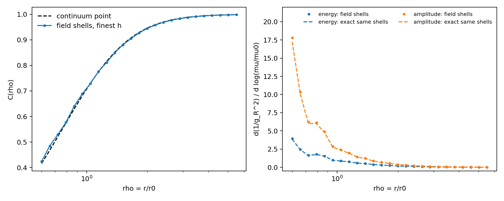

# M5/Faber curvature scale curve: field measurement and coupling-convention boundary

**Status:** classical single-ansatz form-factor instrument complete and independently audited. It does not measure a renormalized coupling, does not change `MODELS.md`, and awaits task allocation/model-owner input on the missing source/action dictionary. Coordination and preregistration: [Discussion #438](https://github.com/openwave-labs/openwave/discussions/438).

## 1. Equations first

### 1.1 Field, connection, and curvature

This task evaluates the same regularized hedgehog as M5.6.4b:

\[
q_0(\mathbf x)=\frac{r_0}{\sqrt{r^2+r_0^2}},\qquad
\mathbf q(\mathbf x)=\frac{\mathbf x}{\sqrt{r^2+r_0^2}},
\]

\[
\boldsymbol\Gamma_i
=q_0\partial_i\mathbf q-(\partial_iq_0)\mathbf q
+\mathbf q\times\partial_i\mathbf q,
\qquad
\mathbf R_{ij}=\boldsymbol\Gamma_i\times\boldsymbol\Gamma_j.
\]

The grid uses a nonperiodic second-order centered derivative,

\[
\partial_i f(\mathbf x)=\frac{f(\mathbf x+h\hat e_i)-f(\mathbf x-h\hat e_i)}{2h}
+O(h^2),
\]

and excludes the undefined boundary planes. This removes the periodic `np.roll` boundary assumption in the original onset script.

### 1.2 Convention-free observable and exact oracle

With \(\rho=r/r_0\), the measured dimensionless shell observable is

\[
C(\rho)=\left\langle r^2
\sqrt{\sum_{i<j}\lVert\mathbf R_{ij}\rVert^2}
\right\rangle_{|r/r_0-\rho|<0.16}.
\]

Direct differentiation of the displayed hedgehog gives

\[
\boldsymbol\Gamma_i
=\frac{r_0\hat e_i+\mathbf x\times\hat e_i}{r^2+r_0^2},
\]

and therefore the continuum pointwise oracle

\[
\lVert R\rVert
=\frac{\sqrt{r^2+3r_0^2}}{(r^2+r_0^2)^{3/2}},
\qquad
C_{point}(\rho)
=\frac{\rho^2\sqrt{\rho^2+3}}{(\rho^2+1)^{3/2}}.
\]

For \(\mu/\mu_0=1/\rho\),

\[
\frac{d\log C_{point}}{d\log\mu}
=-\frac{6}{(\rho^2+1)(\rho^2+3)}.
\]

The numerical field is compared with the exact expression averaged over the identical grid shells, so finite shell width is not misclassified as discretization error.

### 1.3 The unresolved coupling dictionary

The field calculation fixes \(C(\rho)\); it does not by itself say whether the curvature amplitude is proportional to \(g_R\) or \(g_R^2\). Both preregistered readings are therefore reported, with the farthest shell \(C_{ref}=C(5.5)\):

\[
\text{energy/action reading:}\quad
\frac{g_R^2}{g_{ref}^2}=\frac{C}{C_{ref}},\qquad
\frac{d(1/g_R^2)}{d\log\mu}
=\frac{6(C_{ref}/C)}{(\rho^2+1)(\rho^2+3)},
\]

\[
\text{field-amplitude reading:}\quad
\frac{g_R}{g_{ref}}=\frac{C}{C_{ref}},\qquad
\frac{d(1/g_R^2)}{d\log\mu}
=\frac{12(C_{ref}/C)^2}{(\rho^2+1)(\rho^2+3)}.
\]

Here \(g_{ref}=1\) is only a dimensionless reference normalization. The M5 source/action dictionary—not agreement with a target beta function—must select between these readings. The raw \(C\) curve remains usable if neither is selected.

## 2. Equation-to-code map

| Object | Auditable implementation |
| --- | --- |
| \(q_0,\mathbf q\) | [`regularized_hedgehog`](https://github.com/vantasnerdan/openwave/blob/substrate-claim-dump/openwave/xperiments/m5_liquid_crystal/research/scripts/m5_coupling_curvature_field.py#L33-L44) |
| Nonperiodic \(\partial_i\) | [`centered_difference`](https://github.com/vantasnerdan/openwave/blob/substrate-claim-dump/openwave/xperiments/m5_liquid_crystal/research/scripts/m5_coupling_curvature_field.py#L47-L57) |
| \(\Gamma_i\) and \(R_{ij}\) | [`connection` and `curvature_magnitude`](https://github.com/vantasnerdan/openwave/blob/substrate-claim-dump/openwave/xperiments/m5_liquid_crystal/research/scripts/m5_coupling_curvature_field.py#L60-L86) |
| Exact \(\lVert R\rVert,C,d\log C/d\log\mu\) | [`analytic_*`](https://github.com/vantasnerdan/openwave/blob/substrate-claim-dump/openwave/xperiments/m5_liquid_crystal/research/scripts/m5_coupling_curvature_field.py#L89-L103) |
| Shell observable \(C\) | [`shell_profile`](https://github.com/vantasnerdan/openwave/blob/substrate-claim-dump/openwave/xperiments/m5_liquid_crystal/research/scripts/m5_coupling_curvature_field.py#L106-L124) |
| Two conditional coupling readings and derivative methods | [`local_polynomial_derivative` and `coupling_interpretations`](https://github.com/vantasnerdan/openwave/blob/substrate-claim-dump/openwave/xperiments/m5_liquid_crystal/research/scripts/m5_coupling_curvature_field.py#L161-L197) |
| Spatial ladder, fixed-\(h\) box-invariance check, and exact-shell gates | [`run`](https://github.com/vantasnerdan/openwave/blob/substrate-claim-dump/openwave/xperiments/m5_liquid_crystal/research/scripts/m5_coupling_curvature_scan.py#L53-L108) |
| Load-bearing mutations | [`run`, mutation block](https://github.com/vantasnerdan/openwave/blob/substrate-claim-dump/openwave/xperiments/m5_liquid_crystal/research/scripts/m5_coupling_curvature_scan.py#L107-L146) |

## 3. Results against frozen gates

The deterministic run takes approximately 2.5 seconds on the contributor machine. It scans 25 logarithmic radii over \(0.6\le\rho\le5.5\).

| Check | Result | Frozen gate | Verdict |
| --- | ---: | ---: | --- |
| Field/exact-shell relative \(L^2\), \(h/r_0=0.4000\) | 2.394% | diagnostic | — |
| Field/exact-shell relative \(L^2\), \(h/r_0=0.2667\) | 1.085% | diagnostic | — |
| Field/exact-shell relative \(L^2\), \(h/r_0=0.2000\) | 0.609% | diagnostic | — |
| Field/exact-shell relative \(L^2\), \(h/r_0=0.1509\) | **0.348%** | < 3% and improves | PASS |
| Fixed-\(h/r_0=0.3\) box invariance, \(L/r_0=7.2,9,12\) | \(6.1\times10^{-15}\) | < 0.5% | PASS |
| Energy-reading derivative: gradient vs local cubic | 4.21% | < 8% | PASS |
| Amplitude-reading derivative: gradient vs local cubic | 5.39% | < 8% | PASS |
| Energy-reading slope vs exact-shell oracle | 2.00% | < 3% | PASS |
| Amplitude-reading slope vs exact-shell oracle | 2.81% | < 3% | PASS |
| Full-connection far-field exponent for \(\lVert R\rVert\) | **−1.970** | \(|p+2|<0.2\) | PASS |

The measured raw field curve rises from \(C(0.6)=0.4240\) to \(C(5.5)=0.9982\): this is the resolved scale-dependence curve behind the earlier five-shell onset statement. It is a classical core form factor approaching a Coulomb plateau, not a constant one-loop slope. On the preregistered derivative interior, \(0.722\le\rho\le4.573\), the local-cubic inverse-coupling slope falls from 1.663 to 0.0122 under the energy/action reading and from 6.211 to 0.0243 under the amplitude reading. The two samples at either endpoint are diagnostic only. These dimensionless values are normalization- and scheme-conditional and are not \(b_0\).



## 4. Mutation sensitivity

Removing \(\mathbf q\times\partial_i\mathbf q\) from \(\Gamma_i\) changes the measured far-field curvature exponent from −1.970 to −3.723. The Coulomb plateau therefore depends on the advertised non-Abelian connection term.

Scaling \(\Gamma\to1.2\Gamma\) changes raw \(C\) by exactly \(1.2^2=1.44\), while the far-normalized curve is invariant to \(<10^{-12}\). This distinguishes the load-bearing raw normalization from the normalization-free shape.

## 5. What this contributes—and what it does not

This contribution supplies:

- a dense field-derived \(C(\rho)\) curve from the reviewer-named M5.6.4b setup;
- a nonperiodic finite-difference instrument with fixed-scale spatial refinement and a fixed-\(h\) box-invariance check;
- two numerical derivative estimators and an exact same-shell oracle;
- explicit, machine-readable coupling-convention alternatives;
- mutation-sensitive evidence and tracked JSON/plot outputs.

Not computed:

- the source/action normalization that selects \(C\propto g_R\) or \(C\propto g_R^2\);
- a QFT beta function or an M5-to-SU(3)/QCD field identification;
- a stationary two-core potential- or force-scheme coupling;
- \(b_0\), an effective flavour count, or any fit selected by a comparator.

Accordingly this is a reusable classical scale-curve instrument and a qualified advance on the running-coupling measurement path. The independent audit REFUTED interpreting it as a measured renormalized coupling or beta-function coefficient. The MODELS row remains open until the model supplies the coupling dictionary or a stronger two-core scheme measures it.

No Substrate code or private URL is imported. The two conditional inverse-coupling transformations are rederived above so this public contribution stands on its own.

## 6. Reproduction

From the repository root:

```bash
python3 openwave/xperiments/m5_liquid_crystal/research/scripts/m5_coupling_curvature_scan.py
```

Outputs:

- [`m5_coupling_curvature_scan.json`](../data/m5_coupling_curvature_scan.json)
- [`m5_coupling_curvature_scan.png`](../plots/m5_coupling_curvature_scan.png)

## 7. Independent adversarial audit

The audit imports neither contribution module. It rederives the identities exactly in SymPy, reconstructs the field with a five-point fourth-order stencil on fresh grids, differentiates with SciPy `CubicSpline`, applies wrong-scale and connection-term mutations, and reruns byte-for-byte determinism. Script: [`m5_coupling_curvature_audit.py`](https://github.com/vantasnerdan/openwave/blob/substrate-claim-dump/openwave/xperiments/m5_liquid_crystal/research/scripts/m5_coupling_curvature_audit.py); record: [`m5_coupling_curvature_audit.json`](../data/m5_coupling_curvature_audit.json).

All 16 mathematical gates pass. Claim-level verdicts are 5 CONFIRMED, 3 PARTIAL, and 1 REFUTED:

| Claim under attack | Verdict | Disposition |
| --- | --- | --- |
| Exact \(\Gamma_i,\lVert R\rVert,C,d\log C/d\log\mu\) identities | CONFIRMED | SymPy exact zero residuals. |
| Second-order shell curve and spatial convergence | CONFIRMED | Independent fourth-order shell error improves from 0.2037% to 0.0351%; its \(n=61\) curve agrees with the primary second-order curve within 1.062%. |
| Fixed-\(h\) ladder as domain refinement | PARTIAL | Reworded throughout as box invariance: identical local shell points explain the null spread and there is no boundary solve. |
| Two conditional inverse-coupling formulas | CONFIRMED | Independent spline slope errors on the validated interior are 0.0063% and 0.0448%. |
| Endpoint slopes covered by the frozen derivative gate | PARTIAL | Endpoint values are now labeled diagnostic; the quoted range uses only the validated interior. |
| Removing \(\mathbf q\times\partial_i\mathbf q\) destroys the plateau | CONFIRMED | Independent exact mutation reproduces exponents −1.9733 and −3.7270. |
| \(\Gamma\) rescaling as an independent mutation | PARTIAL | The arithmetic is correct but tautological; retained only as a normalization covariance check. |
| Scan measures a renormalized coupling or beta coefficient | **REFUTED** | The status, conclusions, and not-computed boundary explicitly retain classical single-ansatz form-factor scope. |
| Explicit not-computed list keeps instrument scope | CONFIRMED | No \(b_0\), flavour, QCD map, or two-core force is claimed. |

Every scope correction is adopted above.
