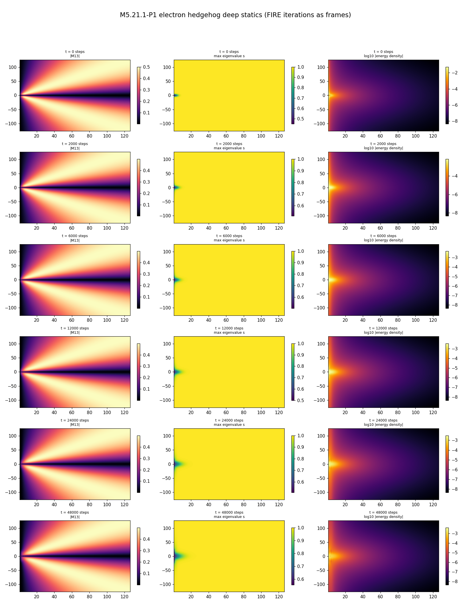

# M5 visualization standards

The single source for the M5 research visualization conventions: film-strip templates, title/time standards, and the snapshot-instrument catalog. Implementation: [`scripts/m5_film.py`](scripts/m5_film.py) (the standard API) + [`scripts/m5_21_a_snap.py`](scripts/m5_21_a_snap.py) (the reusable snapshot instrument, built at [M5.21](tasks/m5_21_task_details.md)). Adopted 2026-07-14 (during the [M5.20.3](tasks/m5_20_3_task_details.md) run); it SUPERSEDES the 2026-07-14-morning per-series presentation boundary (M5.20 series = seed/endpoint maps only, M5.21 series = its own film format): both series now emit film strips from the shared template set.

## Viz Needs

- flux mesh of energies
- electric/magnetic field
- scalar + vector viz
- magnitude + direction views
- glyphs

enumeration:

- charge
- mass/energy
- deBroglie clock/ZBW, particle stability
- LC director vector
- angular momentum, spin, magnetic moment
- **2-particle attraction/repulsion**
- **Coulomb**, force fields (ele-mag-grav)
- EM waves
- and thermal energy in the future if it lands

| Phenomenon | What it is in M5 | Visualization |
| --- | --- | --- |
| **Electric / charge** | `E = ∇·n̂` (director splay): the radial hedgehog diverging at the core like Coulomb charge | **Pure static 3D geometry** — already done (`WAVE_MENU` 6 + E glyph). 3D is enough; no time-projection |
| **Magnetic / spin** | `B = ∇×n̂` (curl): *zero* for a static radial hedgehog, appears only from the clock's circulation | A **shadow of the time axis** (sourced by the clock), but its spatial curl pattern is 3D-renderable |
| **Gravity** | boost-tilt of the 4×4 time axis (GEM ∝ (b·g)²): gravitational time dilation | A **shadow of the time axis** |

## The observable catalog — what each quantity IS

This part organizes the full observable wishlist for the EM + clock-state rendering into one coherent
catalog: **the physical quantities to display, what each *is* in the substrate, and the render
channel that conveys it.** The channels are how we will *read* the field's amplitude/clock state and
*watch* its dynamics in the simulator.

Everything visible derives from `M`'s **eigenframe** — the director `n̂` (principal eigenvector) +
the δ-axis (middle eigenvector) + the deviation `M−D`. Two source families: **EM = orientation
distortion of `n̂`** (tilts/gradients), **the clock's rotational state** = its `(A, ω)` (of the
`clock_twist`). The director is the origin of both EM observables (`∇·n̂`, `∇×n̂`). **Status reflects the
as-built stack through VIZ.4 (2026-05-31).** The 4 glyph states (UI checkboxes, §4.2): `0` Director,
`1` Director + Delta, `2` Electric Field, `3` Magnetic Field; all glyphs **centered** on the voxel.

| Quantity | What it IS in the substrate | Scalar / vector | Source field (live) | Status |
| --- | --- | --- | --- | --- |
| **Director `n̂`** | principal eigenvector of `M` (largest λ=`1`, the EM axis) — the LC "grain"; apolar (`n̂≡−n̂`), unit | unit vector | `director_nhat` | ✅ live — glyph states 0/1, COLOR_MEDIUM, centered+barbless |
| **δ-axis (middle eigenvector)** | the middle eigen-axis (eigenvalue `δ~ℏ`; L1 figure's `b`) — the **QM/twist** axis = the clock-hand that sweeps around `n̂`; apolar, shorter (∝ λ₂/λ₁) | unit vector | `director_mid` | ✅ live — **VIZ.3: CYAN cross-bar in "Director + Delta" (glyph state 1)**; the ellipsoid-wireframe "+" |
| **Electric field lines** | the director field itself (E ∝ the `n̂` texture); convention: lines point **+ → −** | vector (= `n̂`) | `director_nhat` | ✅ live — glyph state 2, centered+barbed; single **GREEN** / gradient greenyellow charge |
| **Charge density** | `∇·n̂` (director splay) — diverges at defect cores like Coulomb charge | signed scalar | `director_div_field` | ✅ live (WM6, greenyellow diverging) |
| **Charge sign** | sign of `∇·n̂` (+ outward / − inward hedgehog) | sign | `director_div_field` sign | ⚠️ flips under Evolve-PDE → §4.4 fix (M5.8 winding density) |
| **Magnetic field lines** | the curl vector `∇×n̂` — direction = circulation; handedness N→S | vector | `director_curl_field` (raw vector stored) | ✅ live — glyph state 3, centered+barbed; single **ORANGE** / gradient **bluered N/S** (radial `B·r̂` + γ-spread, §4.3) |
| **Magnetic field strength** | `‖∇×n̂‖` (`frank_twist`+bend circulation magnitude) — ≈0 for a static charge | scalar ≥0 | `director_curl_mag_field` | ✅ live (WM7) |
| **Magnetic moment μ** | net `∮ B` of the defect / its dipole axis — a single vector per defect | vector (per defect) | future: ∫ `director_curl_field`; **now: HARDCODED `DIPOLE_AXIS`** | 🔶 **HARDCODED placeholder** — VIZ.4 draws a YELLOW moment glyph but `m̂ = DIPOLE_AXIS = +ẑ` is a constant in `_viz_sample_dipole` (`update_moment_glyph`), **NOT computed from the field**. Real μ = compute from the actual circulating B (`m̂ ∝ ∫∇×n̂`) + auto-axis + **remove the hardcoded one** @ M5.8 (§4.5, roadmap 5f stage-2) |
| **Amplitude `A`** | `‖M−D‖_F` EMA = the clock's rotational **radius** (`≈δ/2`), grows with excitation | scalar | `amp_local_emarms_am` | ✅ live (WM2, ironbow) |
| **Clock `ω`** | `‖Ṁ‖_F` EMA = the Zitterbewegung rate (director angular speed) | scalar | `freq_local_cross_rHz` | ✅ live (WM3, blueprint) |
| **Gravitational field `g`** | gradient of the boost eigenvalue `g` (mass monopole, `1/r²`) — the 4D addition | vector | none yet (needs 4×4 `M`) | 🚧 M5.8 / §4.7 (PURPLE glyph + density mesh) |

> **Zitterbewegung note (from `0c §L7`):** the amplitude `A` is the *radius* of the spinning
> director (constant at ground state, `≈δ/2`), `ω` its rate — the two are the AM/FM channels. WM2 +
> WM3 already show them.

## Film strips

A film strip is a grid: **one row per snapshot (time), one column per plot defined by the TEMPLATE**. Rendered by `m5_film.film_strip(states, path, template=..., ...)`.

### Templates

| Template | Columns (left to right) | Lineage / use |
| --- | --- | --- |
| `basic` | \|M13\| (magma) · max spatial eigenvalue s (viridis) · log10 \|energy density\| (inferno) | the M5.20-series cross-section format (`m5_20_1_endpoints.png` era); the cross-series DEFAULT: winding structure + order parameter + energy localization at a glance |
| `thermal` | glyphs (director + δ-tick clock) · A (spectral amplitude) · clock (phase) · energy · charge · curl | the M5.21 panel set (`m5_21_c_film_prod.png` era); directed at thermal / energy-flow analysis: amplitude-excess, clock-phase, and transport channels |

Adding a template = one entry in `m5_film.py` + one row here.

### The standard (applies to every template)

| Rule | Detail |
| --- | --- |
| First row = t = 0 | The seed state ALWAYS opens the strip (`film_strip` raises if `states[0]["t"] != 0`) |
| Title format | Every row is titled `t = <steps> steps`, plus `\| <t·time_unit_s> s` (scientific notation) when a tu → s calibration is passed. ⚠️ No anchored tu → s value exists yet in the M5 stack (the unit map is author-gated, the M5.12 A1/A2 residual): the internal model-time value is NOT shown (user call 2026-07-14); the `time_unit_s` parameter is wired and the seconds field appears the moment a calibration lands |
| Snapshot count | A parameter, default **N_SNAP = 6** (the seed + 5 shots); capture times from `m5_film.pick_frame_ts(T, n)` (evenly spaced, first = 0) |
| Blowup runs: the takeoff tail | Blowup strips use 7 rows: 1 seed + 3 quiet + 3 takeoff, log-spaced in time-to-singularity: full detail in [§ Snapshot spacing for blowup runs](#snapshot-spacing-for-blowup-runs) |
| Which series emits what | BOTH series emit `basic` strips. The M5.21 series (M5.21.1 on) emits `basic` AND `thermal`. The M5.20 series emits `basic` (its legacy seed/endpoint 2-row maps are retired for new runs) |
| State format | `states = [{"it": steps, "t": model_time, "M": (nr, nz, 4, 4) array, "V": optional velocity}]` |

### Snapshot spacing for blowup runs

(Pattern: `m5_20_3_c_production.film_one`, adopted 2026-07-14 during M5.20.3.) A finite-time blowup has two regimes with wildly different clocks: a long quiet crawl (field changes at the 1e-3 level for most of the run's life) ending in an exponential takeoff that develops within the last few hundredths of a time unit. An evenly spaced grid either misses the takeoff entirely or wastes every row on it. The standard layout:

| Rows | Content | Spacing |
| --- | --- | --- |
| 0 | the seed (t = 0, mandatory) | - |
| 1-3 | the quiet window | evenly spaced over `[0, t* − 0.08]` |
| 4-6 | the takeoff | log-spaced in time-to-singularity: dyadic offsets `{2, 1, 0}` fine snapshot intervals (default Δ_fine = 0.005 tu, i.e. t_lf − 0.01 / − 0.005 / 0) before the LAST FINITE state; the final row IS the last finite state. (First cut used `{4, 2, 0}`; at the measured σ ≈ 40-80/t the earliest tail row still read visually quiet, so the tail was tightened, 2026-07-14) |

**Why log-spacing in (t\* − t)**: the takeoff is a measured exponential, mode amplitude A(t) ≈ A₀·e^(σt) (M5.20.3 measured σ = 6.31-80.9/t depending on background and regularization). Halving the time-to-singularity per row multiplies the amplitude by a CONSTANT factor e^(σ·Δ) (≈ 1.5-2.2× per 0.01 tu at the measured rates), so the three takeoff rows read as a uniform visual growth ladder instead of one jump from quiet to catastrophe. If the ladder reads too gentle or too abrupt for a given σ, the offsets are one tuple in `film_one` (scale them to ~1/σ).

**Capture mechanics** (why one pass, not a restart): the frame states are captured in a single fine-grid evolution from t = 0 to past t\*: restarting mid-way from a stored frame with V = 0 would be a DIFFERENT trajectory (the velocity field is part of the state). A ring buffer (deque, maxlen 8) keeps the most recent finite states on the fine grid; the dyadic picks come out of it after the blowup guard trips. Cost note: this means the film pass re-runs the evolution once on the fine snapshot grid; at 64×128 that is minutes, and the physics runs' own data/JSONs are untouched (the film pass is presentation-only regeneration).

**Non-blowup runs** keep the plain standard: N_SNAP = 6, evenly spaced, first row t = 0.

### Regeneration status (2026-07-14)

| Figure | Status |
| --- | --- |
| M5.20.3 cross-sections | ✅ regenerated under the standard via `python m5_20_3_c_production.py film`: `plots/m5_20_3_film_raw.png` (the raw ansatz-seed run, rel_cut 1e-2, t = 1.93: the headline anatomy) + `plots/m5_20_3_film_recipe.png` (the energy-minimized recipe seed, q = 0.5, rel_cut 1e-2, t* = 0.53); the earlier 2-row `m5_20_3_sections.png` is DELETED (it had become a duplicate of film_raw under the legacy name) |
| `plots/m5_21_c_film_prod.png` | stays in the pre-standard format: the M5.21 frame states were not persisted (the > 1 MB rule) and regeneration means re-running the production evolution: deferred to the next M5.21-series run (M5.21.1), which emits both templates natively |

## The snapshot instrument (M5.21 infra, consolidated)

Built and GV0-gated at [M5.21](tasks/m5_21_task_details.md) (`scripts/m5_21_a_snap.py`; findings: [`findings/m5_21_films.md`](findings/m5_21_films.md)). What it provides:

| Piece | What it does |
| --- | --- |
| `eig_fields` / `orient` | spatial-block eigendecomposition (descending) + apolar sign-alignment of director fields |
| `splay_curl` | cylindrical splay/curl of an apolar director (hedgehog anchor: div n̂ = 2/r, gated at 3.1e-4 with an h²-truncation proof) |
| `spectral_amplitude` / `clock_phase` | the amplitude-excess channel and the δ-axis phase (mod π; rotator read-back gated at 1e-16) |
| `glyph_collections` | director glyphs with the δ-tick clock hand, activation grayscale, eigenvalue-gap glyph masking |
| `render_panels` / `film_strip` | one snapshot row / the full strip; `title_fn` hook carries the 2026-07-14 title standard (fed by `m5_film.frame_title`) |
| GV0 gate practice | validate the instrument on analytic placeholders BEFORE physics reads (the M5.21 pattern: hedgehog splay, u·r⁴/8, rotator phase/ω) |

## Other visualization conventions (standing)

| Convention | Source |
| --- | --- |
| Headless matplotlib only (`Agg`); rendering gates nothing | the headless-first decision (2026-06-07) |
| Plots embedded inline in task_details / findings (``), never link-only | the images-inline rule (flow-level, 2026-07-03) |
| Frequency claims on plots quote the FFT bin width; band language unless the peak is resolved by ≥ 3 bins | the M5.20.x G-SPECTRUM practice |
| Trajectory plots drop the singular final snapshot (`fin[:-1]`) so scales stay readable; the singularity is reported in text | the M5.20.3 anatomy practice |
| The "ellipsoid" viz (VIZ.5, launcher GGUI): one M·u eigen-ellipsoid per 3D angle on an S² shell per defect + the disclination rods / rod rings; mesh-only, taichi-first, one density knob; suppresses the plane glyphs while active | [M5.23](tasks/m5_23_task_details.md) (design decisions + amendments of record) |
| NO display-only kinematics: rendered motion always comes from SIMULATED dynamics; a visualization idea that needs motion waits for the physics that produces it (e.g. the ZBW δ-sweep waits on the fixed-J state, never a rigid-conjugation animation) | user directive at the [M5.24](tasks/m5_24_task_details.md) close (2026-07-19): "we need simulation fidelity; animation is easy; we need to be running on top of real physics always" |
| The same rule applied to STRUCTURE, not just motion: a conjecture is never rendered as if it were a measurement. When an author-requested picture asserts geometry we have not measured (the "point with two loops" decay sketch: our descent-grade count is one ring, and loop closure is unmeasured), the deliverable becomes the INSTRUMENT that would decide it (the tracer), not the picture | the author's 2026-07-20 render ask, routed at [M5.23.2](tasks/m5_23_2_task_details.md) ([`tasks/m5_23_convo.md § 2026-07-20`](tasks/m5_23_convo.md)) |
| AUTHOR-FACING render spec (standing, his own words across 2026-07-18 / 07-19 / 07-20): single ellipsoid per angle, never a dense continuous field, "only emphasizing central behavior and vortices"; energy-density ISOSURFACES in the ContourPlot3D idiom, optionally covered uniformly with those same ellipsoids, "optimizing surface both around vortices, and central charge" | [`tasks/m5_23_convo.md`](tasks/m5_23_convo.md) (both entries); implemented as VIZ.5 ([M5.23](tasks/m5_23_task_details.md)) + [M5.23.2](tasks/m5_23_2_task_details.md) arm (4) |
