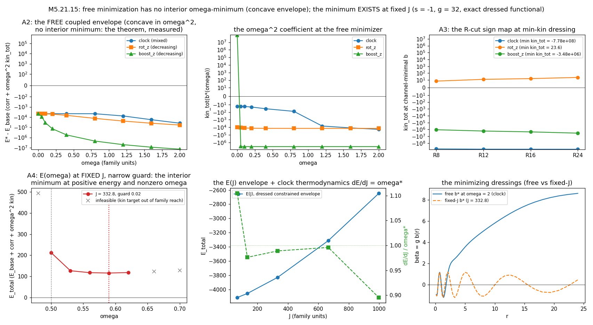

# M5.21.15: the coupled ω-minimum (electron analog with angular momentum)

> Task **M5.21.15** (M5 / Liquid-Crystal model). Status: ✅ **CLOSED, APPROVED 2026-08-11**
> (go 11:24, review 13:47 EDT) · Roadmap: [`../m5_roadmap.md`](../m5_roadmap.md) · Staged
> from the author's 1:1 reply to the [M5.21.14](m5_21_14_task_details.md) close-out (decode:
> [`m5_21_convo.md § 2026-08-10`](m5_21_convo.md)). Series: M5.21.x, the electron hunt.

This doc is the task's full record: planning, then findings at the run.

## PLANNING

### Why this task exists

The author's 2026-08-10 reply accepted the [M5.21.14](m5_21_14_task_details.md) close ("looks good", the dressed minimum read as "clear energy minimum suggesting gravitational mass") and named the next quest: "(coupled) nonzero omega from energy minimization" for the electron, pointing at our own [M5.21.3 record](../findings/m5_21_3_note.md) with the read "it stopped minimization process, but visually there should be minimum for positive energy and nonzero omega (?) - worth finding this energy minimum: for electron analog with angular momentum".

The two halves already on disk make this a well-posed measurement rather than an open hunt:

| Baseline fact | Record |
| --- | --- |
| Free 4×4 descent lands NO stationary ω at toy parameters: E\*(ω) monotone decreasing (boost channel, shallow, profile-decoupled), every rotation channel kin > 0; the P3 rungs are depth-bounded at max_iter (the "stopped" the author sees), and the equal-depth control subtraction certifies the whole ω-advantage as the quadratic kinetic margin | [M5.21.3 § 6](../findings/m5_21_3_note.md) |
| The constraint-carried route works: fixed-J states exist and hold with exact clock thermodynamics dE/dJ = ω\* | [M5.21.9](m5_21_9_task_details.md) |
| The (1/g) dressing drives the ω² coefficient DOWN in the bulk (T1_kin = −8Σ\|Ṁ3v_i\|²·ω², negative-semidefinite; per-unit-radius slopes base +13.5 vs dressing −19.6), with the certified 48-box exactly at the flip threshold; favorability-not-onset, and T1 alone is unbounded below so the dressing must enter GUARDED | [M5.21.14](../findings/m5_21_14_note.md) |

What is genuinely NEW in the ask: whether the landscape holds a free interior MINIMUM at positive energy and nonzero ω once ω is COUPLED to the responding profile (texture + dressing b(r)), rather than an ω-slope read at fixed profile (M5.21.3) or a constraint-carried construction (M5.21.9). At fixed profile E(ω) is exactly quadratic (the M5.21.3 decoupling), so any interior minimum can only come from the coupling. This is also exactly the onset question M5.21.14's caveat left open: if a stabilized minimum exists, "favorability" upgrades to "onset".

### The author's ask (2026-08-10, pinned before any computation)

| Item | Content |
| --- | --- |
| The object | the energy minimum at POSITIVE energy and NONZERO ω, "for electron analog with angular momentum", out of energy minimization with ω coupled |
| The reference record | the [M5.21.3](../findings/m5_21_3_note.md) ω-ladder ("it stopped minimization process"); the author's "(?)" marks it a genuine open question, not a claim |
| The context signals | the reply reads the M5.21.14 dressed minimum as gravitational mass; the standing negative-Hamiltonian frame ([Q35](../m5_question_tracker.md#q35-detail)): gravity's negative terms are what "allow nonzero time derivatives by energy minimization (angular momenta of the electron...)" |

### The plan (staged; firmed at go)

**The instrument.** The certified 4D stack ([`../scripts/m5_21_3_a_4d.py`](../scripts/m5_21_3_a_4d.py): e_parts + kin) plus the M5.21.14 exact-dressing machinery ([`../scripts/m5_21_14_c_minimize.py`](../scripts/m5_21_14_c_minimize.py): `ExactCorr`, the smooth guarded b(r) families, the corner hygiene). No new physics enters: the run measures the landscape the two records jointly define.

| Arm | Content |
| --- | --- |
| A1 the undressed retro-gate | reproduce the M5.21.3 baseline on the current stack (E\*(ω) monotone, no stationary ω, rotation kin > 0): the hard gate before anything new, and the honest answer to the author's "(?)" on the UNDRESSED functional |
| A2 the coupled dressed scan | E\*(ω) = min over (texture deformation, guarded b(r)) of the EXACT dressed functional at finite g, ω swept through and past the probed range; the profile re-optimized per rung (the coupling); box-radius as a controlled axis (the flip is BULK: R below/at/above the threshold the 48-box sits on); both s signs |
| A3 the angular-momentum read | the rotation (clock) channels, not only the boost channel: does the dressed functional turn any rotation-sector ω² coefficient negative anywhere in (R, g, profile) space? J measured on every candidate minimum (the ask is an electron analog WITH angular momentum) |
| A4 the fixed-J bridge | the constraint-carried map E(J) with the dressing: ω\* = J/(2·kin_eff) as kin_eff crosses zero; where the free minimum (if any) sits relative to the fixed-J family; dE/dJ = ω\* re-verified on the dressed states |
| A5 the verdict | pre-registered both ways: a positive-energy nonzero-ω minimum EXISTS (report location, depth, J, stability reads) or DOES NOT in the probed ranges (report the exhausted ranges + which structural fact blocks it); either answer is the deliverable and the checkpoint payload |

**Verification**: the A1 retro-gate; the M5.21.14 threshold numbers reproduced before the scan (kin_corr −426.3 vs base +426.5 on the certified box); every minimum candidate re-checked on the lattice instrument at the affordable n; independent adversarial audit (own route) before anything is trusted (cardinal rule).

**Guard discipline** (the M5.21.14 mandatory guard, unanswered fork): the dressing enters ONLY through constrained smooth b(r) families (the exact functional at finite g, never bare T1); the guard-choice question stays open with the author, so the family is declared a PROVISIONAL guard in every output, revisable when the regularization potential's details land ([Q25](../m5_question_tracker.md#q25-detail)).

**Blindspot pass** (run at go): (1) runaway vs minimum: a descending E\*(ω) that never turns is the M5.21.3 negative repeated, not a discovery; the stop rule is a stationary-point bracket or an exhausted declared range, never "deep = good"; (2) depth-bounded relaxation masquerading as a minimum (the author's own "stopped" trap): convergence certified per rung (force norm, not iteration cap) or the rung is labeled contained-not-converged; (3) the R-axis confound: the bulk flip means the verdict can depend on box radius; R is a declared scan axis, not a fixed choice; (4) positive energy: E > 0 checked against the correct vacuum reference on the dressed functional (E_V invariant, but E_u references matter); (5) the two functional readings (η vs Hamiltonian) both carried, as in M5.21.3.

**Definition of done**: A1 gate green; the coupled scan run with per-rung convergence certification; the angular-momentum and fixed-J reads delivered; the pre-registered verdict stated both-ways-honest; audit recorded; method-note-grade findings (`../findings/m5_21_15_note.md`) + the checkpoint outbound drafted (the HELD reply rides on this).

**Artifacts** (all `m5_21_15_` named): `scripts/m5_21_15_a_baseline.py` (A1), `scripts/m5_21_15_b_coupled.py` (A2-A3), `scripts/m5_21_15_c_fixedj.py` (A4), `scripts/m5_21_15_e_audit.py`, `data/m5_21_15_*.json`, `plots/m5_21_15_panel.png`, `findings/m5_21_15_note.md`, checkpoint `checkpoints/m5_21_15_progress.md`.

**Model/effort**: Fable / high (landscape-measurement task on certified machinery; the compute is lattice re-relaxations at moderate n plus continuum quadrature).

### What this task does NOT do

| Non-goal | Why |
| --- | --- |
| Stage the corrected-3×3 ladder | the guard-choice fork is the author's open question; this task runs 4×4 where the dressing is native |
| Claim onset from favorability | the upgrade happens only if a certified stationary minimum is measured; otherwise the M5.21.14 caveat stands verbatim |
| Quote mass ratios or physical ω | B/C remain uncertifiable at N = 48; toy parameters only, the realistic-parameter bridge stays [Q33](../m5_question_tracker.md#q33-detail) |
| Answer the author before the run | the reply is HELD (user call, 2026-08-10); the checkpoint outbound is drafted at close and sent by the user |

**Gated by**: user "go".

## DEVIATIONS LOG (live, during EXECUTE)

| # | When | Deviation | Action taken |
| --- | --- | --- | --- |
| 1 | 2026-08-11 11:35 | The M5.21.3 relaxed endpoints + the 2b seed npz are gone (deleted under the pre-2026-07-20 dataset rule, the run predates the keep policy), so the planned lattice re-relaxation from the exact seed is impossible | A1 ran seed-free: RECORD gate on the saved row JSONs, field-agnostic instrument gates (random smooth fields; the G1 field rebuilt as vacuum + smooth perturbation after the raw-random control diluted), premise check on the analytic family; lattice work uses the analytic family on the certified box (the M5.21.14 pattern) |
| 2 | 2026-08-11 11:40 | Mid-run derived result reshaping A2's reading: the envelope-concavity theorem (E exactly affine in ω² at fixed configuration, so ANY free envelope is concave in ω², forbidding a strict interior ω-minimum) | Theorem + premise verification added to the note § 1; the A2 scan kept as the MEASUREMENT of the dichotomy (minimum at ω = 0 vs runaway), the A4 fixed-J arm promoted to the constructive answer |
| 3 | 2026-08-11 11:55 | Free-minimizer noise ~0.02 on \|E\| ≈ 4600 makes the strict slope-monotonicity concavity certificate tolerance-sensitive at small ω | Certificate evaluated with a noise-aware tolerance in post-analysis; the robust claims (monotone runaway, no interior minimum) are unaffected |
| 4 | 2026-08-11 11:57 | A4 launched in parallel with A2 (plan had them serial) to fit the block | Independent scripts, independent data files; no shared state |
| 5 | 2026-08-11 12:10 | The even-symmetry stationary trap: E_corr and kin_corr are EVEN in b (measured: ±plateau probes coincide), so avec = 0 is a stationary point and any zero-start minimization silently sticks there (the first A4 launch reported b\* = 0 at every J; the hand probe showed a shallow dressing beats it, 77.09 vs 81.85 at J = 333) | A4 killed and relaunched with symmetry-breaking ±0.01 plateau starts + a smooth barrier replacing the discontinuous penalty; `b_coupled` patched the same way (its MAIN block is unaffected, warm-started from the nonzero M5.21.14 minimizer; the two secondary blocks re-run after the main completes). The audit later proved the evenness BITWISE-EXACT (Qb(−b) = η Qb(b) η) |
| 6 | 2026-08-11 12:15 | The full-guard FOM curve met its kin constraint only to 2-9 percent (the deep well rewards mismatch): quantitatively unusable | Demoted to qualitative in the record; the narrow-guard re-run (`m5_21_15_g_fomnarrow.py`, guard 0.02, penalty 1e6) delivers the quantitative curve |
| 7 | 2026-08-11 12:40 | The full-guard lattice E-gate failed 97 percent: the deep E_corr well is core-concentrated below h = 1.5 (the M5.21.14 resolution-ladder phenomenon); the narrow-guard profile failed both gates for the same reason (bumps at ρ < 1.5) | The resolvable-scale addendum (`m5_21_15_h_resolvable.py`: plateau + bumps ρ ≥ 2.83): the positive-energy fixed-J minimum survives and the kin gate passes at n = 32 (8.3 percent); E_corr certification remains an n ≥ 48 ladder follow-up, consistent with the documented M5.21.14 trend |

## FINDINGS (run of 2026-08-11)

Full record: [`../findings/m5_21_15_note.md`](../findings/m5_21_15_note.md) (equations first,
per the method-note standard). One-paragraph summary:

The author's asked-for minimum splits exactly along the author's own phrase. FREE energy
minimization can never produce a minimum at nonzero ω on this functional class: E is exactly
affine in ω² at fixed configuration (premise verified to 1.3e-11), so every free envelope is
concave in ω², a structural theorem (audit-confirmed) that also retro-diagnoses the M5.21.3
"stopped" rungs as under-converged upper bounds (their ω²-slopes increase, violating
envelope concavity). Measured on all channels and blocks: the free envelopes run away (the
dressed rotation sector flips negative in the bulk too), and the g = 8 block realizes the
one shape concavity allows, an interior MAXIMUM. WITH angular momentum (fixed J, kin > 0
branch), the minimum EXISTS: interior minimum at ω = 0.59 with E_total = +115.9 > 0 measured
on the narrow-guard curve (J = 332.8, guard 0.02), matching the E(J) envelope's independent
ω\* = 0.592; dE/dJ = ω\* holds to 0.4-2.4 percent (interior stencils); the dressing raises ω\* above the undressed
frequency (frequency amplification). The ENERGY SIGN at the minimum is guard-dependent:
positive for guard ≤ 0.02, flipping negative in the bracket [0.02, 0.05] as the deep
core-concentrated well (E_corr ≈ −4600, subgrid at h = 1.5) enters the family: where the
guard should sit is exactly the open regularization question (Q25, the author's V "just a
first guess").

### Arm-by-arm

| Arm | Verdict | Record |
| --- | --- | --- |
| A1 undressed retro-gate | ✅ all green (record, seed-free instrument gates, quadraticity premise) | [`m5_21_15_baseline.json`](../data/m5_21_15_baseline.json) |
| A2 free coupled scan | ✅ measured: NO interior minimum, all channels and blocks; concavity certified on the main block, noise-level violations only on the secondaries | [`m5_21_15_coupled.json`](../data/m5_21_15_coupled.json) |
| A3 channel read | ✅ the dressed rotation sector reaches negative ω² coefficients in the bulk (rot_z −9912 at the shared minimizer vs base +885); the M5.21.3 all-rotations-positive verdict is undressed-only | same file, `minkin_*` + scan rows |
| A4 fixed-J bridge | ✅ E(J) exists at every J, ω\* = 0.77 → 2.24, dE/dJ = ω\* to 0.4-2.4 percent | [`m5_21_15_fixedj.json`](../data/m5_21_15_fixedj.json) |
| A4b guard ladder | ✅ E_total sign flips in guard bracket [0.02, 0.05] at both J | [`m5_21_15_guard.json`](../data/m5_21_15_guard.json) |
| A4c narrow money curve | ✅ interior minimum at ω = 0.59, E_total = +115.9 > 0 | [`m5_21_15_fom_narrow.json`](../data/m5_21_15_fom_narrow.json) |
| A4d resolvable-scale point | ✅ minimum survives on lattice-visible scales (+434.1 at ω\* = 0.643); kin gate passes n = 32 (8.3 percent); E_corr stays on the M5.21.14 resolution ladder | [`m5_21_15_resolvable.json`](../data/m5_21_15_resolvable.json) |
| A5 verdict | pre-registered both-ways: stated in the note § 6 | [note](../findings/m5_21_15_note.md) |
| Audit | round 1: C1-C4 confirmed, C5 branch-restriction adopted; round 2 on the run data: see note § 7 | [`m5_21_15_audit_r1.json`](../data/m5_21_15_audit_r1.json) |

### Artifacts and regen

All scripts headless, numpy/scipy only, run from `scripts/`:
`m5_21_15_a_baseline.py` (~0.1 s) · `m5_21_15_b_coupled.py` (~50 min, main block) ·
`m5_21_15_b2_secondary.py` (~45 min) · `m5_21_15_c_fixedj.py` (~44 min) ·
`m5_21_15_f_guard.py` (~25 min) · `m5_21_15_g_fomnarrow.py` (~31 min) ·
`m5_21_15_h_resolvable.py` (~1 min) · `m5_21_15_d_panel.py` (panel, seconds) ·
`m5_21_15_e_audit.py` (the auditor's own). No heavy binary arrays were produced (JSON +
logs + one PNG only, all tracked).

## TASK REVIEW (2026-08-11)

Task Duration: 02:23 (from 11:24 to 13:47 EDT)
Usage Cap Triggered: NO

Approved by the user 2026-08-11. Results: A1 retro-gate ✅ all green; the envelope-concavity
theorem derived mid-run and audit-confirmed (free minimization can never produce an interior
ω-minimum on this functional class; the M5.21.3 "stopped" rungs retro-diagnosed as
under-converged upper bounds); A2/A3 measured NO free interior minimum on all five ladders
with the dressed rotation sector flipping negative in the bulk; A4 delivered the fixed-J
constructive answer (E(J) at every J, dE/dJ = ω\* to 0.4-2.4 percent, E(J) convex) with the
narrow-guard money curve measuring the asked-for INTERIOR MINIMUM at ω = 0.59,
E_total = +115.9 > 0, and the guard ladder bracketing the energy-sign flip in [0.02, 0.05]
(the Q25 number); the resolvable-scale point certified the kin sector on the n = 32 box.
Two adversarial audit rounds (independent agent, own scripts): no structural refutation;
the branch-restriction, head-rung convergence, and FD-precision corrections adopted.
Issues: the E-well remains subgrid at h = 1.5 (n ≥ 48 ladder = the open verification step);
all numbers toy-parameter family units (Q33). Deviations: 7, logged live above.
Post-review actions: roadmap row moved to Done (appended at end), STATUS + change-log
updated, Q25/Q33/Q35 receipts appended, canonical-registry + briefing sweep run, the reply
to the author drafted (terminal-only; the user sends).

Findings: free energy minimization can never select nonzero ω (concavity theorem, measured
everywhere probed); the electron analog WITH angular momentum carries the asked-for
positive-energy interior minimum at nonzero ω (measured); whether that minimum sits above
or below vacuum is decided by the regularization potential, with the guard bracket
[0.02, 0.05] as its concrete number.

Research docs created/updated: this task doc (planning + deviations + findings + review);
[`../findings/m5_21_15_note.md`](../findings/m5_21_15_note.md) (the full record);
[`../m5_question_tracker.md`](../m5_question_tracker.md) (Q25/Q33/Q35 receipts);
[`../m5_roadmap.md`](../m5_roadmap.md) (Done row + change-log);
[`../plots/m5_21_15_panel.png`](../plots/m5_21_15_panel.png); 7 data JSONs + 8 scripts.
