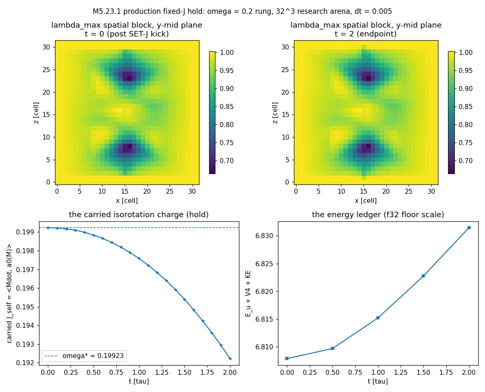

# M5.23.1, fixed-J isorotation dynamics → production port (the former M5.24 round 4)

> ✅ ROUND 1 CLOSED COMPLETE + APPROVED 2026-07-24 (go 12:20 EDT, 27 min, no cap; review approved same day). Staged 2026-07-19 at the [M5.24](m5_24_task_details.md) close (user-approved re-home of its round-4 scope); renumbered M5.26 → M5.23.1 (2026-07-23, the rendering-series consolidation: M5.23.x = the official rendering series). Roadmap row: [`m5_roadmap.md § DONE`](../m5_roadmap.md). Checkpoint: [`../checkpoints/m5_23_1_progress.md`](../checkpoints/m5_23_1_progress.md). Deferred rounds staged (Larmor ramp-on + body-frame, the constrained FIRE build, the J(t) secular-decay falsifier): see TASK PLANNING § Deferred.

## TASK PLANNING

**Scope (round 1, firmed at go 2026-07-24)**: port the [M5.21.9](m5_21_9_task_details.md)-validated fixed-J isorotation machinery into the production engines on the M5.24 pattern (taichi-first, per-gap selftests against the audited research reference, launcher wiring, headless smoke), delivering the launcher's RELAX → SET-J → EVOLVE flow: the first live ZBW clock whose rendered rotation is simulated dynamics only (the no-display-only-kinematics directive, [`m5_visualization.md`](../m5_visualization.md)).

| Piece | Deliverable |
| --- | --- |
| Engine kernels (`engine2_pde.py`, new M5.23.1 section) | (1) the conjugation-tangent clock flow a0 = w·[W, M] per voxel (W = rotation about the local leading spatial eigenvector via the production Cardano eigensolver; envelope w = exp(−(r/renv)⁴) in-kernel; unit global Frobenius norm via the per-slice-partials reduction pattern); (2) the clock inertia kin(M; a0) = h³·Σ_br Σ_i 4⟨[a0, A_i]_η, [a0, A_i]_η⟩_η reduction (both stencil branches, ½ weight each, matching the reference `kin_of`); (3) the SET-J velocity kick: M_prev ← M − dt_eff·ω\*·a0 on the interior (position-Verlet implicit-velocity init; ω\* = J/(2·kin), J = 2·kin·ω_target); (4) the J readout (⟨Ṁ, a_rot_k⟩ projections on the global rotation flows, per-slice partials, host-normalized). Reuses `Md_am` (a0 scratch) + `fire_partials`; no new fields |
| Launcher wiring (`_launcher.py` + a new `xparameters/_topo_fixedj4d.py`) | Canonical-path config with `FIXEDJ_OMEGA` (seed-time set-J after relax) + a paused-mode `SET J (isorotate)` button + an optional periodic console J readout (`FIXEDJ_LOG_EVERY`, default off); prints kin, J, ω\* at set time |
| The machine gate (`research/scripts/m5_23_1_fixedj_engine_selftest.py`) | S1-S5 below, each try-cap 3, against the audited M5.21.3/M5.21.9 reference imported directly (no re-transcription) |
| Convention pins (docstrings + this doc) | kin convention = the CONJUGATION tangent (kin = 0.1206, canonical § 6 anti-recipe; the probe value 0.297 is NOT physical inertia); any absolute J / ħ/2 / g statement pins the PHYSICAL-RATE convention ([`../findings/m5_21_5_note.md § 5`](../findings/m5_21_5_note.md)); the a0 per-voxel sign gauge (below) |

**Definition of done (round 1)**:

| # | Criterion | Check |
| --- | --- | --- |
| S1 | Production a0 matches the research `a0_conj` on the certified state up to the per-voxel sign gauge (alignment ≥ f32-grade on the envelope-weighted bulk), with the sign-gauge structure quantified | selftest |
| S2 | Production kin matches `INS4.kin_of` both ways (production a0 → reference reduction; reference a0 → production reduction) at f32 tolerance | selftest |
| S3 | The Legendre closure dE/dJ = ω\* reproduced with PRODUCTION kernels on the three research rungs (`fixedj_conj_om{0.2,0.5,1}_end.npz`), within f32-widened tolerance of the research 0.997 / 0.992 | selftest |
| S4 | The hold: production evolution of the kicked ω = 0.2 state (research arena, 32³, dt = 0.005) stays bounded with E-drift at the documented f32 floor, core spectrum intact, J retained (observable-level cross-check vs the research `leap()` reference trajectory) | selftest |
| S5 | Launcher smoke: RELAX → SET-J → EVOLVE headless on the demo config: bounded energy, coherent J(t), the δ clock-hand axis measurably rotating (rate reported, not assumed); xperiment-switch routing reset still green; M5.24 (14/14) + M5.23 (14/14) selftests regression-green | selftest + regression |
| 6 | Doc checker exit 0 over touched `.md`; roadmap + checkpoint current | machine-checked |

**Gating**: user "go" received 2026-07-24 12:20 EDT ([M5.21.9](m5_21_9_task_details.md) ✅; the physics-first hold cleared at the M5.21.4 close). Model/effort: Fable 5 / high (research default; porting with physics judgement).

**Blindspot pass** (port-boundary territory):

| Blindspot | Guard |
| --- | --- |
| The a0 SIGN GAUGE: the leading eigenvector is apolar (±v give opposite local rotations); the research flow inherits `np.linalg.eigh`'s per-voxel signs, the production Cardano solver would pick its own | kin and all quadratic reads are per-voxel-sign invariant (measured, not assumed, in S2); production pins a DETERMINISTIC radial gauge (v·r̂ ≥ 0, axis fallback near the center); S1 quantifies where the two gauges differ; dynamics gates run at observable level (E, J, spectrum), never trajectory identity |
| f64 research vs f32 Metal production | per-gate tolerance ladder documented next to each gate (the M5.24 precedent: 2.2e-8 f64 conservation ↔ ~5e-4 f32 floor) |
| The launcher arena ≠ the certified research state (different grid, seed, vacuum branch sg) | S1-S4 gate on the RESEARCH arena (cfg from `INS4.load_p1`, sg = cfg value); the launcher-arena hold (S5) is reported as a NEW measurement, not assumed to transfer |
| Position-Verlet velocity init is O(dt) offset from the reference kick-drift-kick | documented at the kick kernel; S4 gates observables over a window, absorbing the phase offset |
| Degenerate eigenvectors in the far field (vacuum spatial spectrum) | the envelope w → 0 suppresses the far field; the eigensolver's degenerate fallback is unit-normed either way |
| Hot files (`_launcher.py`, `engine2_pde.py` edited through M5.24/M5.23) | re-grep current state before every edit; run both existing selftests before AND after |

**Unknowns routing**: machine-checkable → S1-S5; author-gated → none new this round (the Larmor field conventions stay flagged from M5.21.9); nature-gated → none (toy parameters).

**Deferred (round 2+ / staged follow-ups, per the M5.24 multi-round pattern)**: the constrained fixed-J FIRE build in-launcher (sign-wrapped `kin_grad` + refresh; ported only if the kicked-state hold proves insufficient); the Larmor round-3 instrument (adiabatic ramp-on + body-frame read, [`../findings/m5_21_9_note.md § 6b`](../findings/m5_21_9_note.md)) with the [Q36](../m5_question_tracker.md#q36-detail) functional-terms record; the J(t) secular-decay radiation-window falsifier ([M5.21.12](m5_21_12_task_details.md)); the [M5.23.2](m5_23_2_task_details.md) J/μ twist demo arm (feeds on this port).

**Research body**: findings in THIS doc; script `../scripts/m5_23_1_fixedj_engine_selftest.py`; summary JSON `../data/m5_23_1_selftest.json` (tracked; no new heavy arrays, the research npz endpoints are consumed read-only); checkpoint `../checkpoints/m5_23_1_progress.md`; production diffs in `engine2_pde.py` / `_launcher.py` / `xparameters/`.

**Why**: [M5.24](m5_24_task_details.md) brought the launcher to the verified-L canonical stack, and the live demo now shows (correctly) that free evolution never spins up the ZBW clock: the two-stack consensus ([M5.21.3](m5_21_3_task_details.md) + [M5.21.8](m5_21_8_task_details.md)) is that the clock exists only as a FIXED-J isorotation state (ω* = J/2kin, measured clock inertia kin ≈ 0.119). Once [M5.21.9](m5_21_9_task_details.md) builds + verifies that state research-side (with the author's Larmor protocol as the acceptance observable), this task ports the validated fixed-J evolution into the production engines: the same catch-up pattern as M5.24 (taichi-first, per-gap selftests against the research reference, launcher wiring, live verification).

**Scope sketch (to be firmed at go)**:

| Step | Deliverable |
| --- | --- |
| 1 | Port the M5.21.9-validated fixed-J machinery (the constraint-carried J evolution) into `engine2_pde`, gated against the research scripts |
| 2 | Launcher wiring on the canonical path (a fixed-J xperiment config; the RELAX → set-J → EVOLVE flow) |
| 3 | Live verification: the stable rotating state on screen = the first honest ZBW δ-sweep (simulated dynamics only, per the standing no-display-only-kinematics directive, [`m5_visualization.md`](../m5_visualization.md)) |

**Gating**: user "go" ([M5.21.9](m5_21_9_task_details.md) ✅; the physics-first hold cleared at the [M5.21.4](m5_21_task_details.md) close 2026-07-21; the former RENDERING UNLOCK marker retired at the 2026-07-23 Backlog reorder, row order = run sequence). First row of the sequenced Backlog. Feeds [M5.23.2](m5_23_2_task_details.md) (the J/μ twist demo arm rides this port).

## ROUND 1 FINDINGS (2026-07-24)

### What landed

| Piece | Where | Content |
| --- | --- | --- |
| The fixed-J kernels | [`engine2_pde.py`](../../engine2_pde.py) M5.23.1 section | `clock_flow_k` (the conjugation-tangent clock flow a0 = w·[W, M] per voxel: production Cardano eigensolver, in-kernel envelope exp(−(r/renv)⁴), deterministic RADIAL sign gauge) + `md_norm_partials_k`/`scale_md_k` (unit global Frobenius norm, per-slice-partials reduction) + `kin_partials_k` (the clock inertia, both stencil branches, reference `kin_of` twin) + `isorotation_kick_k` (SET-J: M_prev ← M − dt·ω\*·a0, the position-Verlet velocity init) + `j_partials_k`/`j_self_partials_k` readouts; hosts `compute_clock_flow` / `kin_canonical` / `set_fixed_j` / `read_isorotation` / `read_carried_j`. Reuses `Md_am` + `fire_partials`; zero new fields |
| Launcher wiring | [`_launcher.py`](../../_launcher.py) | `set_fixed_j_launcher` (canonical path only, convention-pinned printout), seed-time SET-J via `FIXEDJ_OMEGA` (after CANON_RELAX, the RELAX → SET-J → EVOLVE order), the paused-mode `SET J (isorotate)` button beside RELAX, the periodic carried-J console readout (`FIXEDJ_LOG_EVERY`) |
| Demo xperiment | [`xparameters/_topo_fixedj4d.py`](../../xparameters/_topo_fixedj4d.py) | biaxial hedgehog on the canonical stack + seed-time FIRE (300 iters) + SET-J at ω = 0.2 (the research rung 1): the live ZBW clock config |
| The machine gate | [`../scripts/m5_23_1_fixedj_engine_selftest.py`](../scripts/m5_23_1_fixedj_engine_selftest.py) | S1-S5, ALL 12 GREEN (try 2; the research reference imported directly, no re-transcription) |
| Evidence panel | [`../scripts/m5_23_1_a_hold_panel.py`](../scripts/m5_23_1_a_hold_panel.py) | seed/endpoint field cross-sections + the J_self trace + energy ledger (the simulation-prints rule); summary [`../data/m5_23_1_selftest.json`](../data/m5_23_1_selftest.json) |

### Gate results (selftest, goal-loop: try 1 = 9/11, try 2 = ALL 12 GREEN)

| Gate | Result |
| --- | --- |
| S1 production a0 vs research `a0_conj` (32³ ω = 0.2 rung endpoint) | ✅ aligned rel err 2.52e-7; raw flow norm 12.39; sign-gauge overlap 49.99% (the apolar ±v ambiguity: research inherits `eigh` signs, production pins v·r̂ ≥ 0; quadratic reads gauge-invariant, verified at S2) |
| S2 kin both ways + gauge invariance + anchor | ✅ production reduction vs reference `kin_of`: 1.2e-7 (production a0) / 1.9e-7 (research a0); prod-gauge vs eigh-gauge kin: 1.2e-7; vs the recorded kin_final 0.121014: 1.2e-7 |
| S3 Legendre dE/dJ = ω\* with production kin, three rungs | ✅ ratios **0.9970 / 0.9919** vs the research 0.997 / 0.992 ([`../findings/m5_21_9_note.md § 7`](../findings/m5_21_9_note.md)); per-rung ω\* matches the records at ~1e-7 |
| S4 the hold (SET-J + 400 production steps, dt = 0.005, research arena) | ✅ J_self(0) = ω\* exact (0.19923); ledger drift 3.4e-3 (the f32 floor, M5.24 precedent); core spectrum drift 2.9e-4; carried charge retained 0.965; **cross-stack vs the certified f64 `leap()` at step 200: 1.85e-3 rel** (same flow, same init, same instrument via a twin field) |
| S5 launcher flow (63³ seed → flip → FIRE → SET-J → EVOLVE, substeps + sponge) | ✅ bounded (max\|M\| = 8.0), kin = 0.1341 at the launcher arena, J_self 0.2000 → 0.1839 over t = 3.2 (retention 0.92, sponge on), the δ clock-hand axis rotates 0.051 rad (measured 0.0159 rad/τ vs 0.0185 predicted from ω\*/‖a0_raw‖) |
| Regressions | ✅ M5.24 canonical selftest ALL 14 GREEN; M5.23 ellipsoid selftest 14/14; launcher byte-compile clean |

The field-state evidence (the simulation-prints rule): the production hold run's seed and endpoint cross-sections with the carried-charge trace and the energy ledger:

### Measured findings (beyond the port)

| Finding | Status | Detail |
| --- | --- | --- |
| The global-J observable NEAR-CANCELS on hedgehog-family states | ✅ measured | all three [G_k, M] projections ~1e-5 ≈ 1e-4·ω\* (noise scale) on both arenas: the local rotation axes are spherically distributed, so the global charge sums to ~0. Try 1's gate compared this noise (2 fails); the honest observable is the CARRIED charge J_self = ⟨Ṁ, a0(M)⟩, = ω\* at kick by construction. Also retro-explains part of the M5.21.9 Larmor J-azimuth fragility (that read projected on global flows) |
| The visible axis rate is ω\*/‖a0_raw‖, not ω\* | ✅ measured | the unit-GLOBAL-Frobenius a0 convention spreads the rotation over the state: measured 0.0159 rad/τ vs 0.0185 predicted at the launcher arena (ω\* = 0.2, ‖a0_raw‖ = 10.8). A viz-speed statement about the on-screen clock must quote the measured rate, never ω\* |
| The a0 sign gauge is a REAL free choice | ✅ measured | 50.01% of the flow weight flips between the eigh gauge and the radial gauge on the same state, with kin identical to 1.2e-7: per-voxel-sign is a genuine gauge for all quadratic reads; DYNAMICS runs must build init and readout in ONE gauge (the selftest's twin-field instrument) |
| The launcher-arena hold is real but bleeds via the sponge | ✅ measured | J_self retention 0.92 over t = 3.2 with γ = 0.5 sponge on (research arena, no sponge: 0.965 over t = 2); the sponge damps the outer envelope of the clock flow. A decay-grade J(t) read (the [M5.21.12](m5_21_12_task_details.md) radiation-window falsifier) needs the sponge ledger or γ = 0 |

### Issues (carried honestly)

| # | Issue |
| --- | --- |
| I1 | DATA HYGIENE: the recorded S1/S2 base state `m5_21_3_p1_s-1.npz` AND its seed `m5_21_2b_end_i2_A_T2.npz` are missing locally (pre-2026-07-20 delete-rule casualties); `m5_21_5_seed32.npz` fingerprint-tested (E_seed 19.16 vs recorded 9.20) = NOT the same object; the `_DATASETS.md` rows for `m5_21_2b`/`m5_21_3` overstate what exists, and the recorded m5_21_9 regen commands are broken without the chain. Selftest re-based onto the fixed-J rung endpoints (present). Restore + manifest audit = a follow-up housekeeping task |
| I2 | The S4 hold window is t = 2 (research arena) / t = 3.2 (launcher); the research t = 80 long hold is NOT re-certified in f32 production this round (long-run behavior rides the user's live session + the deferred decay-grade read) |

**Deviations from plan**: (1) the S1/S2 arena moved from the (missing) M5.21.3 base state to the ω = 0.2 rung endpoint (I1); (2) the hold gates re-based from global-J components to the carried charge after the try-1 near-cancellation measurement (the goal-loop working as intended: the gate surfaced an instrument error); (3) a restore attempt for the missing p1 state was made and abandoned when the chain proved broken one level deeper (fingerprint test negative); (4) `read_carried_j`/`j_self_partials_k` added beyond the planned kernel list (the observable the plan's J readout should have been).

## Consumes from M5.21.9 (wired 2026-07-20 at the run close)

| Input | Where it lives |
| --- | --- |
| The fixed-J states (three J rungs, all holding) | `research/data/m5_21_9_fixedj_om{0.2,0.5,1}_end.npz` (local, manifest-listed; regen `python3 m5_21_9_d_fixedj.py om=<v> maxit=1200 refresh=300`, ~6 min each). ω\* = J/(2kin) per state: the port's live clock spins at THESE measured rates, nothing display-only |
| The certified 4×4 leapfrog | `m5_21_9_e_larmor.py leap()` (the M5.21.6 form lifted to 4×4: velocity masked every kick, implicit γ): E-conservation 2.2e-8 per 400 steps, dt = 0.02 certified post-audit (4× margin): the research reference the port's per-gap selftests run against |
| The clock thermodynamics | dE/dJ = ω\* at ~1% ([`../findings/m5_21_9_note.md § 7`](../findings/m5_21_9_note.md)): the port's energy ledger must reproduce the Legendre closure as a selftest |
| The Larmor round-2 protocol | The J-flip discriminator + the modeled-floor ±B pair ladder (note § 6): long windows are native here; whatever the M5.21.9 addendum leaves open of the linear read, this task inherits the measurement-grade ladder |
| ⚠️ the kin-convention flag | 0.297 (probe variant, this run) vs 0.1206 (conjugation-tangent, adopted at M5.21.3; the stub's "kin ≈ 0.119" above is that convention): the port must PIN one convention in code and document it (audit CL9; absolute J and ħ/2 numbers depend on the factor 2.46). **QUANTIFIED at [M5.21.5](m5_21_5_task_details.md) (2026-07-21)**: the m5_21_9 carried J (unit-Frobenius flow parametrization, 0.048 at the ω\* = 0.2 rung) is NOT the physical angular momentum; the PHYSICAL-RATE S_env(twist) = 37.2 on the same state (ratio 771). The port pins the physical-rate convention ([`../findings/m5_21_5_note.md § 5`](../findings/m5_21_5_note.md)) for any g or ħ/2 statement |

## Round 3 carries Q36 (wired 2026-07-21)

The author's reply to the 21.9 note poses the quadratic-effect origin question ([Q36](../m5_question_tracker.md#q36-detail); [`m5_21_convo.md § 2026-07-21 03:30`](m5_21_convo.md)): the measured instant-on systematic (ours) vs a formulation-truncation effect ("3x3 formulation (4x4 might change)") vs a genuine quadratic coupling ("they might search experimentally"). Round 3 (adiabatic ramp-on + body-frame read) is the discriminator for the first; its design should also record which functional terms the port's field coupling carries, so the truncation hypothesis is answerable by inspection rather than a new run.

## TASK REVIEW (2026-07-24)

**Task Duration:** 00:27 (from the 12:20 go to the 12:47 review post)
**Usage Cap Triggered:** NO

**Results**:

| Piece | Verdict |
| --- | --- |
| The fixed-J port (`engine2_pde.py` M5.23.1 section) | ✅ taichi-first: clock flow a0 = w·[W, M] (radial sign gauge), kin reduction, SET-J kick, J readouts; zero new fields |
| Selftest | ✅ ALL 12 GREEN (goal loop, try 2): a0 2.5e-7, kin 1.2e-7, Legendre 0.9970/0.9919 (research 0.997/0.992), hold ledger 3.4e-3 with spectrum 2.9e-4, cross-stack vs the certified f64 `leap()` 1.85e-3 at step 200, carried-charge retention 0.965 |
| Launcher RELAX → SET-J → EVOLVE | ✅ wired + `_topo_fixedj4d`; 63³ smoke: retention 0.92 over t = 3.2, the δ clock-hand axis measurably rotating (0.0159 rad/τ vs 0.0185 predicted from ω\*/‖a0_raw‖) |
| Regressions + docs | ✅ M5.24 14/14, M5.23 14/14, byte-compile clean, doc checker exit 0 |

**Issues / blockers**: I1 (data hygiene: the missing `m5_21_2b`/`m5_21_3` arrays, stale manifest rows, broken recorded regen chain: follow-up housekeeping task) and I2 (the f32 hold certified to t = 2-3.2; the research t = 80 window not re-certified in production): both in ROUND 1 FINDINGS § Issues.

**Deviations from plan**: four, logged in ROUND 1 FINDINGS (arena re-base to the rung endpoint; hold gates re-based on the carried charge after the try-1 near-cancellation measurement; the abandoned p1 restore; `read_carried_j` added beyond the planned kernel list).

**Action needed**: the user live-tests `_topo_fixedj4d` (visible axis rate is ω\*/‖a0_raw‖, raise `ETA_SUBSTEPS` if slow); the commit is the user's. Deferred rounds stay staged in TASK PLANNING § Deferred; [M5.23.2](m5_23_2_task_details.md) arm (2) is now unblocked.

**Model-doc sweep**: canonical § 5 fixed-J recipe row annotated with the production-port pointer + the carried-charge observable + the sign-gauge lesson; model briefing production-launcher row updated (the fixed-J clock is LIVE). The hunt table explicitly SKIPPED (infrastructure port; no hunt observable moved: the Larmor/g cells already point at this task's deferred rounds).

**Findings**: The ZBW clock is live in the production launcher as simulated dynamics only: the M5.21.9 constraint-carried electron ports cleanly (Legendre closure and clock inertia at reference precision; cross-stack trajectory agreement 1.85e-3), and the run measured two facts worth keeping: the global rotation charge of a hedgehog-family state near-cancels (the carried charge ⟨Ṁ, a0(M)⟩ is the honest hold observable, retro-explaining part of the M5.21.9 Larmor J-azimuth fragility) and the on-screen rotation rate is ω\*/‖a0_raw‖, a convention fact any demo statement must quote as measured.

**Research docs created / updated**: [this task_details](m5_23_1_task_details.md) (planning + findings + embedded panel + this review) · [`../scripts/m5_23_1_fixedj_engine_selftest.py`](../scripts/m5_23_1_fixedj_engine_selftest.py) · [`../scripts/m5_23_1_a_hold_panel.py`](../scripts/m5_23_1_a_hold_panel.py) → [`../plots/m5_23_1_hold_panel.png`](../plots/m5_23_1_hold_panel.png) + [`../data/m5_23_1_selftest.json`](../data/m5_23_1_selftest.json) · production [`engine2_pde.py`](../../engine2_pde.py) / [`_launcher.py`](../../_launcher.py) / [`xparameters/_topo_fixedj4d.py`](../../xparameters/_topo_fixedj4d.py) · [`../m5_theory_canonical.md`](../m5_theory_canonical.md) (§ 5 annotation) · [`../../__M5_model_briefing.md`](../../__M5_model_briefing.md) (production row) · [`../m5_roadmap.md`](../m5_roadmap.md) (row → Done) · [`../checkpoints/m5_23_1_progress.md`](../checkpoints/m5_23_1_progress.md)
