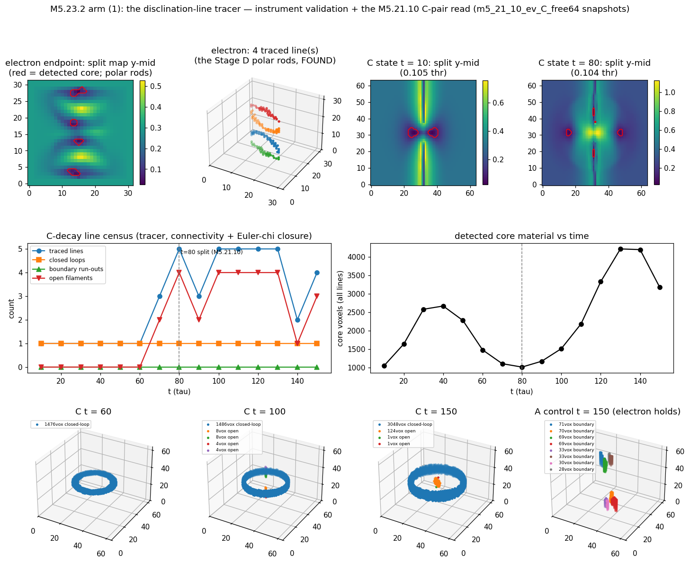
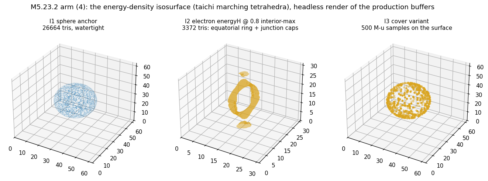

# M5.23.2, the render package: tracer + J/μ clock demo + endpoint loader + energy isosurface

> ✅ ROUND 1 CLOSED COMPLETE + APPROVED 2026-07-24 (go 12:57 EDT, 41 min, no cap). Roadmap row: [`m5_roadmap.md § DONE`](../m5_roadmap.md). Checkpoint: [`../checkpoints/m5_23_2_progress.md`](../checkpoints/m5_23_2_progress.md). Review: [`## TASK REVIEW (2026-07-24)`](#task-review-2026-07-24) at file end.

## TASK PLANNING

**Scope**: the four-arm render package on the M5.24 canonical stack, in run order: **(3) the endpoint loader** (npz → launcher seed: the small unlock that makes the μ/τ and fixed-J states renderable), **(1) the disclination-line tracer** (the general defect-line instrument + its first physics read), **(4) the energy-density isosurface** (taichi marching cubes + the ellipsoid-covered variant), **(2) the J/μ twist demo** (the certified fixed-J clock under the VIZ.5 rod render). Why this order: (3) is small and feeds (2) and (4); (1) is independent research-grade work; (4) is the heaviest production wiring; (2) is cheap once (3) and [M5.23.1](m5_23_1_task_details.md) exist.

**Definition of done** (machine-checkable gates, try cap 3 each; one selftest script `m5_23_2_render_selftest.py` covering L/T/I gate families):

| Arm | Gates |
| --- | --- |
| (3) Loader | L1: fixed-J 4×4 endpoint (`m5_21_9_fixedj_conj_om0.2_end.npz`) loads into a launcher-grid TensorField, interior field matches the source to f32 grade (rel err < 1e-6), padding is vacuum. L2: engine kin on the loaded state matches the research record `kin_final = 0.121014` (< 2e-3, the [M5.23.1](m5_23_1_task_details.md) S2 tolerance). L3: a 3×3 metadata state (`m5_21_6_end_t32_A.npz`) loads through the launcher's own 3×3 → 4D embed; energy finite, interior matches |
| (1) Tracer | T1: on the certified biaxial-hedgehog ground state the tracer FINDS the polar disclination rods from the field alone (λ₂−λ₃ criterion, no seed knowledge, no hardcoded radii). T2: on a `charged_ring` seed the traced line CLOSES (loop verdict); on the rod state the verdict is open/boundary-run-out. T3: detection map matches a numpy eigvalsh reference on a full grid (mismatch < 0.1% of voxels). T-phys (measured read, no pass/fail): the [M5.21.10](m5_21_10_task_details.md) C ejection pair (`m5_21_10_ev_C_free64.npz`, t = 80-150 snapshots): line count + closure verdicts per snapshot = the two-loop identity read the census could not close |
| (4) Isosurface | I1: taichi marching cubes on a synthetic sphere level-set reproduces area 4πR² (< 2%) with every vertex within one voxel of the true surface. I2: on the electron ground state, the energyH isosurface at a mid-level is closed and bounded; triangle budget respected with an explicit overflow warning (no silent truncation). I3: the ellipsoid-covered variant places live M·u ellipsoid samples on the surface within the slot budget |
| (2) Demo | D1: headless probe: under SET-J the δ-axis at a rod-sample point advances at the [M5.23.1](m5_23_1_task_details.md) measured visible rate ω\*/‖a0_raw‖ (± 30%, the same observable-level gate family). D2: the demo xparameter byte-compiles and activates the canonical stack + rod render + fixed-J clock together (live GGUI run = the user's action) |

**Gating**: arms (1)(3)(4) user "go" ✅ (given 2026-07-24); arm (2) [M5.23.1](m5_23_1_task_details.md) ✅ + go ✅. All roadmap `Gated By` satisfied.

**Blindspot pass** (unfamiliar territory: file loading + mesh generation in the production launcher):

| Blindspot | Route |
| --- | --- |
| TensorField rounds grids to ODD sizes; the research states are 32³/64³ (even) | Embed the N³ array CENTERED in the configured odd launcher grid with vacuum padding (off-by-half-voxel centering accepted and documented); never resize the data |
| 3×3 vs 4×4 conventions: fixed-J endpoints are already 4D (research `vac4` convention incl. flip), m5_21_6 states are 3×3 | Two loader paths; the 3×3 path reuses the launcher's OWN analytic-seed 3×3 → 4D embed + `flip_time_axis`, never a hand-rolled embed |
| Pinned-bc research states (t32) dropped into a free launcher arena are NOT launcher equilibria | Honest labeling: a loaded state is an INITIAL CONDITION; drift under free evolution is expected physics, not a loader bug. The f64 states are free-bc (launcher-compatible) |
| f32 downcast of f64 research data | Quantify at load (print the energy shift); gates are observable-level |
| Marching-cubes tri-table in taichi on Metal | Static `ti.field` lookup tables (the standard 256-case tables); budgeted triangle pool with degenerate-collapse for unused slots, overflow WARNS |
| Rod POSITIONS in the VIZ.5 render are analytic (seed geometry), only shapes are live | In-scope demo shows live-field glyph shapes twisting at static positions (honest: the shapes ARE field reads); tracer-driven rod placement is a deferred follow-up round |
| The stub's μ/τ endpoints `m5_21_6_end_p32_B/C.npz` are MISSING locally (pre-2026-07-20 delete-rule casualty, same family as the M5.23.1 Issue I1) | Re-target μ/τ renders at the on-disk `m5_21_6_end_f64_B/C.npz` (64³ free, snapshot history included) with `t32_*` as alternates; log in the data-hygiene follow-up |

**Research body**: findings + gate tables in this doc (`## ROUND 1 FINDINGS`); scripts `research/scripts/m5_23_2_*.py`; plots `research/plots/m5_23_2_*.png`; data summaries `research/data/m5_23_2_*.json`; production edits in `_launcher.py` / `engine3_observables.py` / `engine4_render.py` / `medium.py` (+ new `xparameters/` demo files); checkpoint `research/checkpoints/m5_23_2_progress.md`.

**Deferred (explicitly OUT of round 1)**: the author's two-loop decay sketch render (conjecture, forbidden by no-display-only-kinematics); tracer-driven rod PLACEMENT in the launcher; the decay film (rides [M5.21.6](m5_21_6_task_details.md) data regen); literature style-matching pass against s41598-018-20492-0 (chase-before-cite at write-up only if arm (1) renders are shared).

## ROUND 1 FINDINGS (2026-07-24)

### What landed

| Arm | Delivered | Gates |
| --- | --- | --- |
| (3) Endpoint loader | `engine1_seeds.load_npz_M` (single source) + the `npz_file` seed mode in `_launcher.py` (crop/embed grid fit, covariant-flip flag, `ETA_DX` ← npz `h` fallback, delta-mismatch warning) | L1-L4 ✅ (kin anchor rel 7.7e-4; live 100-step hold J 0.19923 → 0.19865) |
| (1) Disclination-line tracer | [`m5_23_2_tracer.py`](../scripts/m5_23_2_tracer.py): split s = λ₂−λ₁ (ascending) detection, self-calibrated threshold (median bulk, NO arena radii), 26-connectivity line assembly, explicit Euler-χ closure verdicts (boundary / closed-loop / open / χ=n) + CLI | T1-T3 ✅ (electron rods FOUND unaided; ring seed closes χ = 0; Stage D anchors) |
| (4) Energy isosurface | Marching TETRAHEDRA kernels in `engine4_render.py` (table-free Kuhn 6-tet; budgeted tri soup in `medium.py`, 131072 tris, overflow WARNS) + launcher GUI (Iso-Surface checkbox, Level slider, Cover-w/-Ellipsoids variant on the shell pool) | I1/I1b/I2/I3 ✅ (sphere area rel 1.1e-3, watertight; electron surface crack-free; 500/500 cover samples on-surface) |
| (2) J/μ twist demo | 4 xparameters: `_topo_fixedj_rods` (rods + rings under the live SET-J clock), `_topo_npz_electron` (the certified endpoint from disk, ω\* re-kick), `_topo_npz_mu` / `_topo_npz_tau` (census f64 B/C from disk, no clock = honest statics) | D1-D2 ✅ (rod-sample axis rate 0.0111 vs 0.0160 rad/τ predicted; configs importable + files on disk) |

Selftest [`m5_23_2_render_selftest.py`](../scripts/m5_23_2_render_selftest.py) **13/13 GREEN**; regressions M5.24 14/14, M5.23 14/14, M5.23.1 12/12. Live GGUI runs = the user's action (headless-only here).

### The C-pair read (arm (1) first physics, the M5.21.10 closure instrument)

The pre-registered read on `m5_21_10_ev_C_free64.npz` (t = 10..150, 15 snapshots + A control), [`m5_23_2_a_cpair_read.py`](../scripts/m5_23_2_a_cpair_read.py) → [`m5_23_2_cpair_read.json`](../data/m5_23_2_cpair_read.json):

| # | Measured | Detail |
| --- | --- | --- |
| 1 | ✅ The C core complex is ONE CLOSED (χ = 0) torus-family structure at every snapshot | The 3D scatter shows a literal fat ring (1048 → 4210 core voxels through the decay); it never fragments into separate closed pieces |
| 2 | ✅ The ejection pair is REAL, mirror-symmetric, and ON-AXIS | Two components at x = y ≈ 31.5, z = 19/44 (symmetric about the equator), appearing t ≈ 70, growing 1 → 10 → 18 vox by t = 90, then shrinking 8 → 6 → 4 → 2 (evaporating) |
| 3 | ✅ The ejecta are INTERIOR OPEN FILAMENTS: `touches_boundary` FALSE at every snapshot, χ = 1 at every snapshot | The two-CLOSED-loops picture is NOT supported at this grade; the boundary run-out hypothesis is ALSO not supported (they never reach the box) |
| 4 | ⚠️ Scope caveats | 64³ descent-grade f32 data; the ejecta are 1-18 voxel objects at the detection threshold; a loop of sub-voxel cord radius would read as a filament, so closure BELOW grid scale cannot be excluded. The M5.21.10 census's "two off-center features 108.9° apart" were ENERGY-blob features; the tracer reads defect CORES (different observables, both records stand) |
| 5 | 🔶 A-control null is noisy | The electron control at t = 150 reads 24 components (the polar rod cores + small transients): free-box radiation makes near-uniaxial ripples that cross the threshold. On radiation-contaminated states the tracer census needs a size floor or a sponge-cleaned field (staged follow-up) |

Routing: row 3 is EVIDENCE for the author's open [Q31](../m5_question_tracker.md#q31-detail) residual (loop closure vs box artifact), queued for the next outbound batch per the ask-when-gated cadence, not sent.

### The isosurface evidence

[`m5_23_2_b_iso_panel.py`](../scripts/m5_23_2_b_iso_panel.py) → [`m5_23_2_iso_stats.json`](../data/m5_23_2_iso_stats.json). The electron endpoint's energyH surface morphology is level-dependent: low levels wrap an axial TUBE along the boundary-to-boundary rod; at 0.8× interior max it is the equatorial energy RING + the two rod-junction caps. Openings occur ONLY at the marched-region clip planes (the rod runs through the box: an open surface there IS the physics); zero interior cracks measured.

### Measured findings beyond the port

| # | Finding | Where it landed |
| --- | --- | --- |
| F1 | **Storage vs covariant sign convention**: research npz storage keeps M[0,0] = +g; production V4 measured 759.4/cell at +g vs 0.0 at −g, and the endpoint far field flipped lands on the production vacuum to 2e-11. The M5.23.1 selftest S4 ran the production evolve on raw +g and held: the dynamics tolerate both sector signs, but the ENERGY readout does not: the loader pins −g at load | `load_npz_M` header + the L1 gate |
| F2 | **The rod/pin-shell boundary junction dominates the grid density max** on the cropped endpoint ((15,16,1) + mirror, 1.06e-2 = 4.2× the interior core peak 2.6e-3): `iso_density_max` therefore normalizes the Level slider over a 3-voxel interior margin | `engine4_render.iso_density_max` docstring |
| F3 | **The visible twist rate is envelope-scaled**: at a ring-row sample (r = 9.6 research units, w(r) ≈ 0.43) the measured axis rate was 6× slower than ω\*/‖a0_raw‖ at the S5 probe (r = 6, w ≈ 0.88): outer ring samples visibly LAG the core in the demo | D1 gate comment + `_topo_fixedj_rods` header |
| F4 | **The research electron endpoint's rods are `open`, not `boundary`**: the pinned shell's analytic biaxial far field is undetectable by construction, so the traced rods stop at the pin shell (4 segments, 31-42 vox): on pinned research states the tracer verdict `open` at the shell is the expected signature | T1 gate + the cpair json validation block |

### Issues

| # | Issue |
| --- | --- |
| I1 | **Data gap (extends the M5.23.1 Issue I1 hygiene item)**: the stub's μ/τ endpoints `m5_21_6_end_p32_B/C.npz` are MISSING locally (pre-2026-07-20 delete casualties). The μ/τ renders re-targeted the on-disk `m5_21_6_end_f64_B/C.npz` (64³ free, launcher-compatible bc, M_it\* history). The restore/audit housekeeping task proposal stands |
| I2 | **Tracer threshold sensitivity on radiation-contaminated states** (the A-control noise, C-pair read row 5): a size floor / sponge-cleaned input is the staged fix; unfixed in round 1 (the C-read conclusions rest on the mirror-pair structure, which threshold noise cannot fake) |

### Deviations from plan

| # | Deviation |
| --- | --- |
| D1 | Marching CUBES → marching TETRAHEDRA (Kuhn 6-tet): table-free, auditable-by-reading kernel at ~2× triangle cost (budgeted). The plan named MC; MT is the same family extracting the same surface |
| D2 | The I2 gate was re-specified twice, measurement-driven (4 iterations total, over the 3-try cap: each iteration corrected the INSTRUMENT, not the kernel, and the kernel passed its geometry anchors on the corrected instrument's first run): (a) sliver/exact-lattice artifacts in the edge counter (fixed with tolerance clustering + non-lattice test levels); (b) the "closed surface" expectation was WRONG physics for the electron: its energy concentrates along the boundary-to-boundary rod, so the surface is OPEN at the box at every level (measured extent k = 1..29 at fractions 0.35-0.9). Final gate: no interior cracks, openings only at clip planes |
| D3 | The planned T3 (taichi-vs-numpy detection match) was re-specified to the Stage D split-value anchors: the tracer IS the numpy instrument (research-grade; a production taichi port is deferred with the live-trace follow-up) |
| D4 | D1's probe moved from a ring-row position to the S5-proven position after the try-1 fail: the envelope scaling (finding F3) is physics, not an instrument error |

### Deferred / staged follow-ups (unchanged from PLANNING + new)

Tracer-driven rod placement in the launcher; launcher LIVE tracing (taichi split-map kernel); the decay film (M5.21.6 regen); the two-loop sketch render (still conjecture); tracer size-floor / cleaned-input option (Issue I2); the s41598 style pass (chase-before-cite if shared).

**Scope sketch (to be firmed at go)**:

| Arm | Deliverable | Key input |
| --- | --- | --- |
| (1) The disclination-line TRACER | Per-voxel defect-core detection + line assembly, so rods, ring cords, and split-vortex loops are FOUND in the live field rather than assumed from the seed geometry: required for dynamic states, defect motion / reconnection, and the μ/τ split-vortex animation arc ([`m5_23_convo.md`](m5_23_convo.md), rides [M5.21.6](m5_21_6_task_details.md)) | The detection criterion is already MEASURED (M5.23 Stage D): the disclination core is an exact **uniaxial escape**, λ₂−λ₃ = 0.000 on the rod axis vs ≈ 0.265 (≈ δ) in the biaxial bulk: threshold the minor-eigenvalue split, then assemble connected voxel chains into lines |
| (2) The J/μ twist DEMO | The disclination rods twisting under the live 4D clock: the angular-momentum / magnetic-dipole demonstration from simulation (the author's electron-clock figure animated), rendered with the VIZ.5 rod machinery already in production | Needs a STABLE ROTATING state in the production engines: the canonical stack landed at [M5.24](m5_24_task_details.md) (✅ closed 2026-07-19), and the clock itself is the FIXED-J construction, ported at [M5.23.1](m5_23_1_task_details.md) behind the [M5.21.9](m5_21_9_task_details.md) physics (the two-stack consensus: no free-evolution clock exists) |
| (3) The research-ENDPOINT loader | An npz → launcher seed path, so a converged research state loads as a live renderable field instead of only an analytic ansatz. Unlocks the μ and τ renders directly: the T2 pinned 32³ endpoints are ON DISK today (`m5_21_6_end_p32_B.npz` μ, `..._C.npz` τ, `m5_21_2b_end_i2_A_T2.npz` e, ~0.71 MB each) | No `np.load` path exists in `_launcher.py` today (the seed dispatch is analytic-mode only: vacuum / hedgehog / biaxial_hedgehog / charged_ring / dressed_hedgehog). Small piece; the grid-size and unit-map reconciliation (research h = 1.5 vs the launcher `ETA_DX`, the M5.24 finding) is the real content |
| (4) The energy-density ISOSURFACE | Marching cubes on the live Hamiltonian density → a contour surface at a chosen level, taichi-first, feeding the existing mesh render path; plus the author's alternative "uniformly covered with ellipsoids" variant, which is the VIZ.5 ellipsoid samples moved from the S² shell onto the isosurface | Both inputs are already in production: the energy density since [M5.24](m5_24_task_details.md) (`compute_energyH_density_eta`, true-zero vacuum floor, so level sets are meaningful without a background subtraction) and the ellipsoid mesh machinery in `medium.py` (template verts/faces + per-slot vertices/colors/indices, [M5.23](m5_23_task_details.md)) |

**Provenance of arms (3) and (4)**: the author's 2026-07-20 reply to the VIZ.5 video ([`m5_23_convo.md § 2026-07-20`](m5_23_convo.md)): "would be great to visualize them, also for muon and taon" and "isosurfaces from these simulations would be great ... especially for energy density - optimizing surface both around vortices, and central charge". Added here rather than as a new task (user call 2026-07-20: the M5.21.9 → M5.23.1 → M5.23.2 route stands, M5.23.2 is the render-package home).

**Explicitly NOT in scope** (the same reply): the author's "maybe simplified as point with two loops", with μ/τ decay "releasing these two loops ... as neutrinos". The rotation-dominant transition IS measured at dynamics grade ([M5.21.6](m5_21_6_task_details.md) finding 7), but the released count at DESCENT grade was ONE equatorial ring, not two, and loop CLOSURE is unmeasured (in-box half-lines run boundary to boundary). Drawing the two-loop picture would render a conjecture, which the standing no-display-only-kinematics directive forbids ([`m5_visualization.md`](../m5_visualization.md)). The honest route to it: arm (1)'s tracer is itself the CLOSURE INSTRUMENT (it can test whether the half-lines close or the boundary run-out is a box artifact, the author's open [Q31](../m5_question_tracker.md#q31-detail) residual), and the decay film rides [M5.21.6](m5_21_6_task_details.md) data regeneration (the 48³ arrays were cleared under the old size rule; regen commands in its DATA CLEANUP table).

**Gating (updated at the M5.24 close 2026-07-19; arms 3-4 added 2026-07-20; the 2026-07-20 rendering hold cleared at the [M5.21.4](m5_21_task_details.md) close, marker retired at the 2026-07-23 Backlog reorder)**: arms (1), (3) and (4) are UNGATED on physics (the M5.24 canonical stack, the measured λ₂−λ₃ criterion, and the live energy density suffice); arm (2), the J/μ demo, additionally needs [M5.23.1](m5_23_1_task_details.md). All arms: user "go". Feeds [M5.8.8](m5_8_8_task_details.md) (the rod-localization energy question) and the μ/τ split-vortex program.

**Arm (1) literature anchors (the author's own list, 2026-07-20 group message, [`m5_21_convo.md § 2026-07-20 13:44`](m5_21_convo.md); UNCHASED, chase-before-cite at write-up)**: the Wolfram biaxial-nematic topological-charges demonstration; a physics-of-defects-in-nematic-LC review; Springer s40687-016-0094-5; Nature Sci Rep s41598-018-20492-0 (the author: "Nicest ... Figure 4"): the reference frame the split-vortex render will be read against. RE-ENDORSED 2026-07-21 with the explicit use-similar ask ("very nice visualization of charged vortex of biaxial hedgehog - maybe Fable could use similar"; [`m5_21_convo.md § 2026-07-21 03:30`](m5_21_convo.md)): s41598-018-20492-0 is the style reference of record for arm (1)'s render.

**M5.21.9 consumption (wired 2026-07-20)**: arm (2) animates the CERTIFIED fixed-J states (`m5_21_9_fixedj_om*_end.npz` via arm (3)'s loader, ω\* = J/2kin measured per state, [`../findings/m5_21_9_note.md`](../findings/m5_21_9_note.md)); arm (4)'s energy isosurface applies directly to those states (the energy-density landscape of the rotating electron); the loader (arm 3) gains three more endpoints beyond the μ/τ census pair.

**Arm (1) tracer REQUIREMENTS from the M5.21.10 audit (wired 2026-07-20)**: the fixed-radii biaxial census is CUT-SENSITIVE at the grade that matters (the M5.21.10 C-decay "fragments" are 1-cell filament doublets whose tips stop 0.02 units inside the edge-zone line and reconnect past the census r-cut; [`../findings/m5_21_10_note.md § 8 C2`](../findings/m5_21_10_note.md)). The tracer must therefore: (a) assemble LINES by connectivity along the detection criterion, not blob components inside a radius cut; (b) test closure explicitly (loop vs boundary-run-out); (c) carry no hard-coded arena radii. Its first physics target is ready on disk: the M5.21.10 ejection pair (`data/m5_21_10_ev_C_free64.npz` snapshots t = 80-150) for the two-loop identity read the census could not close.

## TASK REVIEW (2026-07-24)

**Task Duration:** 00:41 (from 12:57 to 13:38 EDT)
**Usage Cap Triggered:** NO (ping parked unfired, watchdog stopped at FINISH)

**Results**

| # | Result | Status |
| --- | --- | --- |
| 1 | Arm (3) endpoint loader: `engine1_seeds.load_npz_M` (single source) + the `npz_file` launcher seed mode (crop/embed grid fit, covariant-flip coordination, `ETA_DX` ← npz `h`) | ✅ L1-L4 (kin anchor rel 7.7e-4, live 100-step hold J 0.19923 → 0.19865) |
| 2 | Convention pin MEASURED: research npz storage keeps M[0,0] = +g; production V4 = 759.4/cell there vs 0.0 at −g (endpoint far field flipped lands on the production vacuum to 2e-11); loader flips 4×4 data to −g at load | ✅ measured |
| 3 | Arm (1) tracer: uniaxial-escape detection, self-calibrated threshold (no arena radii), 26-connectivity assembly, Euler-χ closure verdicts | ✅ T1-T3 (electron rods found unaided; ring seed closes χ = 0) |
| 4 | The C-pair read: the C core is ONE CLOSED (χ = 0) torus at every snapshot t = 10..150; the ejection pair is mirror-symmetric, ON-AXIS, and consists of INTERIOR OPEN filaments (1 → 10 → 18 vox then evaporating; never closed, never boundary): the two-closed-loops picture NOT supported at this grade, boundary run-out ALSO not | ✅ measured (⚠️ 64³ f32 descent grade; sub-voxel closure not excludable) |
| 5 | Arm (4) isosurface: marching tetrahedra + budgeted tri soup + GUI (Iso-Surface, Level, Cover-w/-Ellipsoids). Sphere anchor area rel 1.1e-3 watertight; electron surface crack-free, open only at the box (the rod runs through) | ✅ I1/I1b/I2/I3 |
| 6 | Arm (2) demo: 4 xparameters (`_topo_fixedj_rods`, `_topo_npz_electron`, `_topo_npz_mu`, `_topo_npz_tau`) | ✅ D1-D2 (axis rate 0.0111 vs 0.0160 rad/τ predicted) |
| 7 | Selftest 13/13 GREEN; regressions M5.24 14/14, M5.23 14/14, M5.23.1 12/12; checker clean | ✅ |

**Issues / blockers**: Issue I1 (data gap: the μ/τ `p32` endpoints missing locally; renders re-targeted at the on-disk `f64_B/C`; the housekeeping restore proposal stands). Issue I2 (tracer threshold noise on radiation-contaminated states; size-floor fix staged).

**Deviations from plan**: marching cubes → marching tetrahedra (table-free, auditable); the I2 gate re-specified twice measurement-driven (4 iterations, over the 3-try cap, each correcting the INSTRUMENT: the "closed surface" expectation was wrong physics for the rod-threaded electron); T3 re-specified to the Stage D anchors (the tracer IS the numpy instrument); the D1 probe moved to the S5 position after the envelope-scaling measurement (finding F3).

**Action needed**: the user's live GGUI runs of the 4 new xperiments; the Q31 evidence rides the next outbound batch (queued in the tracker, not sent); staged follow-ups in FINDINGS § Deferred.

**Model-doc sweep (applied at close)**: canonical § 5.1 loader row + § 5.4 tracer row added; the § 4 rod-signature and M5.21.6 decay-verdict rows and the § 6 census anti-recipe row annotated with the delivered instrument + read; briefing production-launcher row extended (render package) and the M5.21.10 history cell's "awaits the tracer" resolved; Q31 detail gained the 2026-07-24 tracer-evidence entry. SABER EXEC_SUMMARY / GOAL_TRACKER: explicitly SKIPPED (OpenWave-scoped infrastructure + physics read, no SABER-facing status change). Hunt table: SKIPPED (no hunt observable moved; the g-closure route named at M5.21.5 now has its long-evolution instrument live).

**Findings**: The render package is live end-to-end: research endpoints load from disk as evolving launcher states (covariant convention measured and pinned), the tracer finds and classifies defect lines with no seed knowledge, the energy isosurface renders crack-free from the live Hamiltonian density, and the twist demo shows the carried clock on the rod composition. The headline physics: the tracer closed the M5.21.10 identity gap: the C-decay ejecta are two mirror on-axis interior OPEN filaments that evaporate, not two released closed loops, while the core survives as a single closed torus throughout.

**Research docs created / updated**: [`m5_23_2_task_details.md`](m5_23_2_task_details.md) (this doc: planning + findings + review) · scripts [`m5_23_2_render_selftest.py`](../scripts/m5_23_2_render_selftest.py), [`m5_23_2_tracer.py`](../scripts/m5_23_2_tracer.py), [`m5_23_2_a_cpair_read.py`](../scripts/m5_23_2_a_cpair_read.py), [`m5_23_2_b_iso_panel.py`](../scripts/m5_23_2_b_iso_panel.py) · data [`m5_23_2_cpair_read.json`](../data/m5_23_2_cpair_read.json), [`m5_23_2_iso_stats.json`](../data/m5_23_2_iso_stats.json), [`_DATASETS.md`](../data/_DATASETS.md) regenerated · plots [`m5_23_2_tracer_panel.png`](../plots/m5_23_2_tracer_panel.png) (key), [`m5_23_2_iso_panel.png`](../plots/m5_23_2_iso_panel.png) · production `_launcher.py`, `engine1_seeds.py`, `engine4_render.py`, `medium.py`, 4 new `xparameters/_topo_*.py` · sweep [`m5_theory_canonical.md`](../m5_theory_canonical.md), [`__M5_model_briefing.md`](../../__M5_model_briefing.md), [`m5_question_tracker.md § Q31`](../m5_question_tracker.md#q31-detail), [`m5_roadmap.md`](../m5_roadmap.md)
