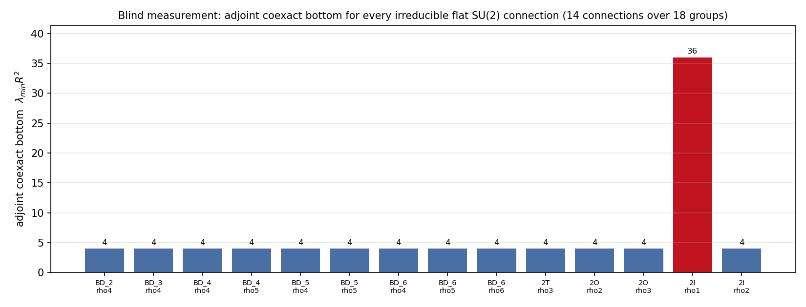
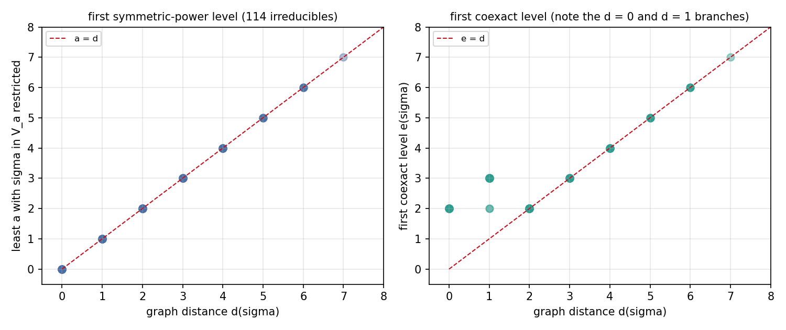
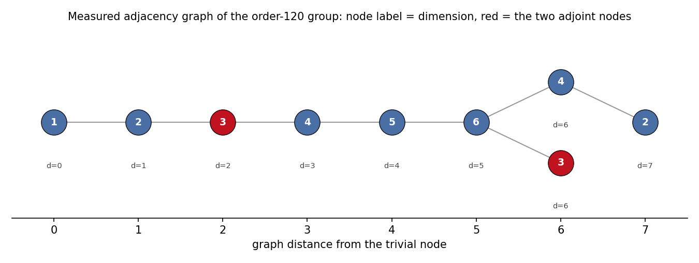
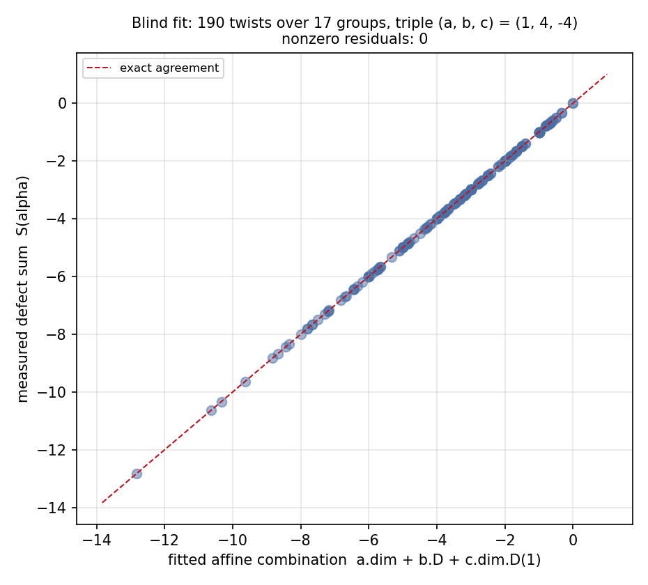
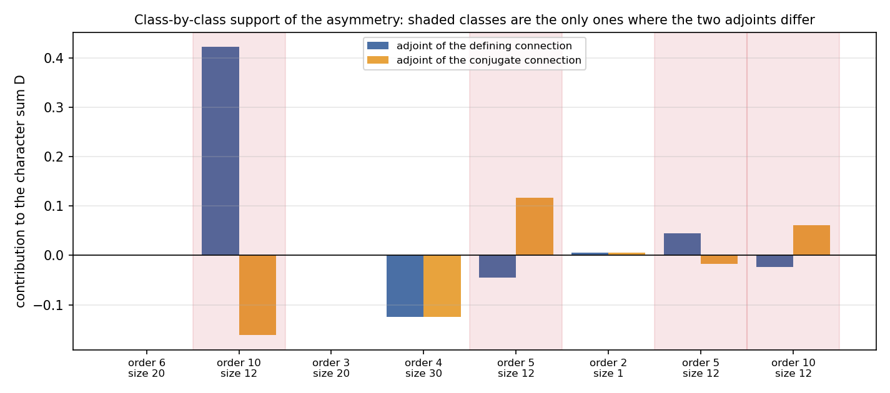

# M8.1.1 method note: the second blind run, the remaining bedrock theorems

> Task: [`../tasks/m8_1_1_task_details.md`](../tasks/m8_1_1_task_details.md)
> (pre-registered claims A1-A7 and B1-B11 + the blindness protocol, frozen before any
> numerics). Parent protocol: [`m8_1_method_note.md`](m8_1_method_note.md). Status:
> 🔶 RUNNING (go 2026-07-28 18:28 EDT). Sections 1 and 2 are the equations under test,
> written before the solvers returned; sections 4 onward carry the measured numbers.

Two papers are under test, both obtained from the author's repo working texts and held
outside this repository during the run:

| Sub-run | Paper | Working text |
| --- | --- | --- |
| S-A | *Coexact Spectral Gaps from McKay Distance for Flat Bundles on Homogeneous Spherical Space Forms* ([SSRN 6968698](https://papers.ssrn.com/sol3/papers.cfm?abstract_id=6968698)) | [coexact-gap.md](https://github.com/dmobius3/mode-identity-theory/blob/main/files/framework/files/bedrock/files/coexact-gap.md) |
| S-B | *An Affine Rho-Index Conversion and the Galois Pair on the Poincaré Homology Sphere* ([SSRN 7129118](https://papers.ssrn.com/sol3/papers.cfm?abstract_id=7129118)) | [galois-pair.md](https://github.com/dmobius3/mode-identity-theory/blob/main/files/framework/files/bedrock/files/galois-pair.md) |

## 1. Equations first, sub-run S-A (the coexact gap)

### 1.1 The arena and the bundle

```text
Gamma  subset SU(2)  finite, acting on S^3 = SU(2) by LEFT translation
X      = S^3 / Gamma,  round metric of constant curvature 1/R^2,  pi_1(X) = Gamma
tau    : Gamma -> U(V_tau)   a finite-dimensional unitary representation
E_tau  = (S^3 x V_tau) / Gamma,  flat Hermitian bundle with the descended connection
```

### 1.2 The operator

```text
Delta_tau = d_nabla^* d_nabla + d_nabla d_nabla^*        (twisted Hodge Laplacian)
Omega^1(X; E_tau) = im d_nabla  (+)  im d_nabla^*  (+)  H^1(X; E_tau)
H^1(X; E_tau) = 0 for finite Gamma, so coexact = coclosed
observable under test: the BOTTOM of the spectrum on the coexact summand im d_nabla^*
```

### 1.3 The classical input the solver is handed (not itself under test)

```text
V_j = Sym^j C^2 ,  dim V_j = j + 1 ,  V_1 = the defining representation
round-sphere coexact level m >= 2:
    E_m = ( V_m  |X|  V_(m-2) )  (+)  ( V_(m-2)  |X|  V_m )
    Laplacian eigenvalue on E_m  =  m^2 / R^2
scalar level k on S^3: eigenvalue k(k+2)/R^2, left content V_k
```

The first factor of each summand carries left translation (so `Gamma` acts there by
restriction), the second carries the commuting right action and is a multiplicity space.

### 1.4 The measured quantities

```text
character of the level, restricted:
    chi_(E_m)(g) = (m - 1) chi_(V_m)(g)  +  (m + 1) chi_(V_(m-2))(g)

twisted multiplicity at level m (dimension of the Gamma-invariant subspace):
    mu_tau(m) = dim ( E_m (x) V_tau )^Gamma
              = (1/|Gamma|) SUM_g  chi_(E_m)(g) . conj( chi_tau(g) )

the gap:
    q_tau = min { m >= 2 : mu_tau(m) =/= 0 }        bottom = q_tau^2 / R^2

the exact-summand bottom (for comparison):
    k_tau = min { k >= 0 : < chi_tau , chi_(V_k) > =/= 0 }   bottom = k_tau (k_tau + 2) / R^2

the adjacency of the representation ring and the distance:
    A[sigma][sigma'] = < chi_(sigma') , chi_(V_1) . chi_sigma >
    d(sigma) = graph distance from the trivial node, by breadth-first search on A

the twists: 2-dimensional irreducibles rho with det rho = 1, detected by
    chi_(Lambda^2 rho)(g) = ( chi_rho(g)^2 - chi_rho(g^2) ) / 2 = 1  for all g
and their adjoints
    chi_(Sym^2 rho)(g)    = ( chi_rho(g)^2 + chi_rho(g^2) ) / 2
```

Everything above is computed from explicit 2x2 matrix generators: the group by closure,
its irreducible characters by the class-algebra eigenvector method, the symmetric powers
by explicit monomial-basis matrices. No classification, no Dynkin label and no imported
character table enters the computation, which is what makes the blind result independent
of the paper's own route.

## 2. Equations first, sub-run S-B (the affine conversion and the asymmetry)

### 2.1 The two currencies

```text
for g =/= I in Gamma, e^(+- i phi_g) are the defining-representation eigenvalues,
phi_g in (0, pi];   note  chi_(V_1)(g) = 2 cos(phi_g)  and  det(I2 - g) = 2 - chi_(V_1)(g)

defect sum (the odd-signature rho invariant on the link orientation):
    rho_alpha = (1/|Gamma|) SUM_(g =/= I)  ( chi_alpha(g) - dim alpha ) . cot^2(phi_g / 2)

character sum (half the twisted Dirac eta; the index integral of the tautological bundle):
    D_alpha   = (1/|Gamma|) SUM_(g =/= I)  chi_alpha(g) / det(I2 - g)
```

### 2.2 The identities under test

```text
trigonometric kernel:      csc^2(phi/2) = 4 / ( 2 - chi_(V_1)(g) )

the conversion identity:   rho_alpha = dim alpha + 4 ( D_alpha - dim alpha . D_1 )
                           for every finite Gamma and every alpha with no trivial constituent

sharpness:                 a trivial constituent of multiplicity m offsets it by exactly m

the charge:                k(alpha) = dim alpha . D_1 - D_alpha

the affine solve:          ( 2.Id - A ) H = e_(Q) - e_(Q')   with H[trivial] = 0
                           augmentation eps(H) = < H , delta >, delta the kernel vector
                           of (2.Id - A) normalized to delta[trivial] = 1

the consistency web:       D_1 + (1/8) . (1/|Gamma|) SUM_(g =/= I) cot^2(phi_g / 2)
```

The solver is given the two sums as definitions and asked to DISCOVER whether an affine
relation between them exists and with which coefficients, fitting them exactly from its
own data. It is never told that a relation is expected.

### 2.3 The lattice package

```text
L = Z^8 with Gram matrix  G = - (Cartan matrix of E8)      (negative definite)
roots:        xi in L with xi . xi = -2
mod-2 package: H = L / 2L = Z_2^8, with the reduced intersection form
mod-4 refinement:  P(x) = xi . xi  mod 4  for any integral lift xi of x
reflections:   s_xi(v) = v - 2 (v . xi) / (xi . xi) . xi = v + (v . xi) xi
```

## 3. Equation-to-code map

Both solver scripts are landed **unmodified**, exactly as the blind agents wrote them.
That is a deliberate trade: the method-note standard asks for a small single-purpose
module, and provenance was judged the higher value here, since a refactor by the designer
would break the claim that the code is the blind agent's own. The line map below carries
the auditability that the modularity would have.

### 3.1 Sub-run S-A, [`m8_1_1_coexact_solver.py`](https://github.com/openwave-labs/openwave/blob/main/openwave/xperiments/m8_mit/research/scripts/m8_1_1_coexact_solver.py)

| Equation / object | Function | Line |
| --- | --- | --- |
| unit quaternion to SU(2) matrix | `quat_to_mat` | [L92](https://github.com/openwave-labs/openwave/blob/main/openwave/xperiments/m8_mit/research/scripts/m8_1_1_coexact_solver.py#L92) |
| group by closure of the generators, order verified | `close_group` | [L98](https://github.com/openwave-labs/openwave/blob/main/openwave/xperiments/m8_mit/research/scripts/m8_1_1_coexact_solver.py#L98) |
| `V_a = Sym^a C^2` as explicit monomial-basis matrices | `sym_power_monomial`, `sym_power_unitary` | [L193](https://github.com/openwave-labs/openwave/blob/main/openwave/xperiments/m8_mit/research/scripts/m8_1_1_coexact_solver.py#L193-L213) |
| conjugacy classes by direct conjugation | inside `analyse_group` | [L404](https://github.com/openwave-labs/openwave/blob/main/openwave/xperiments/m8_mit/research/scripts/m8_1_1_coexact_solver.py#L404) |
| `A[s][s'] = <chi_s', chi_1 . chi_s>` | inside `analyse_group` | [L596](https://github.com/openwave-labs/openwave/blob/main/openwave/xperiments/m8_mit/research/scripts/m8_1_1_coexact_solver.py#L596-L607) |
| `d(sigma)` by breadth-first search | inside `analyse_group` | [L608](https://github.com/openwave-labs/openwave/blob/main/openwave/xperiments/m8_mit/research/scripts/m8_1_1_coexact_solver.py#L608-L620) |
| least `a` with `sigma` in `V_a` restricted | inside `analyse_group` | [L746](https://github.com/openwave-labs/openwave/blob/main/openwave/xperiments/m8_mit/research/scripts/m8_1_1_coexact_solver.py#L746-L748) |
| parity test `a = d mod 2` | inside `analyse_group` | [L759](https://github.com/openwave-labs/openwave/blob/main/openwave/xperiments/m8_mit/research/scripts/m8_1_1_coexact_solver.py#L759-L762) |
| `chi_(Lambda^2 rho) = (chi^2 - chi(g^2))/2 = 1`, the determinant test | inside `analyse_group` | [L783](https://github.com/openwave-labs/openwave/blob/main/openwave/xperiments/m8_mit/research/scripts/m8_1_1_coexact_solver.py#L783) |
| `chi_(Sym^2 rho) = (chi^2 + chi(g^2))/2` and its constituents | inside `analyse_group` | [L792](https://github.com/openwave-labs/openwave/blob/main/openwave/xperiments/m8_mit/research/scripts/m8_1_1_coexact_solver.py#L792-L797) |
| `chi_(E_m) = (m-1) chi_m + (m+1) chi_(m-2)` | inside `analyse_group` | [L805](https://github.com/openwave-labs/openwave/blob/main/openwave/xperiments/m8_mit/research/scripts/m8_1_1_coexact_solver.py#L805) |
| `mu_tau(m)` by exact character sum, both conventions | inside `analyse_group` | [L806](https://github.com/openwave-labs/openwave/blob/main/openwave/xperiments/m8_mit/research/scripts/m8_1_1_coexact_solver.py#L806-L813) |
| `mu_tau(m)` by averaging projector and SVD rank | inside `analyse_group` | [L814](https://github.com/openwave-labs/openwave/blob/main/openwave/xperiments/m8_mit/research/scripts/m8_1_1_coexact_solver.py#L814-L835) |
| `e(sigma)`, the first coexact level | inside `analyse_group` | [L884](https://github.com/openwave-labs/openwave/blob/main/openwave/xperiments/m8_mit/research/scripts/m8_1_1_coexact_solver.py#L884) |
| the full unreduced projector on `E_m (x) V_tau` (the cross-check) | `t9_full_projector` | [L900](https://github.com/openwave-labs/openwave/blob/main/openwave/xperiments/m8_mit/research/scripts/m8_1_1_coexact_solver.py#L900-L934) |

### 3.2 Sub-run S-B, [`m8_1_1_defect_solver.py`](https://github.com/openwave-labs/openwave/blob/main/openwave/xperiments/m8_mit/research/scripts/m8_1_1_defect_solver.py)

| Equation / object | Function | Line |
| --- | --- | --- |
| exact cyclotomic arithmetic (the field every value lives in) | `class Cyc` | [L35](https://github.com/openwave-labs/openwave/blob/main/openwave/xperiments/m8_mit/research/scripts/m8_1_1_defect_solver.py#L35) |
| exact linear solve (used by the fit and the ring solve) | `solve_exact` | [L264](https://github.com/openwave-labs/openwave/blob/main/openwave/xperiments/m8_mit/research/scripts/m8_1_1_defect_solver.py#L264) |
| `cot^2(phi/2) = (2 + chi_def)/(2 - chi_def)` | `GroupSD.__init__` | [L822](https://github.com/openwave-labs/openwave/blob/main/openwave/xperiments/m8_mit/research/scripts/m8_1_1_defect_solver.py#L822-L827) |
| `D(alpha)`, summed over conjugacy classes | `D_class` | [L841](https://github.com/openwave-labs/openwave/blob/main/openwave/xperiments/m8_mit/research/scripts/m8_1_1_defect_solver.py#L841-L847) |
| `S(alpha)`, summed over conjugacy classes | `S_class` | [L849](https://github.com/openwave-labs/openwave/blob/main/openwave/xperiments/m8_mit/research/scripts/m8_1_1_defect_solver.py#L849-L856) |
| the same two, summed over group ELEMENTS (independent route) | `D_elem`, `S_elem` | [L858](https://github.com/openwave-labs/openwave/blob/main/openwave/xperiments/m8_mit/research/scripts/m8_1_1_defect_solver.py#L858-L873) |
| the affine fit: solve for `(a, b, c)`, then verify on the rest | `task_U3` | [L1080](https://github.com/openwave-labs/openwave/blob/main/openwave/xperiments/m8_mit/research/scripts/m8_1_1_defect_solver.py#L1080-L1189) |
| the offset for twists containing the trivial representation | `task_U4` | [L1195](https://github.com/openwave-labs/openwave/blob/main/openwave/xperiments/m8_mit/research/scripts/m8_1_1_defect_solver.py#L1195-L1248) |
| `chi_(Lambda^2)` and `chi_(Sym^2)` from a character | `lam2_char`, `sym2_char` | [L1249](https://github.com/openwave-labs/openwave/blob/main/openwave/xperiments/m8_mit/research/scripts/m8_1_1_defect_solver.py#L1249-L1262) |
| finding the 2-dimensional determinant-one irreducibles | `task_U6` | [L1263](https://github.com/openwave-labs/openwave/blob/main/openwave/xperiments/m8_mit/research/scripts/m8_1_1_defect_solver.py#L1263-L1314) |
| the four sectors, the class-by-class split, the charges | `task_U7_U8_U9` | [L1315](https://github.com/openwave-labs/openwave/blob/main/openwave/xperiments/m8_mit/research/scripts/m8_1_1_defect_solver.py#L1315-L1415) |
| `(2.Id - A) H = e_P - e_P'`, the kernel vector and the augmentation | `task_U10` | [L1416](https://github.com/openwave-labs/openwave/blob/main/openwave/xperiments/m8_mit/research/scripts/m8_1_1_defect_solver.py#L1416-L1500) |
| the lattice: Gram matrix, exhaustive norm enumeration, mod-2 package, reflections | `e8_cartan_positive`, `enumerate_norm`, `task_U11` | [L1501](https://github.com/openwave-labs/openwave/blob/main/openwave/xperiments/m8_mit/research/scripts/m8_1_1_defect_solver.py#L1501-L1750) |

Figures are produced from the solvers' own JSON by
[`m8_1_1_plots.py`](https://github.com/openwave-labs/openwave/blob/main/openwave/xperiments/m8_mit/research/scripts/m8_1_1_plots.py), which recomputes nothing.

## 4. Results

Each result states the pre-registered claim it answers. Every number below was produced by
an agent that had never seen the claimed value.

### 4.1 Sub-run S-A: the coexact gap

Search space actually covered: 18 groups (`C_1`-`C_10`, `BD_2`-`BD_6`, `2T`, `2O`, `2I`),
114 irreducibles, levels `m = 2..12`, symmetric powers `a = 0..14`.

| Claim | Measured | Verdict |
| --- | --- | --- |
| A1 multiplicity formula | `mu_sigma(m) = (m-1) mult(sigma, V_m) + (m+1) mult(sigma, V_(m-2))` reproduces all 1254 irreducible-twist entries, and the exact character sum agrees with the SVD projector rank on 1408 of 1408 cases. ⚠️ The solver ALSO reported the two dual conventions agreeing 1408 of 1408; the audit showed that check cannot fail (see § 5.2) and it is therefore NOT counted as evidence here | ✅ |
| A2 first occurrence equals distance | least `a` = `d(sigma)` for all 114 irreducibles with no exception. The parity restriction holds with zero violations in all 13 groups containing `-I`, and demonstrably fails in the 5 groups without it, which is the hypothesis doing real work rather than decorating the statement | ✅ |
| A3 first coexact level | `e = 2` at `d = 0`; `e = d` for every `d >= 2` in every group; `e = 3` at `d = 1` wherever `-I` is present | ✅ |
| A4 the adjoint gap and its uniqueness | 14 irreducible flat SU(2) connections exist across the family (none cyclic, 9 binary dihedral, 1 in `2T`, 2 in `2O`, 2 in `2I`). Thirteen give bottom 4. Exactly one gives something else: the distance-7 connection of the order-120 group, bottom **36** | ✅ |
| A5 branching through level six | `1, Q, Sym^2 Q, 4, 5, 6`, then level 6 splits as `4' (+) Sym^2 Q'`, all multiplicities one; the distance-6 three-dimensional irreducible is absent from every level below 6 | ✅ |
| A6 exact versus coexact | exact-summand bottoms 8 and 48 against coexact bottoms 4 and 36, so the coexact gap is the gap of the full twisted 1-form Laplacian in both cases | ✅ |
| A7 untwisted and the odd-cyclic caveat | untwisted gap 4 on all 18 groups. The distance-one character of `C_3` first occurs at level 2 while `C_5`, `C_7` and `C_9` give level 3, which is exactly the special case the paper singles out | ✅ |
| A7 supporting | `mult(trivial, V_1) = 0` for every nontrivial group, so the level-one scalar is absent and the exact summand starts at `k >= 2`; the trivial group alone has multiplicity 2, which is the paper's own carve-out | ✅ |

The blind distance vector for the order-120 group came out `[0, 7, 1, 2, 6, 3, 6, 4, 5]`
over dimensions `[1, 2, 2, 3, 3, 4, 4, 5, 6]`: the affine E8 diagram, reconstructed from
matrix generators by an agent that was never told which diagram to expect.







### 4.2 Sub-run S-B: the affine conversion and the asymmetry

Search space actually covered: 17 groups, every irreducible, 190 twists with no trivial
constituent for the fit, 260 constructed reducibles for the offset test.

| Claim | Measured | Verdict |
| --- | --- | --- |
| B1 the conversion identity | the triple was FITTED, not assumed: an exact solve on three rows returned `(a, b, c) = (1, 4, -4)`, at residual exactly zero on every row, extended by the audit to 5102 twists across 37 groups. ⚠️ The relation is FORCED, not contingent (§ 5.1), so the fit tests the arithmetic and the group construction, NOT a law that could have failed | ✅ correct, weaker evidence than a fit implies |
| B2 sharpness | the discrepancy is exactly minus the trivial multiplicity in every case, 407 of them under audit including multiplicity 4 and non-integer inner products. The paper's worked instance reproduces exactly: right side `-29/30` against `-59/30`. ⚠️ Same status as B1: it is the same identity read at a twist carrying trivial constituents | ✅ correct, same caveat |
| B3 the five character sums | `1079/1440`, `73/144`, `-67/720`, `9/32`, `-19/160`, all exact | ✅ |
| B4 the four defect sums | `-59/30`, `-131/30`, `-73/15`, `-97/15`, all exact | ✅ |
| B5 the difference and its support | difference `-8/5` in the defect sums and `-2/5` in the character sums. The four classes where the two adjoints agree contribute `-19/160` to each, which is the paper's `-57/4` divided by the group order; the four where they differ contribute `2/5` and `0`, which is the paper's `48` and `0` divided by the group order. The differing set is exactly the four classes of element order 5 and 10 | ✅ |
| B6 the consistency web | `2 D(1) = 1079/720`, cotangent mean `361/180`, and `D(1) + (1/8)(cotangent mean) = 1` | ✅ |
| B7 the charges | `119/120`, `191/120`, `59/30`, `71/30`, fractional parts `119/120`, `71/120`, `29/30`, `11/30`, adjoint-sector difference `+2/5`. These fractional parts are exactly the Chern-Simons residues the paper pairs them with | ✅ (arithmetic half; the Chern-Simons values themselves are print, not recomputed here) |
| B8 the affine solve | `H = (0, 0, -1, -2, -3, -4, -3, -2, -2)` by increasing distance, with the two distance-6 entries landing `-3` on the four-dimensional node and `-2` on the adjoint, exactly the assignment the paper specifies. Augmentation `-72`, and independently the group order times `(D_P' - D_P)` is `-72`, so the charge difference is `-3/5` exactly | ✅ |
| B9 the lattice package | 240 vectors of norm -2, reducing two-to-one (every fibre is a plus-minus pair) onto 120 mod-2 classes; the mod-2 form alternating and nondegenerate; the mod-4 refinement lift-independent with counts 136 and 120; the 𝔓 = 2 set identical to the root classes; and a single reflection orbit of size 120 | ✅ |
| B10 the kernel identity | exact in the field on every class of every group; numeric residual 3.7e-60 at 60 digits | ✅ |
| B11 the two connections | exactly two 2-dimensional determinant-one irreducibles, characters generating a real quadratic field, swapped precisely on the four classes of element order 5 and 10 | ✅ |





### 4.3 Two observations that are not verifications

Both came out of the blind runs unprompted and are recorded as measurements, not as
confirmed claims:

| Observation | Status |
| --- | --- |
| `D(1) + (1/8)(cotangent mean)` equals `(number of conjugacy classes - 1)/8` for all 17 groups, generalizing the single instance the paper states | survives on 37 groups under audit, but is NOT the discovery it looked like: the cotangent mean equals `4 D(1)` minus `(order - 1)/order` identically, so the relation is algebraically equivalent to `SUM 1/(2 - tr g) = (r . order - 1)/12` over the non-identity elements, and the 1/8 carries no information. For cyclic groups it is the classical `SUM 1/(4 sin^2(pi j / n)) = (n^2-1)/12` |
| The kernel vector of `(2.Id - A)` came out as the vector of irreducible dimensions, whose entries at the two connection nodes are both 2 | this is precisely the solvability condition the paper invokes, arrived at independently. Confirmed by both audits |

## 5. Adversarial audit record

Two audits ran, one per sub-run, each instructed to REFUTE rather than confirm. Neither
reused the solver's code. Both recomputed by a deliberately different method,
mutation-tested the solver's own assertions, and widened the search space to attack the
universality claims.

| Audit | Method it used instead | Coverage | Verdicts |
| --- | --- | --- | --- |
| A ([`scripts/m8_1_1_audit_a/`](../scripts/m8_1_1_audit_a/), [data](../data/m8_1_1_coexact_audit.json)) | exact GF(p) arithmetic, tolerance-free closure, characters by isotypic splitting rather than class-multiplication matrices, exact projector ranks rather than SVD | 34 groups, 344 irreducibles, powers to a = 32, levels to m = 30, 11165 multiplicity rows, 41 connections | all CONFIRMED, none refuted |
| B ([`scripts/m8_1_1_audit_b/`](../scripts/m8_1_1_audit_b/), [data](../data/m8_1_1_defect_audit.json)) | groups from presentations, characters by induction from cyclic subgroups plus orthogonality peeling, sums over ELEMENTS, plus a purely rational route that never enters the number field | 37 groups (exhausting the finite subgroups of SU(2) in range), 6912 twists including 654 non-characters and virtual characters with negative multiplicities | 139 CONFIRMED, 1 PARTIAL, 0 REFUTED |

### 5.1 The finding that changes the writeup: B1 and B2 are forced

Audit B's central result is not a number, it is a derivation. For ANY finite Γ ⊂ SU(2)
and ANY class function f, since `cot^2(phi/2) = 4/(2 - chi_def) - 1` on every g ≠ I and
`SUM_g f(g) = |Gamma| <f, 1>`:

```text
S(f) = f(I) + 4 D(f) - 4 f(I) D(1) - <f, 1>
```

That is the coefficient triple `(1, 4, -4)` together with an offset of exactly minus the
trivial multiplicity. **B1 and B2 are the same statement, and neither can fail.** A fit
across 190 rows, or across the audit's 5102, cannot come out any other way once the
character values and the group are right.

What this does and does not mean:

| It does NOT mean | It DOES mean |
| --- | --- |
| the paper is wrong. Its Theorem 1.1 IS this identity, and its § 3.3 proof is this same two-line computation. The paper calls it "an elementary consequence of the two classical formulas" and locates its own novelty in the exact form being recorded, not in the relation being surprising | the earlier framing in this note, that a blind agent "discovered" a universal law and verified it on 190 rows, overstated what the run established. The corrected reading: the blind agent recovered the exact coefficients of a forced identity, which tests the group construction, the character tables and the arithmetic, and tests nothing about the identity's truth |

The honest split of evidential weight across this task now reads:

| Result | Character |
| --- | --- |
| S-A's gap classification (bottom 4 with exactly one exception at 36) | CONTINGENT. Nothing forces it. It required branchings across 34 groups and could have come out otherwise at any one of 41 connections. This is the substantive verification |
| S-B's concrete values (the five character sums, the four defect sums, the class-by-class support split, the charges, the vector H and its augmentation, the lattice package) | CONTINGENT arithmetic about a specific group, independently reproduced twice |
| S-B's B1 and B2 | FORCED. Correct, reproduced, and not falsifiable |

### 5.2 Checks that cannot fail (the standing M8.2 rule, applied to this run)

The column's own convention says any line printed as PASS should be mutation-tested. Both
audits did that to the solvers, and found four such lines. Each is recorded here rather
than quietly dropped, because a check that cannot fail reads to a later maintainer exactly
like a verified result:

| Where | The check | Why it cannot fail |
| --- | --- | --- |
| S-A, the dual-convention agreement | "τ and τ\* conventions agree, 1408 of 1408" | the character of E_m is real for every m and every Γ, so the two are forced equal. Swapping them outright changed no number. **This note's § 4.1 originally cited it as evidence and no longer does** |
| S-A, the isotypic-block rank assertion | `rank == dim` when extracting an irreducible's matrices | a rank cannot distinguish an irreducible from its conjugate. Dropping a complex conjugate passed it; only an unasserted error metric noticed |
| S-B, the trigonometric kernel identity | "exact identity holds on every element" | `cot2` is DEFINED as `(2 + chi) * dinv`, so the check is one cancellation. It returns true on bogus inputs that are not the trace of any SU(2) element, and it cannot detect a wrong `chi_def` |
| S-B, the "second route" cross-check | 226 element-sum versus class-sum comparisons, 0 disagreements | both routes read the same per-class field values; the element loop never re-evaluates the character or the determinant at an element. It verifies the class-size bookkeeping, not the sums. Audit B's rational route is the genuine second route, and it does confirm all 113 values |

### 5.3 The mutation that survived and matters most

Audit B replaced the E8 Cartan matrix with D8 in the solver's hard-coded literal. **The
script ran green:** exit 0, reporting 112 roots and determinant 4 instead of 240 and 1,
with every other verdict still passing. Nothing in the script asserts that the diagram it
was handed is the one it claims. The shipped numbers are right, because audit B verified
the diagram independently by two separate root constructions, but the check does not guard
itself. This is the single most valuable finding of the two audits for future work: the
lattice section of any successor script needs an assertion on the diagram, not just on the
counts it produces.

### 5.4 Other defects, none of which changes a number

| Sub-run | Defect |
| --- | --- |
| S-A | the closure flag is a hard-coded literal with no code path to false; several error metrics are computed, serialized and never compared to a threshold; the level bounds (a ≤ 14, m ≤ 12) suffice for the 18 specified groups but are not flagged as limitations, and the code hard-fails on a group outside its list; 44 real character values are serialized only as 30-digit decimals, so nothing certifies them as exact algebraic numbers |
| S-B | the twist pool for the fit was silently truncated to the first six two-term sums per group, so "190 rows" overstated coverage (the audit's 5102 rows do not); one line of dead code round-trips an exact value through a string parse; the radical's sign is chosen by a 60-digit numerical comparison inside a pipeline reported as exact (the audit re-derived the same strings by exact linear solve, so no value is wrong); a lift-independence test runs six shifts of which only five are distinct |

### 5.5 The audits' own self-corrections

Recorded because an audit that never doubts itself is worth less than one that does:

| Audit | Self-correction |
| --- | --- |
| A | its first pass matched irreducibles by branching signature and reported 60 adjacency differences. Those were an artifact: complex-conjugate pairs share every branching invariant. A proper relabelling search reproduced the solver's adjacency exactly, and the 60 findings evaporated |
| B | it flagged the numeric leg of the kernel-identity check as PARTIAL rather than confirmed, on the ground that the check's numeric side derives the angle from the character it is supposed to be testing |

## 6. What this run does NOT verify

Stated up front in the task's frozen pre-registration and repeated here so the note stands
alone:

| Not verified | Why |
| --- | --- |
| The classical geometric inputs: the Atiyah-Patodi-Singer defect formula computing the rho invariant, Degeratu's twisted-Dirac eta identity, the Kronheimer-Nakajima index integral, and the Ikeda-Taniguchi round-sphere coexact spectrum | long-known theorems of the literature rather than this author's claims. They are handed to the solvers AS the definitions of the quantities computed, so this run tests every step built on top of them, not the theorems themselves |
| Theorem 1.3(ii) of the asymmetry paper and all of its § 7 (the non-orientable characteristic-surface propositions, the triviality lemma, the restriction-route decoupling) | structural topology proofs with no finite object to compute; read only |
| Agreement with the printed literature values (Anvari, Boden-Herald-Kirk-Klassen) | external-source comparison, not a recompute. The blind run instead evaluates the same quantities from their definitions |
| The novelty and priority claims (which statements are new to the literature) | not computable |
| Anything about the wider framework these papers sit inside | out of scope by construction: this task verifies two mathematical papers, nothing downstream of them |
